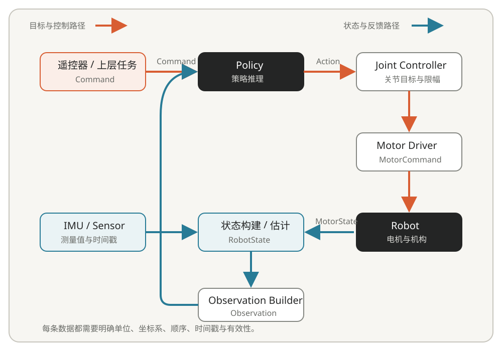
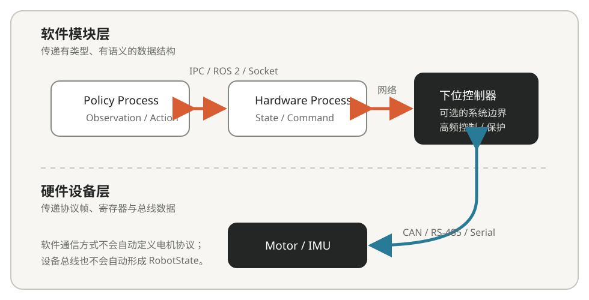

上一章介绍了机器人软件处理的状态、指令和坐标系。本篇继续回答一个运行时问题：这些数据由谁产生，在什么时候更新，又怎样经过不同模块最终变成电机指令。这里讨论的是机器人软件常见的组织思路，不要求所有项目都采用同一种进程结构或通信框架。

## 1. 机器人程序是怎样持续运行的

机器人程序通常不会计算一次就退出。设备通电以后，传感器持续产生数据，控制器持续更新输出，整套系统形成反复执行的信息闭环：

```text
读取传感器 → 更新机器人状态 → 运行控制器或策略
     ↑                              ↓
机器人运动 ← 执行器接收指令 ← 生成控制指令
```

一个任务每秒执行的次数称为频率，单位是赫兹（Hz）；相邻两次执行之间的理想时间称为周期。二者满足：

$$
T=\frac{1}{f}
$$

例如，1000 Hz 对应 1 ms，50 Hz 对应 20 ms。机器人系统往往同时存在多个频率：电机通信和底层关节控制可能以数百赫兹到 1 kHz 运行，状态估计跟随 IMU 和关节反馈更新，运动策略可能以几十赫兹推理，定位与规划则可能更慢。具体数值取决于硬件和任务，这些量级不是统一标准。

策略以 50 Hz 运行而底层控制以 1 kHz 运行并不矛盾。策略每 20 ms 更新一次关节目标，在两次推理之间，底层控制器仍以 1 ms 左右的周期读取新反馈，并使用最近一次有效目标计算输出。这种多速率结构让计算量较大的策略负责运动目标，让底层环路及时响应关节的快速变化。系统必须规定目标如何保持、何时视为过期，以及策略或通信中断后进入什么保护状态。

数据是否可用还取决于时间。采样时刻、发送时刻、接收时刻和真正用于控制的时刻可能不同，它们之间形成采集、通信、调度和计算延迟。仅仅“刚收到一条消息”不代表它就是当前数据，因此状态和指令通常需要时间戳、序号或有效标志。多传感器融合还要保证时钟来源和时间同步关系明确，否则相机、IMU 与关节反馈可能对应不同的真实时刻。

目标频率也不等于实际频率。操作系统调度、日志输出、内存分配、网络等待和锁竞争都可能使某一周期延后。实际周期相对目标周期的变化称为抖动（Jitter）。“一秒平均执行 1000 次”和“每次都在规定时间内完成”是不同要求。在开发中不仅要关注平均计算时间，也要关注最大延迟、超时次数和从采样到输出的总延迟。

## 2. 程序的模块化

一台四足机器人可能同时运行电机通信、IMU 采集、状态估计、策略推理、遥控器、定位、导航和日志等功能。它们的数据来源、更新频率、计算量和故障处理方式不同，全部混在一个大循环中会使代码难以测试，也会让非关键任务拖慢控制路径。

模块（Module）是按照职责划分的软件单元：一个模块负责一类相对明确的功能，并通过清楚的输入和输出与其他模块配合。例如：

| 模块 | 主要输入 | 主要输出 |
| --- | --- | --- |
| 电机驱动 | `MotorCommand` | `MotorState`、通信状态 |
| 状态估计 | IMU、关节反馈、接触信息 | `RobotState` |
| 策略推理 | `Observation` | `Action` |
| 上层任务 | 遥控器、识别与比赛状态 | `Command` |

模块化描述的是职责边界，一个模块可以实现为 C++ 类、一组源文件、一个线程、一个独立进程或一个 ROS 2 Node。高频且关系紧密的功能可能放在同一进程中，计算量较大或需要故障隔离的功能则可能单独运行。具体划分取决于时限、数据规模、安全要求、计算设备和维护成本。

比“使用什么框架”更重要的是接口。调用者不应依赖模块内部怎样实现，只需要知道输入、输出和失败行为。例如 `Policy` 接收符合约定的 Observation 并输出 Action；电机驱动模块负责把统一的 MotorCommand 编码为具体总线帧。这样更换策略模型或电机协议时，其他模块不必随之大范围修改。

## 3. 数据在机器人系统中的流动

机器人软件在模块之间传递的是 `ImuData`、`JointState`、`RobotState`、`Command`、`Observation`、`Action` 和 `MotorCommand` 等具有明确语义的数据。下面的图展示了一个包含强化学习策略的典型闭环，实际项目可以增加定位、导航、机械臂或安全管理模块。



以四足策略部署为例，电机反馈和 IMU 数据先经过校验、坐标变换或状态估计，形成 RobotState；Observation Builder 再按照训练时的字段顺序、缩放和历史信息构造 Observation；策略输出的 Action 被解释为关节目标或其他控制量，经限幅和底层控制后形成 MotorCommand。电机执行指令并产生新反馈，下一轮循环由此开始。

沿这条数据流，每个接口至少应说明：

- 数据表示什么，是测量值、估计值、目标值还是中间量；
- 使用什么单位、坐标系、正方向和数组顺序；
- 对应哪个采样或计算时刻，以什么频率更新；
- 数据是否已经初始化，多久以后过期，异常时怎样表示；
- 生产者和消费者频率不同时，是保持最新值、排队处理还是允许丢帧。

这些约定与上一章直接相连。只写出字段名称并不足以形成可靠接口：同样叫作 `base_velocity` 的数组，可能使用世界坐标系，也可能使用机身坐标系；同样叫作 `Action`，可能表示关节位置偏移，也可能表示力矩。分析系统问题时，可以沿箭头逐段确认数据在哪里产生、在哪里改变含义、何时开始异常，比只观察最终“机器人没有按预期运动”更容易定位原因。

## 4. 模块之间的通信

通信需要先区分两个层次：软件模块之间交换结构化数据，计算机或控制器再通过设备链路与真实硬件交换字节和总线帧。两者可能使用完全不同的机制。



同一程序内部可以通过函数调用、共享对象或队列传递数据；不同进程之间可以采用共享内存、消息队列、Socket 或 ROS 2；跨计算机通信通常还要经过网络。程序与电机、IMU 和下位控制器之间则可能使用 CAN、RS-485、串口、USB 或 Ethernet。

常见的软件部署方式可以概括为：

| 结构 | 典型组织 | 主要特点 |
| --- | --- | --- |
| 单进程 | 驱动、估计、策略和控制位于一个程序 | 路径直接，但需要避免模块相互阻塞 |
| 多进程 | 驱动、控制、导航分别运行 | 便于隔离和调试，需要进程间通信 |
| 上位机与下位机 | PC 运行策略、导航和任务；微控制器运行电机通信与高频控制 | 计算与实时控制分工，必须处理链路延迟和失联保护 |

这些结构没有脱离具体需求的统一最优答案。入门阶段只需要能够辨认系统边界：哪些模块在同一进程，哪些位于不同设备，软件接口通过什么方式传递，设备通信又由哪一层负责。共享内存性能、DDS、序列化、无锁队列、CPU 亲和性和实时调度等问题，应在遇到明确工程需求时再深入。

ROS 2 提供 Node、Topic、Service、Action、Parameter、Launch、日志和数据录制等机制，是组织机器人模块和数据流的一种完整工具。下一篇会把这里的模块、接口和通信关系对应到一个可观察的 ROS 2 系统中，目标是能够运行、查看和调试已有项目。
