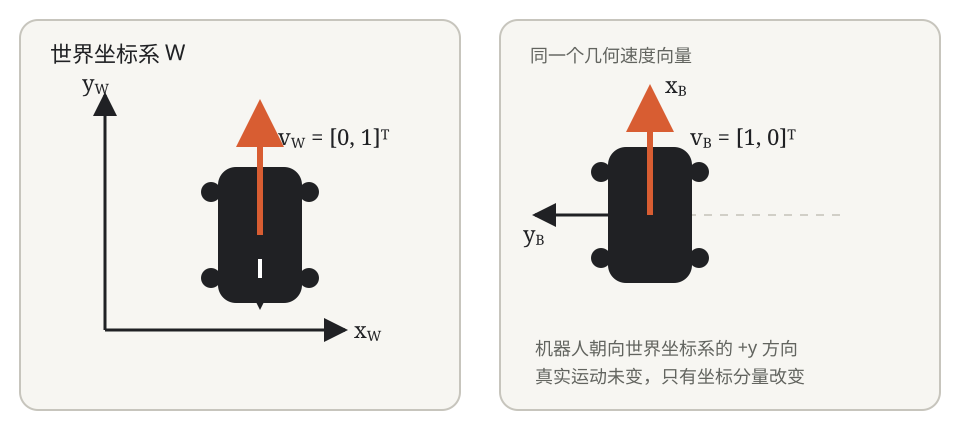
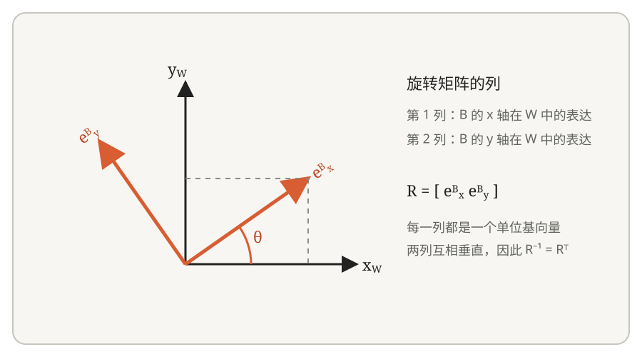
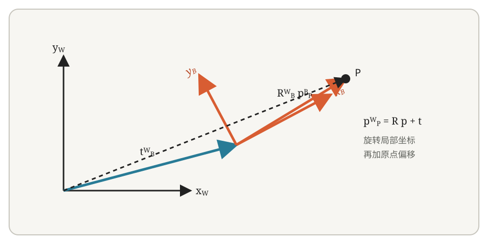
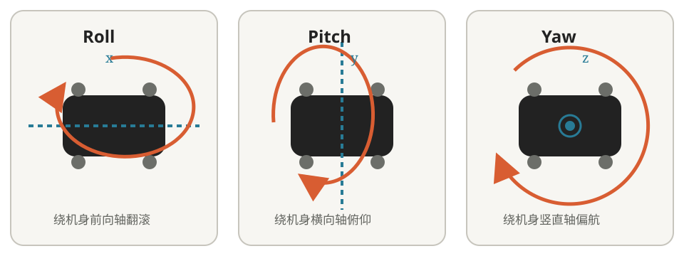
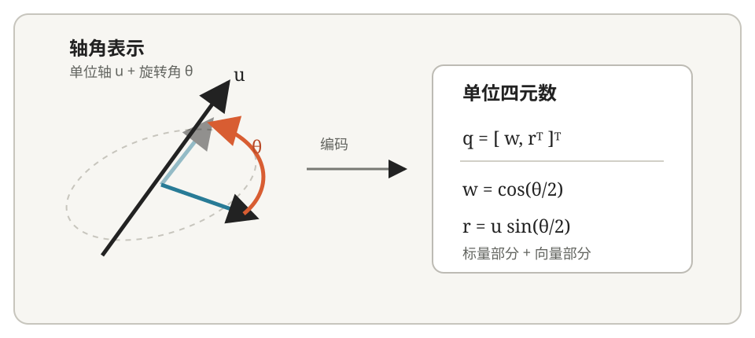

机器人软件处理的不只是“若干个数”，而是带有物理含义、单位、参考坐标系和时间戳的数据。关节位置、机身姿态、IMU 角速度和关节力矩看起来都可以存进数组，但它们描述的对象和使用方式完全不同。后续的运动控制、强化学习、状态估计、导航和机械臂控制都会反复使用这些量，因此在进入具体算法之前，需要先建立一套共同的表达方式。

## 1. 机器人状态

状态（State）是对系统当前情况的描述。程序要控制机器人，首先需要获得或估计与任务有关的状态。这里的“状态”不一定来自单个传感器，也不一定能够被直接测量。

对于一台四足机器人，最直观的是关节状态。一个旋转关节常用以下物理量描述：

| 物理量 | 常用符号 | 含义 |
| --- | --- | --- |
| 关节位置 | $q$ | 通常为关节角度，单位一般是 rad |
| 关节速度 | $\dot q$ | 关节角速度，单位一般是 rad/s |
| 关节力矩 | $\tau$ | 关节轴上的力矩，可能是测量值、估计值或指令值 |

必须注意数据来源。编码器通常直接提供电机轴或关节的位置，速度常由驱动器或软件根据位置变化估计；没有独立力矩传感器时，关节力矩可能根据电机电流、转矩常数、减速比和传动效率估算。电流与力矩可以建立近似关系，但“电流就是力矩”并不准确。

四足机器人关节驱动器中还常见一种复合控制接口，它同时接收目标位置 $q_d$、目标速度 $\dot q_d$、刚度 $K_p$、阻尼 $K_d$ 和前馈力矩 $\tau_{ff}$，并按照类似下面的关系计算力矩指令：

$$
\tau_d
=K_p(q_d-q)
+K_d(\dot q_d-\dot q)
+\tau_{ff}
$$

这类接口常被工程项目称为“MIT 模式”或“MIT 风格控制”。这个名称并不代表所有厂商都实现了同一套通信协议，参数范围、编码方式和保护逻辑仍应以具体驱动器文档为准。这里的 $K_p$、$K_d$ 以及各项目标值属于控制参数或控制指令，并不是机器人当前状态。关于具体电机接口，可以参考宇树 [M8010 电机开发指南](https://support.unitree.com/home/zh/Motor_SDK_Dev_Guide/about)，但实际使用前仍需核对所用型号的协议与安全限制。

只有关节状态还不足以描述整台机器人。四足机器人的机身可以在空间中自由运动，因此还经常需要知道：

- 机身位置；
- 机身姿态；
- 机身线速度；
- 机身角速度。

惯性测量单元（Inertial Measurement Unit，IMU）通常直接测量角速度和比力。静止时加速度计读数中也包含重力影响，因此它不能直接给出世界坐标系中的机身线加速度。部分 IMU 模块会在内部融合传感器数据并输出姿态，但机身姿态、位置和线速度通常仍属于估计量，而不是 IMU 的直接原始测量。足端接触也不一定由独立力传感器测得，可以根据关节状态、电机力矩或接触模型进行判断。

所以“机器人状态”通常不是一个固定的数据结构，而是根据任务选取的一组信息。一个基础运动控制器可能使用关节位置、关节速度、估计姿态和 IMU 角速度；一个强化学习策略的观测（Observation）还可能包含估计速度、投影重力方向、用户指令、上一时刻动作、足端接触或地形信息。Observation 是提供给策略的输入，不应与严格意义上的系统状态画等号：用户指令不是机器人状态，历史动作也可能只是为策略补充上下文。

机器人接口中还经常把相关空间量组合起来：位姿（Pose）由位置和姿态组成；速度旋量（Twist）由线速度和角速度组成；力旋量（Wrench）由力和力矩组成。它们都必须附带明确的参考坐标系。尤其是 Twist 中的线速度和角速度，只有在约定了表达坐标系和参考点之后，含义才完整。

### 状态和控制指令

还需要区分机器人当前的状态和我们希望机器人执行的指令。

例如，当前关节角度 $q$、当前关节速度 $\dot q$ 和当前估计力矩 $\hat\tau$ 描述机器人；目标关节角度 $q_d$、目标关节速度 $\dot q_d$ 和目标力矩 $\tau_d$ 则描述控制器希望执行器达到的结果。给估计量增加“帽子”并不是强制规范，但接口必须说明一个量究竟是测得、估计还是下发的。

控制器读取当前状态，根据目标计算下一步应该输出什么。

最基本的闭环过程是“传感器与驱动器反馈 → 状态处理或估计 → 控制器计算 → 执行器下发 → 机器人产生新的运动”。这一过程持续循环，而不是只执行一次。

后面的四足强化学习部署本质上也符合这个过程。策略读取 Observation，生成 Action；Action 被转换为关节目标或力矩；机器人运动以后产生新的状态，再构造下一帧 Observation。

## 2. 关节、自由度与执行器

关节（Joint）描述两个刚体之间允许的相对运动，自由度（Degree of Freedom，DoF）表示系统可以独立变化的运动维数，执行器（Actuator）负责驱动实际运动。这三个概念相关，但并不完全等价：一个关节可能具有一个或多个自由度，并非所有自由度都一定由独立电机直接驱动；传动、并联机构或耦合结构也会改变电机与关节之间的对应关系。

常见的 12 DoF 四足机器人通常每条腿具有三个受控转动自由度：髋部外展/内收、髋部屈伸和膝部屈伸。其运动链可以概括为“机身—髋部—大腿—膝部—小腿—足端”。不同项目对关节的英文缩写和正方向约定并不统一，阅读代码时应优先查看模型和接口定义。

> 图中标注的 `Calf` 关节附近没有直接安装电机，驱动电机位于腿的近端，并通过连杆向膝部传递运动和力矩。这类远置驱动或连杆传动设计可以降低小腿部分的质量和转动惯量，使腿更容易快速摆动。
>
> 代价是传动结构增加了轴承、转轴和连接件，可能引入间隙、摩擦和结构柔性，电机角度与关节角度之间也需要额外映射。是否构成严格的平行四边形机构以及具体传动关系，应以该机器人机械模型为准，不能仅根据外观判断。

12 DoF 只是在描述常见平台的受控关节。整台机器人在三维空间中的机身还可以发生三个方向的平移和三个方向的转动，这六个基座自由度没有相对于世界坐标系直接安装执行器，机身运动要通过关节驱动和足地接触间接产生。因此四足机器人属于浮动基座（Floating Base）系统，也属于欠驱动系统。描述整机广义位形时，常见的 12 个关节自由度之外还要考虑 6 个基座自由度；描述控制所需状态时，还要加入相应速度和接触信息。姿态若使用四元数存储会占用四个数，但它仍只表示三个旋转自由度，因为单位约束去掉了一个独立维度。

### 关于电机与关节

在简单结构中，可以把“一个电机”和“一个关节”近似看成一一对应，例如电机经过减速器直接驱动一个转动关节。

但实际机器人中不一定总是这样。并联机构可能由多个电机共同决定一个足端或关节的运动；机械传动也可能改变电机轴与关节轴之间的位置、速度和力矩关系。

所以软件设计中通常会区分电机状态（Motor State）与关节状态（Joint State）。对于结构简单的机器人，两者之间的转换可能主要涉及减速比、零位和正方向；复杂机构则需要额外的运动学映射。

## 3. 坐标系

位置、速度、加速度和力等空间量必须相对于某个参考坐标系表达。只说“机器人速度是 `1 m/s`”并不完整：它可能表示沿世界坐标系的 x 轴运动，也可能表示沿机身正前方运动。机器人转向后，这两个方向不再相同。

四足软件中常见的坐标系包括：

| 坐标系 | 用途 |
| --- | --- |
| World / Map | 描述机器人在全局环境中的位置与方向 |
| Odometry | 描述一段运行过程中的连续局部位姿，可能随时间累积漂移 |
| Base / Body | 固连在机身上的坐标系，用于表达机身相关状态和速度指令 |
| IMU | 固连在 IMU 安装位置和安装方向上的坐标系 |
| Leg / Joint | 与髋部、各连杆或关节关联的局部坐标系 |
| Foot | 与足端关联的坐标系或足端参考点 |
| Sensor | 相机、激光雷达等传感器自身的坐标系 |

坐标系的命名和轴方向由具体项目约定，不能仅凭名称猜测。接入一项数据时至少应确认：原点在哪里，三个轴分别指向哪里，量是在哪个坐标系中表达，是否需要转换，以及时间戳对应哪个时刻。

### 世界坐标系和机身坐标系

这两个坐标系尤其常用。

世界坐标系可以看作机器人运行环境中的固定参考系，例如约定 x 轴指向场地前方、y 轴指向场地左侧、z 轴竖直向上。机器人在场地中运动时，世界坐标系保持不变。

机身坐标系则固定在机器人身上，例如约定 x 轴指向机器人前方、y 轴指向机器人左侧、z 轴指向机器人上方。

机器人转动以后，机身坐标系也会跟着旋转。

假设机器人沿自身前方以 $1\ \mathrm{m/s}$ 运动，这个速度在机身坐标系中可以写成 $[1,0,0]^T$。如果机身相对世界坐标系已经绕 z 轴旋转 $90^\circ$，同一速度在世界坐标系中可能写成 $[0,1,0]^T$。两个数组描述的是同一个真实运动，只是采用了不同的坐标基。

## 4. 坐标变换

既然同一个物理量可以在不同坐标系中表达，就经常需要进行坐标变换。机器人中最常见的坐标变换包括两部分：

- **旋转**：两个坐标系的朝向不同；
- **平移**：两个坐标系的原点位置不同。

其中，同一参考点处的线速度、角速度等向量在同一时刻更换表达坐标系时通常只需要考虑旋转；一个点的位置还需要同时考虑旋转和平移。如果改变刚体上线速度所对应的参考点，还需要考虑角速度产生的附加项。本文采用右手坐标系和列向量，并约定 \({}^A\mathbf R_B\) 把在坐标系 (B) 中表达的向量转换为在坐标系 (A) 中的表达。其他资料可能采用不同记号，使用公式前应先核对约定。

### 4.1 从二维旋转开始

先考虑二维情况。假设坐标系 (B) 相对于坐标系 (W) 逆时针旋转了 $\theta$，那么 (B) 的两个单位基向量在 (W) 中可以表示为：
$$
\mathbf e_x^B =
\begin{bmatrix}
\cos\theta \\
\sin\theta
\end{bmatrix},
\qquad
\mathbf e_y^B =
\begin{bmatrix}
-\sin\theta \\
\cos\theta
\end{bmatrix}
$$
如果一个几何向量在 (B) 中的坐标为：
$$
\mathbf v_B =
\begin{bmatrix}
v_x \\
v_y
\end{bmatrix}
$$
它在 (W) 中可以写成两个基向量的线性组合：
$$
v_x\mathbf e_x^B
+
v_y\mathbf e_y^B
$$
代入两个基向量并整理：
$$
v_x
\begin{bmatrix}
\cos\theta \\
\sin\theta
\end{bmatrix}
+
v_y
\begin{bmatrix}
-\sin\theta \\
\cos\theta
\end{bmatrix}
=
\begin{bmatrix}
\cos\theta & -\sin\theta \\
\sin\theta & \cos\theta
\end{bmatrix}
\mathbf v_B
$$

因此，把上面的矩阵记为从 (B) 到 (W) 的旋转矩阵：
$$
{}^W\mathbf R_B =
\begin{bmatrix}
\cos\theta & -\sin\theta \\
\sin\theta & \cos\theta
\end{bmatrix}
$$

同一个向量在两个坐标系中的表示满足：
$$
\mathbf v_W = {}^W\mathbf R_B\mathbf v_B
$$

这里的记号中，上标 \(W\) 表示转换结果使用坐标系 (W) 表达，下标 \(B\) 表示输入原本使用坐标系 (B) 表达。因此${}^W\mathbf R_B$ 可以读作“将向量从 (B) 坐标系转换到 (W) 坐标系的旋转矩阵”。矩阵的两列，分别是 (B) 坐标系的 x 轴和 y 轴在 (W) 坐标系中的表达。

### 4.2 反方向的坐标变换

如果已知向量在世界坐标系中的表达 \(\mathbf v_W\)，希望求出它在机身坐标系中的表达 \(\mathbf v_B\)，就需要使用反方向的旋转：

$$
\mathbf v_B = ({}^W\mathbf R_B)^{-1}\mathbf v_W
$$

旋转矩阵是正交矩阵，因此它的逆矩阵等于转置矩阵：

$$
\mathbf R^{-1}=\mathbf R^T
$$

从 (W) 到 (B) 的旋转矩阵可以记为 \({}^B\mathbf R_W\)，并且满足：

$$
{}^B\mathbf R_W
= ({}^W\mathbf R_B)^{-1}
= ({}^W\mathbf R_B)^T
$$

于是，反方向的坐标变换可以写成：

$$
\mathbf v_B
= {}^B\mathbf R_W\mathbf v_W
= ({}^W\mathbf R_B)^T\mathbf v_W
$$

例如，已知期望速度在世界坐标系中的表达，而运动控制器需要机身坐标系下的速度指令，就可以根据机器人当前姿态进行上述变换。这里改变的是同一个几何向量的表达坐标系，并不是把机器人实际速度改成了另一个方向。

### 4.3 三维旋转

机器人实际工作在三维空间中，因此需要使用 \(3\times3\) 的旋转矩阵。采用右手定则定义正方向时，绕 x、y、z 轴主动旋转 \(\phi\)、\(\theta\)、\(\psi\) 的基本旋转矩阵通常写为：

$$
\mathbf R_x(\phi)=
\begin{bmatrix}
1 & 0 & 0 \\
0 & \cos\phi & -\sin\phi \\
0 & \sin\phi & \cos\phi
\end{bmatrix}
$$

$$
\mathbf R_y(\theta)=
\begin{bmatrix}
\cos\theta & 0 & \sin\theta \\
0 & 1 & 0 \\
-\sin\theta & 0 & \cos\theta
\end{bmatrix}
$$

$$
\mathbf R_z(\psi)=
\begin{bmatrix}
\cos\psi & -\sin\psi & 0 \\
\sin\psi & \cos\psi & 0 \\
0 & 0 & 1
\end{bmatrix}
$$

对于一个三维向量：

$$
\mathbf v_B=
\begin{bmatrix}
v_x \\
v_y \\
v_z
\end{bmatrix}
$$

从 (B) 到 (W) 以及反方向的坐标变换仍分别为：

$$
\mathbf v_W={}^W\mathbf R_B\mathbf v_B
$$

$$
\mathbf v_B=({}^W\mathbf R_B)^T\mathbf v_W
$$

三维旋转矩阵的乘法一般不能交换顺序：

$$
\mathbf R_x\mathbf R_y\ne\mathbf R_y\mathbf R_x
$$

因此，使用滚转角、俯仰角和偏航角（Roll、Pitch、Yaw）组合描述姿态时，必须同时明确旋转顺序，以及采用固定轴旋转还是随动轴旋转。不同资料还可能区分主动旋转与坐标变换，不能只根据三个角度值判断它们表示的姿态。

### 4.4 点的位置变换

同一参考点处的线速度、角速度等向量在不同坐标系中的分量只与坐标轴方向有关，因此在同一时刻转换表达坐标系时通常只需要旋转。空间中一个点的位置还与坐标系原点有关，所以必须同时考虑平移。

假设点 \(P\) 在机身坐标系 (B) 中的位置为 \({}^B\mathbf p_P\)，机身坐标系原点在世界坐标系 (W) 中的位置为 \({}^W\mathbf t_B\)，机身坐标系相对世界坐标系的旋转为 \({}^W\mathbf R_B\)，那么该点在世界坐标系中的位置为：

$$
{}^W\mathbf p_P
= {}^W\mathbf R_B\,{}^B\mathbf p_P
+ {}^W\mathbf t_B
$$

其中，\({}^W\mathbf R_B\,{}^B\mathbf p_P\) 负责改变坐标轴方向，\({}^W\mathbf t_B\) 是 (B) 的原点在 (W) 中的位置。这里给点的位置加上平移是合理的；自由向量没有固定起点，不能直接套用同一个加法。

### 4.5 齐次变换矩阵

机器人系统经常需要同时处理旋转和平移。为了把两种运算统一起来，可以把它们组合成一个 \(4\times4\) 的齐次变换矩阵（Homogeneous Transformation Matrix）：

$$
{}^W\mathbf T_B=
\begin{bmatrix}
{}^W\mathbf R_B & {}^W\mathbf t_B \\
\mathbf 0^T & 1
\end{bmatrix}
$$

同时，将三维点的位置写成四维齐次坐标：

$$
{}^B\tilde{\mathbf p}_P=
\begin{bmatrix}
{}^B\mathbf p_P \\
1
\end{bmatrix}
$$

点的位置变换就可以统一写成：

$$
{}^W\tilde{\mathbf p}_P
= {}^W\mathbf T_B\,{}^B\tilde{\mathbf p}_P
$$

展开后得到：

$$
{}^W\tilde{\mathbf p}_P=
\begin{bmatrix}
{}^W\mathbf R_B\,{}^B\mathbf p_P+{}^W\mathbf t_B \\
1
\end{bmatrix}
$$

齐次坐标最后一个分量取 1 时表示点，因此平移会生效；如果用最后一个分量为 0 的齐次形式表示自由向量，平移项不会产生影响。因此，机器人学中常见的 \(\mathbf T\) 矩阵并不是一种新的旋转表示，而是把旋转和平移放在同一个矩阵中，便于连续组合多个坐标变换。

### 4.6 多级坐标系变换

实际机器人通常同时维护多个坐标系。例如，移动机器人中常见的关系可以简化为：

~~~text
map
└── odom
    └── base_link
        ├── imu_link
        ├── lidar_link
        └── camera_link
~~~

假设已知从 LiDAR 坐标系到机身坐标系的变换 \({}^{Base}\mathbf T_{LiDAR}\)，以及从机身坐标系到地图坐标系的变换 \({}^{Map}\mathbf T_{Base}\)，那么从 LiDAR 坐标系到地图坐标系的变换为：

$$
{}^{Map}\mathbf T_{LiDAR}
= {}^{Map}\mathbf T_{Base}\,{}^{Base}\mathbf T_{LiDAR}
$$

如果 LiDAR 测得某个点在自身坐标系中的位置 \({}^{LiDAR}\tilde{\mathbf p}_P\)，那么该点在地图坐标系中的位置为：

$$
{}^{Map}\tilde{\mathbf p}_P
= {}^{Map}\mathbf T_{LiDAR}\,{}^{LiDAR}\tilde{\mathbf p}_P
$$

代入前面的组合关系可得：

$$
{}^{Map}\tilde{\mathbf p}_P
= {}^{Map}\mathbf T_{Base}\,
{}^{Base}\mathbf T_{LiDAR}\,
{}^{LiDAR}\tilde{\mathbf p}_P
$$

矩阵从右向左依次作用：先把点从 LiDAR 坐标系转换到机身坐标系，再从机身坐标系转换到地图坐标系。书写时，相邻的坐标系标记应当衔接，即 LiDAR、Base、Map 依次连接。ROS 2 的 tf2 系统所处理的核心问题之一，就是维护这类坐标系关系，并根据时间戳查询任意两个已连接坐标系之间的变换。

入门阶段至少需要熟悉下面三类关系：

$$
\mathbf v_A={}^A\mathbf R_B\mathbf v_B
$$

$$
{}^A\mathbf p_P
= {}^A\mathbf R_B\,{}^B\mathbf p_P
+ {}^A\mathbf t_B
$$

$$
{}^A\mathbf T_C
= {}^A\mathbf T_B\,{}^B\mathbf T_C
$$

它们分别对应自由向量的坐标表达变换、点的位置变换，以及多级刚体变换的组合。后续学习机器人运动学、IMU 状态估计、LiDAR 定位和 ROS 2 TF 时，都会反复用到这些关系。

## 5. 姿态的表示

位置可以用三个坐标表示，姿态描述的则是一个坐标系相对另一个坐标系的朝向。三维姿态具有三个自由度，但没有一种只用三个数、在所有姿态附近都连续且没有奇异性的全局表示。机器人软件中最常见的表示是欧拉角、旋转矩阵和四元数，它们描述的是同一个几何对象，各自适合不同场景。

| 表示 | 参数数量 | 主要特点 |
| --- | ---: | --- |
| 欧拉角 | 3 | 直观，适合显示；依赖旋转顺序并存在奇异性 |
| 旋转矩阵 | 9 | 便于变换向量；需要满足正交约束且包含冗余参数 |
| 单位四元数 | 4 | 计算紧凑、无欧拉角奇异性；具有单位约束和双重覆盖 |

### 5.1 Roll、Pitch、Yaw

滚转角（Roll，$\phi$）、俯仰角（Pitch，$\theta$）和偏航角（Yaw，$\psi$）可以粗略理解为左右翻滚、前后俯仰和水平转向。机器人上坡时俯仰角通常发生明显变化，左右倾斜主要体现在滚转角，在水平面内改变朝向则主要体现在偏航角。欧拉角便于人理解和调试，因此经常出现在日志和可视化中。

欧拉角必须连同旋转顺序一起定义。本文后续示例采用机器人软件中常见的 ZYX 表示，并定义对应旋转矩阵为：

$$
\mathbf R
=\mathbf R_z(\psi)\mathbf R_y(\theta)\mathbf R_x(\phi)
$$

矩阵从右向左作用。在常见术语中，同一关系可从不同视角称为绕固定轴依次进行的 XYZ 外旋，或绕随动轴依次进行的 ZYX 内旋。不同资料对“顺序”的命名视角并不统一，因此本文以明确写出的矩阵乘积为准，实际使用时也应优先核对公式和软件库文档。

对于 ZYX 表示，当 $\theta=\pm90^\circ$ 时，滚转和偏航所对应的旋转轴发生重合，两个角不能再被独立确定。这称为万向节死锁（Gimbal Lock）。机器人姿态本身没有失效，失效的是这一组欧拉角坐标：同一姿态可能对应多组角度，数值也可能在相邻时刻发生跳变。旋转矩阵和单位四元数不具有这种欧拉角奇异性，但这并不意味着它们没有约束或使用约定。

### 5.2 轴角表示

任何三维旋转都可以表示为：绕一条经过原点的单位轴

$$
\mathbf u=
\begin{bmatrix}
u_x\\u_y\\u_z
\end{bmatrix},
\qquad \lVert\mathbf u\rVert=1
$$

旋转角度 $\theta$。这称为轴角表示（Axis–Angle）。它为理解四元数提供了最直接的入口：四元数并不是把 Roll、Pitch、Yaw 填入四个槽位，而是以一种适合运算的形式编码旋转轴和旋转角。

### 5.3 从轴角到四元数

四元数扩展了复数，可以写成一个标量部分和一个三维向量部分：

$$
\mathbf q
=w+x\mathbf i+y\mathbf j+z\mathbf k
=\begin{bmatrix}w&\mathbf r^T\end{bmatrix}^T,
\qquad
\mathbf r=
\begin{bmatrix}x\\y\\z\end{bmatrix}
$$

其中虚数单位满足：

$$
\mathbf i^2=\mathbf j^2=\mathbf k^2=\mathbf i\mathbf j\mathbf k=-1
$$

并且乘法不可交换，例如 $\mathbf i\mathbf j=\mathbf k$，而 $\mathbf j\mathbf i=-\mathbf k$。将绕单位轴 $\mathbf u$ 旋转 $\theta$ 写成指数形式：

$$
\mathbf q
=\exp\left(\frac{\theta}{2}(u_x\mathbf i+u_y\mathbf j+u_z\mathbf k)\right)
$$

令 $\mathbf U=u_x\mathbf i+u_y\mathbf j+u_z\mathbf k$。由于 $\lVert\mathbf u\rVert=1$，可以得到 $\mathbf U^2=-1$。把指数函数展开为幂级数，并将偶数次幂和奇数次幂分别合并：

$$
\begin{aligned}
\exp(\alpha\mathbf U)
&=1+\alpha\mathbf U+\frac{(\alpha\mathbf U)^2}{2!}
+\frac{(\alpha\mathbf U)^3}{3!}+\cdots\\
&=\left(1-\frac{\alpha^2}{2!}+\frac{\alpha^4}{4!}-\cdots\right)
+\mathbf U\left(\alpha-\frac{\alpha^3}{3!}+\frac{\alpha^5}{5!}-\cdots\right)\\
&=\cos\alpha+\mathbf U\sin\alpha
\end{aligned}
$$

取 $\alpha=\theta/2$，就得到轴角对应的单位四元数：

$$
\boxed{
\mathbf q=
\begin{bmatrix}
w\\x\\y\\z
\end{bmatrix}
=
\begin{bmatrix}
\cos(\theta/2)\\
u_x\sin(\theta/2)\\
u_y\sin(\theta/2)\\
u_z\sin(\theta/2)
\end{bmatrix}}
$$

这里出现半角并不是人为规定，而是四元数旋转采用“左乘一次、右乘一次逆元”的结构。使用半角后，最终作用在三维向量上的几何旋转角恰好是 $\theta$。

上述四元数的模长为：

$$
\lVert\mathbf q\rVert^2
=\cos^2\frac{\theta}{2}
+\sin^2\frac{\theta}{2}\lVert\mathbf u\rVert^2
=1
$$

因此表示纯旋转时使用单位四元数。对于单位四元数，它的逆等于共轭：

$$
\mathbf q^{-1}=\mathbf q^*
=\begin{bmatrix}w&-x&-y&-z\end{bmatrix}^T
$$

同时，$\mathbf q$ 与 $-\mathbf q$ 表示同一个三维姿态，因为它们对向量产生完全相同的旋转。这种现象称为双重覆盖。程序比较两个姿态时，不能只逐元素判断四元数是否相等；连续记录姿态时，也可能需要统一符号，避免数值在 $\mathbf q$ 与 $-\mathbf q$ 之间跳变。

### 5.4 使用四元数旋转向量

为了用四元数旋转三维向量 $\mathbf v$，先把它写成标量部分为零的纯四元数：

$$
\mathbf v_q=0+v_x\mathbf i+v_y\mathbf j+v_z\mathbf k
$$

采用本文约定的主动旋转时，旋转后的向量由下式给出：

$$
\mathbf v_q'=\mathbf q\,\mathbf v_q\,\mathbf q^{-1}
$$

结果的标量部分仍为零，向量部分就是旋转后的三维坐标。将乘法展开可以得到罗德里格斯旋转公式：

$$
\mathbf v'
=\mathbf v\cos\theta
+(\mathbf u\times\mathbf v)\sin\theta
+\mathbf u(\mathbf u^T\mathbf v)(1-\cos\theta)
$$

这说明轴角、单位四元数和旋转矩阵最终描述的是同一个旋转。工程代码通常直接调用经过验证的库函数，不需要手写上述乘法，但必须检查库采用的是左乘还是右乘、主动旋转还是坐标变换，以及四元数分量顺序。

### 5.5 欧拉角与四元数的转换

按照本节采用的 ZYX 约定，令

$$
c_\phi=\cos\frac{\phi}{2},\quad s_\phi=\sin\frac{\phi}{2},\qquad
c_\theta=\cos\frac{\theta}{2},\quad s_\theta=\sin\frac{\theta}{2},\qquad
c_\psi=\cos\frac{\psi}{2},\quad s_\psi=\sin\frac{\psi}{2}
$$

对应的标量优先四元数 $\mathbf q=[w,x,y,z]^T$ 为：

$$
\begin{aligned}
w&=c_\psi c_\theta c_\phi+s_\psi s_\theta s_\phi,\\
x&=c_\psi c_\theta s_\phi-s_\psi s_\theta c_\phi,\\
y&=c_\psi s_\theta c_\phi+s_\psi c_\theta s_\phi,\\
z&=s_\psi c_\theta c_\phi-c_\psi s_\theta s_\phi.
\end{aligned}
$$

这些公式只适用于前面明确的轴、顺序和乘法约定。ROS 2 消息 `geometry_msgs/Quaternion` 的字段顺序是 `x, y, z, w`，而不少数学库或论文使用 `w, x, y, z`；数组顺序不同并不表示数学定义不同。看到 `quat_rotate`、`quat_apply` 或 `quat_rotate_inverse` 等函数时，不能只凭名称判断结果，应检查其输入顺序和旋转方向。

## 6. 机器人软件中的数据约定

机器人项目中许多难以排查的问题并非来自算法，而是来自接口双方对数据含义的不同理解。例如一端输出 rad，另一端按 degree 处理；仿真与实机采用不同的关节排列；四元数一端使用 `xyzw`，另一端使用 `wxyz`。程序可能仍能编译和运行，但机器人行为会明显异常，甚至触发安全风险。

一个机器人数据接口至少应明确以下信息：

| 项目 | 需要回答的问题 |
| --- | --- |
| 物理含义 | 是测量值、估计值、目标值还是控制器内部量？ |
| 数组顺序 | 腿和关节按照什么顺序排列？ |
| 单位 | 使用 m、rad、s、N、N·m，还是其他单位？ |
| 坐标系 | 数据在哪个坐标系中表达，参考点在哪里？ |
| 正方向 | 坐标轴、关节角和电机转动的正方向如何定义？ |
| 时间 | 数据对应哪个时刻，更新频率和有效期限是多少？ |
| 有效性 | 数据是否已初始化，是否超时，估计器是否处于可靠状态？ |

国际单位制（SI）是机器人软件中常见且推荐的内部约定，但硬件协议、标定工具和厂商接口未必全部采用 SI，接入时仍需显式转换。接口定义越清楚，模块之间越不容易依赖隐含假设。

## 7. URDF 与机器人结构描述

在 ROS、Gazebo、Isaac Gym、Isaac Lab 等机器人软件中，经常会看到 URDF。

统一机器人描述格式（Unified Robot Description Format，URDF）用来描述机器人由哪些连杆（Link）和关节（Joint）组成，以及它们之间的连接关系。例如一条腿可以形成 `base_link → hip_joint → thigh_link → knee_joint → calf_link` 的运动链。

其中，Link 对应模型中的刚体，Joint 描述父子连杆之间允许怎样运动。URDF 还可以记录关节轴与限位、质量与惯量、碰撞几何和可视化模型等信息。传感器相对机身的安装位置也常通过固定关节写入模型，这种关系称为外参（Extrinsic Parameters）。

URDF 给出的是结构和名义参数，并不会自动产生机器人的实时状态。对于可动关节，系统仍需结合当前关节位置计算各连杆之间的变换；定位或状态估计模块也需要提供世界、里程计和机身坐标系之间的运行时关系。进入仿真和 ROS 2 后，URDF 将成为连接机械结构、关节状态、TF、可视化与动力学参数的重要文件。

## 8. 小结

一台四足机器人可以看作浮动机身、关节与执行器、IMU 和编码器等传感器组成的系统。软件持续读取测量数据、估计不能直接测得的状态，并根据任务生成关节位置、速度或力矩等控制指令。12 个受控关节自由度不等于整机只有 12 个状态量，传感器输出也不等于控制器所需的全部状态。

位置、速度、姿态、力和力矩等空间量必须明确参考坐标系。旋转矩阵和四元数可以描述坐标系之间的朝向关系，齐次变换进一步加入原点偏移；多个变换按照坐标系链依次相乘。欧拉角直观但依赖顺序并存在奇异性，单位四元数适合运算，但要注意归一化、分量顺序、旋转方向以及 $\mathbf q$ 与 $-\mathbf q$ 的等价性。

后续代码中会不断出现 `q`、`dq`、`base_quat`、`base_lin_vel`、`joint_states`、`base_link` 和 `imu_link` 等名称。阅读这些数据时，应主动确认它描述什么、来自测量还是估计、使用什么单位、在哪个坐标系中表达、对应哪个时刻。具备这套检查习惯，才算真正建立了继续学习机器人软件所需的共同语言。
