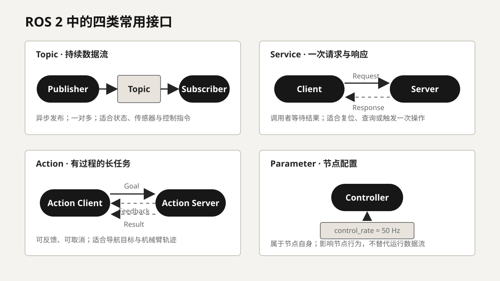
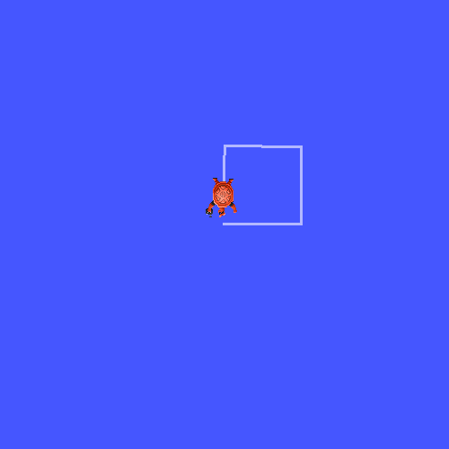
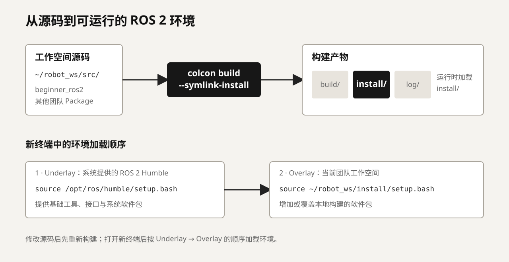
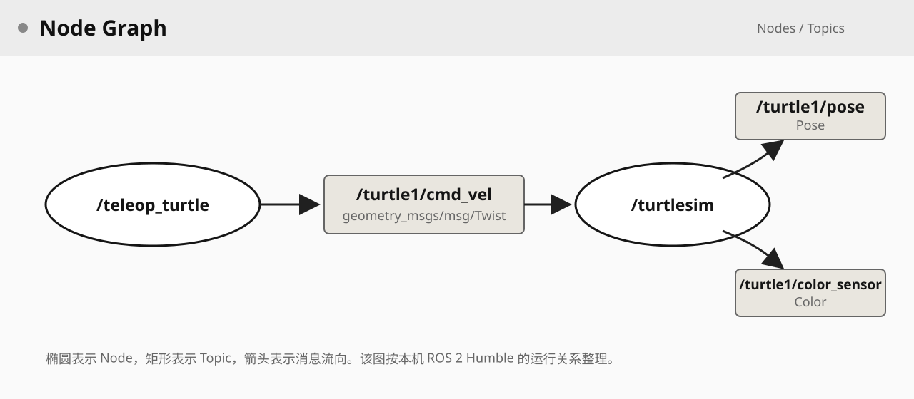

ROS 2（Robot Operating System 2）是一套用于组织机器人软件的开源框架和工具。它提供进程间通信、接口定义、软件包组织、系统启动、参数配置、日志、数据录制和可视化等能力，使传感器驱动、状态估计、运动控制、定位和上层任务能够按照约定交换数据。ROS 2 不是传统意义上的操作系统，也不是某一种机器人算法；它更接近机器人软件的公共基础设施。

四足组学习 ROS 2，是因为许多传感器驱动、定位导航工具和开源机器人项目都采用它。具体项目是否让高频关节控制、策略推理和全部硬件通信都经过 ROS 2，仍要根据实时性、计算平台和现有架构决定。本篇用同一个 Turtlesim 示例贯穿安装验证、节点运行、通信检查、参数修改、工作空间构建、程序编写和数据记录。完成全文以后，读者至少应能独立启动一个已有 ROS 2 项目，沿着数据流找到问题，并建立一个可以被其他节点使用的简单软件包。

## 1. 安装并验证统一环境

### 1.1 四足组使用的版本

ROS 2 会定期发布发行版（Distribution），不同发行版支持的操作系统、软件包版本和维护周期并不相同。**四足组当前统一使用 Ubuntu 22.04 LTS 与 ROS 2 Humble。** 新成员的学习环境、开发环境和运行团队项目的计算机都应采用这一组合。即使其他发行版更新，也不要自行把团队项目切换到新版本；ROS 2 发行版并不是一个可以随意替换的普通应用版本，升级可能影响依赖包、消息接口、构建工具和已有代码。

安装前先确认操作系统和处理器架构：

```bash
lsb_release -a
uname -m
```

第一条命令应显示 Ubuntu 22.04，常见个人计算机的第二条输出为 `x86_64`，部分机器人算力平台则可能是 `aarch64`。初学阶段优先使用原生 Ubuntu。虚拟机或 WSL 可以完成大部分基础练习，但 USB/CAN 设备、局域网发现和图形性能可能受到限制。

### 1.2 使用鱼香 ROS 一键安装

国内网络环境下，推荐新人使用鱼香 ROS 的一键安装工具。它会识别 Ubuntu 版本、配置软件源并安装 ROS，也提供 rosdep、Docker 和环境配置等辅助功能。当前官方入口给出的命令是：

```bash
source <(wget -qO- http://fishros.com/install)
```

运行后选择“一键安装 ROS”，然后选择 **ROS 2 Humble 桌面版**。桌面版包含 RViz 2、Turtlesim 和常用图形工具，更适合第一次学习。安装脚本可能调整 APT 软件源并安装系统软件，因此应认真阅读终端中的每一步选择；不要在一台已经稳定运行的机器人计算机上未经确认直接换源或重装。

一键安装工具的说明和源码可以在[鱼香 ROS 官网](https://fishros.com/page/)与[安装工具仓库](https://github.com/fishros/install)查看。安装失败时，应保存完整终端输出、Ubuntu 版本和所选安装项，再到[鱼香 ROS 社区](https://fishros.org.cn/forum/)检索相同问题。如果需要手动控制软件源和安装内容，可以按照 [ROS 2 Humble 官方 Ubuntu 安装文档](https://docs.ros.org/en/humble/Installation/Ubuntu-Install-Debs.html)操作，不要从来源不明的旧文章复制软件源配置。

### 1.3 加载环境并验证安装

安装完成不代表任意终端都能立即找到 ROS 2。每次新建终端后，都要把 Humble 的路径、接口和工具加入当前 shell 环境：

```bash
source /opt/ros/humble/setup.bash
```

> 一般来说，使用鱼香 ROS 一键安装时，安装工具会帮你将 `source /opt/ros/humble/setup.bash` 写入 bashrc ，以后新建终端时会自动运行，无须再手动输入。

随后检查发行版和命令是否正确：

```bash
echo $ROS_DISTRO
ros2 --help
```

前者应输出 `humble`，后者应显示 `ros2` 的子命令列表。如果出现 `ros2: command not found`，先确认 `/opt/ros/humble/setup.bash` 是否存在并重新执行 `source`，不要一开始就重装系统。`source` 只影响当前终端；在另一个新终端中仍需重新执行，这是后面多终端练习中最常见的疏漏。

可以用官方示例验证本机进程间通信。新开两个终端并分别加载 Humble 环境，在终端 A 运行发布者：

```bash
ros2 run demo_nodes_cpp talker
```

在终端 B 运行订阅者：

```bash
ros2 run demo_nodes_py listener
```

`ros2 run` 后面的两个参数分别是软件包名和可执行程序名。Talker 持续发布文本，Listener 接收并打印相同内容。这一步同时验证了软件包查找、节点启动、接口类型和本机通信。如果 Talker 正常运行而 Listener 一直没有输出，问题就不再是“ROS 2 是否安装”，而应转向检查两个终端是否加载了同一环境、节点是否发现彼此以及通信配置是否一致。

## 2. ROS 2 中的程序与通信

在继续操作之前，需要先建立一个基本认识：ROS 2 系统不是一个包含全部功能的大程序，而是由若干相互协作的软件模块组成。每个模块负责一项相对明确的工作，例如读取 IMU、估计机器人状态、运行运动控制策略或记录日志；模块之间不直接依赖彼此的内部代码，而是通过事先约定的接口交换数据。ROS 2 提供的主要能力，就是让这些模块能够被组织、发现、连接和调试。

### 2.1 Node 与 ROS Graph

节点（Node）是 ROS 2 运行时的基本参与者。一个节点通常承担一类明确职责，例如 `imu_driver` 读取传感器，`state_estimator` 计算机器人状态，`controller` 生成控制指令。节点是逻辑概念，不等同于操作系统进程：一个进程可以只包含一个节点，也可以同时承载多个节点；节点还可以分布在不同计算机上，只要通信环境允许，它们仍能组成同一个系统。

所有正在运行的节点以及它们之间的接口关系共同构成 ROS 图（ROS Graph）。节点启动后会参与自动发现，找到能够与自己通信的其他节点。在 Turtlesim 示例中，后面会看到一条很基本的数据路径：`/teleop_turtle` 把按键转换为速度消息，`/turtlesim` 接收消息并更新仿真，中间的 `/turtle1/cmd_vel` 是双方约定的数据通道。两个节点不需要调用对方的函数，也不需要知道对方使用 Python 还是 C++。这种接口隔离使传感器、控制器和仿真能够分别开发和替换。

ROS 图描述的是当前正在运行的系统，而不是源码目录。某个软件包存在于硬盘中，并不表示它的节点已经启动；某个 Topic 写在源代码里，也不表示当前一定有发布者和订阅者。后面使用 `ros2 node list`、`ros2 node info` 和 `rqt_graph`，就是在观察这个运行时结构。

### 2.2 Topic、Publisher、Subscriber 与 Message

话题（Topic）用于传输持续产生的数据流，是机器人系统中最常见的通信方式。节点可以作为发布者（Publisher）向一个 Topic 发送消息，也可以作为订阅者（Subscriber）接收该 Topic 上的消息。发布者不需要知道有多少订阅者，订阅者也不需要知道数据由哪个具体程序计算，因此一份 IMU 或关节状态可以同时提供给状态估计、控制器、可视化和日志模块。

Topic 是有名称和类型约束的数据通道，不是一个可以随意存放任意内容的全局变量。每一条 Topic 都使用确定的消息（Message）类型，消息定义规定字段名称和数据类型。例如 Turtlesim 的 `/turtle1/cmd_vel` 使用 `geometry_msgs/msg/Twist`，其中包含三维线速度和角速度；真实移动机器人也经常使用相同类型表达期望运动。发布者和订阅者只有在 Topic 名称、Message 类型以及通信策略兼容时，才能建立有效连接。

发布—订阅通常是异步的。发布者发出消息后不会像普通函数调用那样等待所有订阅者处理完毕，慢速订阅者也可能只处理队列中保留下来的部分消息。消息是否可靠传输、队列保留多少数据以及新订阅者能否取得旧数据，由服务质量（Quality of Service，QoS）等配置决定。本章暂不展开 QoS 策略，但需要先避免两个误解：Topic 不负责永久保存历史数据，也不保证每个订阅者在任何条件下都收到每一条消息。

### 2.3 Service 与 Action

服务（Service）采用请求—响应方式。客户端（Client）发送一份请求，服务端（Server）处理后返回一份响应，适合较快完成且需要明确结果的一次性操作，例如创建对象、复位模块、查询状态或触发一次标定。Service 与普通函数调用在使用感受上相似，但调用可能跨越进程或计算机，因此仍会受到节点状态、通信和超时的影响。持续的传感器数据和高频控制指令不适合用 Service 传输，否则每个周期都要等待一次请求与响应。

动作（Action）用于处理持续时间较长的任务。Action Client 发送目标（Goal）后，Action Server 可以持续返回反馈（Feedback），任务结束时再给出结果（Result）；客户端还可以在执行过程中取消目标。导航到指定位置、执行机械臂轨迹和完成一个预设动作都可能使用 Action，因为上层不仅关心最终成功或失败，也关心任务是否被接受、当前进度以及能否中途停止。

Service 和 Action 都带有“请求某项功能”的含义，但二者的时间尺度不同。能够立即完成并只需一次结果的操作通常使用 Service；需要持续执行、反馈和取消能力的任务通常使用 Action。后面的 Turtlesim 实践会分别创建一只新海龟和执行一次指定角度旋转，让这个区别直接体现在操作结果中。

### 2.4 Parameter、Package、Workspace 与 Launch

参数（Parameter）是节点自身的配置项，例如控制频率、阈值、算法模式或背景颜色。Parameter 不等同于 Topic：Topic 用于模块之间持续交换运行数据，Parameter 用于影响某个节点怎样工作。参数可以来自默认值、命令行、YAML 文件或 Launch 文件；有些节点允许运行时修改，有些参数只在启动时读取。因此“参数设置成功”只表示节点接受了新值，是否立即影响行为还要看节点的实现。

软件包（Package）是 ROS 2 源码、依赖和资源的基本组织单位，可以包含节点、接口、配置、Launch 文件与机器人模型。工作空间（Workspace）则是用于统一存放和构建若干软件包的目录。系统安装的 Humble 提供基础软件包，团队工作空间在此基础上增加自己的驱动、控制和任务代码。Launch 用于把多个节点、参数和接口配置组合成一次可重复的系统启动，而不是要求开发者分别打开许多终端手工运行。

这些概念可以按下面的方式区分：

| 概念 | 主要作用 | 典型例子 |
| --- | --- | --- |
| Node | 承担一项运行时功能 | IMU 驱动、状态估计、控制器 |
| Topic + Message | 持续、异步地传输数据流 | 关节状态、IMU、速度指令 |
| Service | 完成一次请求并返回响应 | 复位、查询、触发标定 |
| Action | 执行可反馈、可取消的较长任务 | 导航目标、机械臂轨迹 |
| Parameter | 配置一个节点的行为 | 频率、阈值、算法选项 |
| Package | 组织源码、依赖和资源 | 一个驱动包或控制包 |
| Workspace | 一起开发和构建多个 Package | 团队机器人工作空间 |
| Launch | 按配置启动一组节点 | 启动整机软件系统 |



接下来会通过一个完整系统观察它们怎样配合：节点通过 Topic 交换状态与指令，通过 Service 和 Action 提供功能，通过 Parameter 改变行为，最后由 Workspace 和 Launch 组织成可以重复构建与启动的项目。

## 3. 运行第一个完整系统

Talker 和 Listener 证明通信能够工作，但它们还不像一个机器人系统。下面使用 Turtlesim 建立一个包含被控对象、状态反馈和控制输入的最小闭环。若系统找不到该软件包，先执行：

```bash
sudo apt update
sudo apt install ros-humble-turtlesim
```

在终端 A 中加载环境并启动仿真节点：

```bash
source /opt/ros/humble/setup.bash
ros2 run turtlesim turtlesim_node
```

这条命令启动了软件包 `turtlesim` 中的可执行程序 `turtlesim_node`。新出现的蓝色窗口是节点对外显示的界面，真正值得关注的是后台已经建立的接口：节点接收运动指令，更新海龟状态，再把位姿发布给其他节点。

在终端 B 中启动键盘控制节点：

```bash
source /opt/ros/humble/setup.bash
ros2 run turtlesim turtle_teleop_key
```

保持终端 B 获得键盘焦点并按方向键，海龟会随之移动。此时系统中已经存在两个职责不同的节点：`/teleop_turtle` 把按键解释为速度指令，`/turtlesim` 接收指令并更新仿真。控制节点不需要知道仿真的内部实现，仿真节点也不需要知道指令来自键盘、自动程序还是网络，只要双方同意 Topic 名称与 Message 类型即可。

另开终端 C，加载环境后查看当前节点：

```bash
ros2 node list
```

在没有启动其他 ROS 2 工具时，主要输出应为：

```text
/teleop_turtle
/turtlesim
```

继续查看仿真节点的接口：

```bash
ros2 node info /turtlesim
```

输出会列出该节点订阅、发布、提供和调用的接口。第一次进入真实项目时，应先用 `node list` 建立模块清单，再用 `node info` 找到数据入口和出口，而不是立即在整个代码仓库中搜索函数。ROS 图（ROS Graph）就是当前所有节点及其接口构成的运行时网络；源代码告诉我们程序可能做什么，ROS 图告诉我们此刻实际启动了什么。

为了展示本机 Humble 的实际运行结果，下面画面由 `turtlesim_node` 与自带的 `draw_square` 节点共同产生：

```bash
ros2 run turtlesim draw_square
```



`draw_square` 并没有进入仿真程序内部修改海龟位置，而是向 `/turtle1/cmd_vel` 发布运动指令，并从 `/turtle1/pose` 取得状态反馈。这与真实机器人中控制模块根据反馈持续产生指令的关系类似，只是被控对象从机器人换成了二维仿真。

## 4. 沿着 Topic 读取和修改数据

### 4.1 找到指令与状态

执行下面的命令可以同时查看 Topic 名称和消息类型：

```bash
ros2 topic list -t
```

Turtlesim 中最重要的两条数据是：

```text
/turtle1/cmd_vel [geometry_msgs/msg/Twist]
/turtle1/pose [turtlesim/msg/Pose]
```

`/turtle1/cmd_vel` 是控制输入，使用 `geometry_msgs/msg/Twist` 表达线速度和角速度；`/turtle1/pose` 是状态输出，使用 `turtlesim/msg/Pose` 表达位置、朝向及当前速度。命名习惯不是 ROS 2 强制规定，但 `cmd_vel`、`joint_states`、`imu/data` 等名称在机器人项目中很常见。

查看控制 Topic 两端的连接关系：

```bash
ros2 topic info /turtle1/cmd_vel
```

当键盘控制节点已经发送过指令时，本机示例的输出为：

```text
Type: geometry_msgs/msg/Twist
Publisher count: 1
Subscription count: 1
```

一个发布者是 `/teleop_turtle`，一个订阅者是 `/turtlesim`。如果 Publisher count 为 0，说明当前没有模块产生指令；如果 Subscription count 为 0，说明指令虽然在发布，却没有模块接收。使用 `ros2 topic info /turtle1/cmd_vel -v` 还能看到节点名、命名空间和 QoS 等更详细的信息。

接下来查看位姿消息包含哪些字段：

```bash
ros2 interface show turtlesim/msg/Pose
```

Humble 中的接口定义为：

```text
float32 x
float32 y
float32 theta
float32 linear_velocity
float32 angular_velocity
```

接口只规定字段及数据类型。`x` 和 `y` 的坐标系、`theta` 的正方向与单位仍需要结合软件包文档理解；换成四足机器人后，关节顺序、速度所在坐标系和时间戳更不能只靠变量名猜测。这正是上一节《机器人状态、关节与坐标系》所建立的接口意识。

### 4.2 观察数据内容和频率

让海龟保持移动，并在终端 C 中执行：

```bash
ros2 topic echo /turtle1/pose
```

终端会持续打印消息。按 `Ctrl+C` 只是停止当前查看命令，不会关闭仿真节点。随后检查消息到达频率：

```bash
ros2 topic hz /turtle1/pose
```

`echo` 用于确认数值是否更新、字段是否合理，`hz` 用于估计接收频率。面对“程序没有反应”时，先观察输入 Topic 是否有数据，再观察输出 Topic 是否变化，通常比一开始单步调试整个程序更有效。需要注意，`hz` 测得的是当前订阅端实际收到的频率，不一定等于发布者内部定时器的理论频率；系统负载、网络、QoS 和测量窗口都会影响结果。

### 4.3 从命令行直接发布控制指令

停止键盘控制节点，避免两个发布者同时控制海龟。然后用命令行持续发布一条线速度和角速度指令：

```bash
ros2 topic pub --rate 10 \
  /turtle1/cmd_vel \
  geometry_msgs/msg/Twist \
  "{linear: {x: 1.0}, angular: {z: 0.5}}"
```

海龟会沿圆弧运动。这里 `--rate 10` 表示每秒发布 10 次；`linear.x` 是向前速度，`angular.z` 是绕平面法向轴的角速度。按 `Ctrl+C` 停止发布后，可以把 `angular.z` 改为 `0.0` 观察直线运动，也可以把 `linear.x` 改为 `0.0` 观察原地旋转。

这条命令完整展示了一个 ROS 2 发布行为所需的三项信息：Topic 名称、Message 类型和具体数据。实际项目中的控制器也是在构造类似的消息，只是指令来自算法而非手工输入。对真实机器人发送测试指令时不能照搬这些数值，必须先确认单位、限幅、安全状态和紧急停止方式。

## 5. 操作 Service、Action 与 Parameter

Topic 适合持续数据流，但机器人系统还需要一次性操作和较长任务。ROS 2 因此提供 Service（服务）、Action（动作）和 Parameter（参数）。仍然使用正在运行的 Turtlesim，可以直接观察三者与 Topic 的区别。

### 5.1 使用 Service 完成一次操作

列出服务及其类型：

```bash
ros2 service list -t
```

其中会出现：

```text
/clear [std_srvs/srv/Empty]
/reset [std_srvs/srv/Empty]
/spawn [turtlesim/srv/Spawn]
/turtle1/set_pen [turtlesim/srv/SetPen]
```

先查看 `/spawn` 的请求和响应字段：

```bash
ros2 interface show turtlesim/srv/Spawn
```

再发出一次请求，创建第二只海龟：

```bash
ros2 service call /spawn turtlesim/srv/Spawn \
  "{x: 2.0, y: 2.0, theta: 0.0, name: 'turtle2'}"
```

请求完成后，终端会显示响应中的名称，窗口中出现 `turtle2`，并新增 `/turtle2/pose`、`/turtle2/cmd_vel` 等接口。Service 的调用者会等待这一次请求的结果，它适合创建对象、复位模块或查询配置，不适合替代几十赫兹持续发布的控制 Topic。

### 5.2 使用 Action 观察任务反馈

Action 适合执行需要一段时间、能够反馈进度并允许取消的任务。查看 Turtlesim 提供的 Action：

```bash
ros2 action list -t
ros2 interface show turtlesim/action/RotateAbsolute
```

向 `turtle1` 发送转到约 90° 的目标：

```bash
ros2 action send_goal \
  /turtle1/rotate_absolute \
  turtlesim/action/RotateAbsolute \
  "{theta: 1.57}" \
  --feedback
```

终端会先显示目标是否被接受，再持续输出剩余角度，最后给出执行结果。导航到目标点或执行机械臂轨迹通常也属于这类问题：上层需要知道任务是否接受、进行到什么程度、最终是否成功，并且可能在中途取消。入门阶段不必编写 Action Server，但应能从接口行为判断某项功能为什么没有使用普通 Topic 或 Service。

### 5.3 修改 Parameter 并让配置生效

Parameter 用于配置节点行为，而不是传输连续状态。查看仿真节点的参数：

```bash
ros2 param list /turtlesim
ros2 param get /turtlesim background_r
```

修改背景颜色并清除已有轨迹：

```bash
ros2 param set /turtlesim background_r 30
ros2 param set /turtlesim background_g 30
ros2 param set /turtlesim background_b 30
ros2 service call /clear std_srvs/srv/Empty "{}"
```

参数修改和画面刷新是两件事：前面三条命令改变配置，最后的 Service 让仿真重新绘制背景。实际项目中，有些参数可以在运行时更新，有些只在节点启动时读取，还有些参数更新后需要模块主动重置才能生效。看到 `Set parameter successful` 只能说明节点接受了参数，不能代替对实际行为的检查。

经过这一组操作，可以把四类接口区分开：Topic 传输持续变化的速度和位姿，Service 创建或复位对象，Action 执行有过程的旋转任务，Parameter 保存节点配置。选择接口时先判断数据的交互方式，而不是只考虑“哪一种写起来方便”。

## 6. 建立工作空间并编写第一个节点

前面的命令使用系统已经安装好的软件包。真正参与项目时，团队代码会位于自己的工作空间中。下面建立一个 Python 软件包，让节点周期性发布 `/turtle1/cmd_vel`，从而把“命令行测试”改成可构建、可复用的程序。

### 6.1 创建工作空间和软件包

打开新终端并加载 Humble，然后建立目录：

```bash
source /opt/ros/humble/setup.bash
mkdir -p ~/robot_ws/src
cd ~/robot_ws/src
```

创建名为 `beginner_ros2` 的 Python 软件包，同时声明 `rclpy` 和 `geometry_msgs` 依赖：

```bash
ros2 pkg create \
  --build-type ament_python \
  --license Apache-2.0 \
  --dependencies rclpy geometry_msgs \
  --node-name turtle_velocity \
  beginner_ros2
```

生成结果中，`package.xml` 记录包名、依赖和维护信息，`setup.py` 负责 Python 包安装及可执行入口，`beginner_ros2/turtle_velocity.py` 是节点源码。软件包不是随意放置源码的文件夹，而是 ROS 2 构建与查找程序的基本单位。

将 `~/robot_ws/src/beginner_ros2/beginner_ros2/turtle_velocity.py` 修改为：

```python
import rclpy
from geometry_msgs.msg import Twist
from rclpy.node import Node


class TurtleVelocity(Node):
    def __init__(self):
        super().__init__('turtle_velocity')
        self.publisher = self.create_publisher(
            Twist,
            '/turtle1/cmd_vel',
            10,
        )
        self.timer = self.create_timer(0.1, self.publish_command)

    def publish_command(self):
        command = Twist()
        command.linear.x = 1.0
        command.angular.z = 0.5
        self.publisher.publish(command)


def main(args=None):
    rclpy.init(args=args)
    node = TurtleVelocity()
    try:
        rclpy.spin(node)
    except KeyboardInterrupt:
        pass
    finally:
        node.destroy_node()
        rclpy.shutdown()


if __name__ == '__main__':
    main()
```

`TurtleVelocity` 继承 ROS 2 的 `Node`。`create_publisher` 声明该节点会向 `/turtle1/cmd_vel` 发布 `Twist`，队列深度暂设为 10；`create_timer(0.1, ...)` 每 0.1 秒调用一次发布函数，也就是约 10 Hz。`rclpy.spin` 让节点持续处理定时器和其他回调，直到按下 `Ctrl+C`。这里的数值只适用于 Turtlesim 示例，真正控制机器人时还需要处理指令有效期、限幅、停止指令和异常退出。

### 6.2 构建并加载 Overlay

回到工作空间根目录，先安装软件包声明过但系统中缺少的依赖，再构建目标包：

```bash
cd ~/robot_ws
rosdep install --from-paths src --ignore-src -r -y
colcon build --symlink-install --packages-select beginner_ros2
```

构建完成后会出现 `build/`、`install/` 和 `log/`。`src/` 保存源码，`build/` 保存中间文件，`install/` 保存可执行结果与环境脚本，`log/` 保存构建日志。`--symlink-install` 会对部分 Python 文件建立符号链接，修改源码后调试更方便；接口定义、入口和依赖发生变化时仍应重新构建。

当前终端只加载了 `/opt/ros/humble`，还不知道刚构建的软件包，因此需要继续加载本地工作空间：

```bash
source install/setup.bash
ros2 pkg executables beginner_ros2
```

Humble 的系统安装称为 Underlay，`~/robot_ws/install` 称为 Overlay。Overlay 在 Underlay 提供的 ROS 2 基础上增加或覆盖本地软件包。以后新开终端运行此项目时，应先加载 `/opt/ros/humble/setup.bash`，再加载 `~/robot_ws/install/setup.bash`，顺序不能反过来。



保持 `turtlesim_node` 运行，在加载了两个环境的终端中启动自己的节点：

```bash
ros2 run beginner_ros2 turtle_velocity
```

海龟应开始沿圆弧运动。此时再执行 `ros2 node list`、`ros2 topic info /turtle1/cmd_vel` 和 `ros2 node info /turtle_velocity`，可以确认自己的节点已经进入 ROS 图，并与此前手工发布命令建立了同样的数据连接。如果提示找不到包，优先检查是否在正确工作空间构建、构建是否成功以及当前终端是否加载了 Overlay。

## 7. 使用 Launch 组织系统

到目前为止，每个节点都通过单独终端启动。真实项目常常同时包含驱动、状态估计、控制器、可视化和日志节点，还要加载 YAML 参数、设置命名空间并重映射 Topic。Launch 文件将这些步骤整理成可重复执行的系统启动过程：

```bash
ros2 launch <package_name> <launch_file>
```

Humble 自带的 Turtlesim 软件包包含一个 Launch 示例。先停止此前的 Turtlesim，再执行：

```bash
ros2 launch turtlesim multisim.launch.py
```

该文件会启动两个仿真实例，并用命名空间区分它们。运行后执行 `ros2 node list` 和 `ros2 topic list`，可以观察 `/sim1`、`/sim2` 下结构相同但名称互不冲突的节点和 Topic。命名空间常用于多机器人或多个同类传感器；重映射则允许在不修改节点源码的情况下改变接口名称。

阅读团队项目时，可以先从启动命令找到对应 Launch 文件，再回答：启动了哪些节点，包含了哪些其他 Launch 文件，加载了哪些参数文件，设置了什么命名空间，哪些接口被重映射。程序行为与源代码默认值不一致时，真正生效的值经常来自 Launch 或外部 YAML 配置。初学阶段不必记忆 Launch 的全部 Python API，但要能沿着启动入口还原实际系统。

## 8. 用图形工具和 rosbag 调试

### 8.1 从计算图检查连接

在 Turtlesim 与自己的 `turtle_velocity` 节点同时运行时，执行：

```bash
rqt_graph
```

界面会把节点画成椭圆，把 Topic 画成矩形或连接线。使用前面的键盘控制节点时，可以看到 `/teleop_turtle` 通过 `/turtle1/cmd_vel` 连接到 `/turtlesim`；改为运行自己编写的节点后，图中的发布者会变成 `/turtle_velocity`，但 Topic 和订阅者保持不变。



如果图中只有控制节点而没有 `/turtlesim`，应检查仿真是否启动、ROS 环境和 Domain 是否一致；如果两个节点都存在但没有连接，应检查 Topic 名称、Message 类型和 QoS。`rqt_graph` 适合建立整体认识，但一条连线只能说明接口存在，不能证明数值、单位、坐标系和频率正确，所以还要配合 `topic echo`、`topic hz` 和日志。

对于真实机器人，RViz 2 更适合观察机器人模型、TF、点云、轨迹和地图：

```bash
rviz2
```

RViz 2 本身通常不产生算法结果，只是订阅并可视化已有数据。

### 8.2 记录和回放一次实验

rosbag2 可以把 Topic 消息及时间保存下来。保持 Turtlesim 运行，在新的终端中开始录制：

```bash
mkdir -p ~/rosbags
cd ~/rosbags
ros2 bag record -o turtle_demo \
  /turtle1/cmd_vel \
  /turtle1/pose
```

让键盘节点或自己编写的节点控制海龟一段时间，然后在录制终端按 `Ctrl+C`。检查记录内容：

```bash
ros2 bag info ~/rosbags/turtle_demo
```

停止其他控制指令、保持仿真节点运行，再回放：

```bash
ros2 bag play ~/rosbags/turtle_demo
```

回放时 `/turtle1/cmd_vel` 会重新驱动海龟，而 `/turtle1/pose` 只是被重新发布；仿真节点不会根据另一个发布者给出的 Pose 强行修改内部状态，因为它没有订阅这个 Topic。这个区别说明 bag 回放的是消息流，不是把整个程序内部状态恢复到某个时间点。

实机实验中，应根据问题选择关节反馈、IMU、控制指令、估计状态和定位结果，并同时保存代码版本、参数文件、启动命令与实验说明。

### 8.3 建立固定的排查顺序

面对一个没有按预期工作的 ROS 2 系统，可以沿数据流逐层确认：

1. 用 `echo $ROS_DISTRO` 和工作空间路径确认终端加载了 Humble 与正确 Overlay；
2. 用 `ros2 node list` 确认目标节点实际存在，用 `ros2 node info` 查看它真正使用的接口；
3. 用 `ros2 topic list -t` 和 `ros2 topic info -v` 检查名称、类型、发布者、订阅者与 QoS；
4. 用 `ros2 topic echo` 检查数据内容，用 `ros2 topic hz` 检查实际频率；
5. 检查参数、Launch、YAML、命名空间和重映射是否改变了默认行为；
6. 最后再进入源码和日志定位计算逻辑，而不是同时修改多个模块。

跨计算机通信还需要检查两端的消息定义、`ROS_DOMAIN_ID`、防火墙、网络接口和系统时间。如果设置了 `ROS_LOCALHOST_ONLY=1`，节点只能在本机发现彼此。另一个常见问题是 QoS 不兼容：Topic 名称与消息类型相同，发布者和订阅者仍可能无法建立通信。入门阶段不必深入 DDS 与全部 QoS 策略，但要知道 `topic list` 能看见名称不等于一定能收到数据。

## 9. 对应到四足机器人系统

Turtlesim 很简单，但使用的观察方法可以直接迁移到四足项目。`/turtle1/cmd_vel` 对应上层速度指令，`/turtle1/pose` 对应某种状态反馈，`turtlesim_node` 对应被控对象或仿真，`turtle_velocity` 则对应一个简化控制模块。真实系统只是把接口扩展为 `/joint_states`、`/imu/data`、机器人状态、策略 Observation、Action 和电机指令，并把一部分模块放到不同进程或不同计算机上。

进入一个代码仓库时，可以先尝试回答：哪个节点读取 IMU 和关节反馈，哪个节点构造控制状态，策略或控制器订阅什么并发布什么，指令怎样到达硬件进程，各模块采用什么频率和坐标系，Launch 最终加载了哪组参数。能够用 ROS 2 工具验证这些关系，就已经具备了继续学习强化学习部署、定位导航和整机联调的基础。

本篇没有深入 DDS、QoS 配置、Executor、Callback Group、组件化节点、实时通信、自定义接口、TF、URDF、Nav2 和 ros2_control。这些内容应结合具体项目继续学习。详细教程可以参考：

- [鱼香 ROS：《动手学 ROS 2》](https://d2lros2foxy.fishros.com/)：中文教程，第二版主要使用 Humble；阅读时仍应核对页面所用发行版。
- [ROS 2 Humble 官方 Beginner CLI tools](https://docs.ros.org/en/humble/Tutorials/Beginner-CLI-Tools.html)：系统练习环境、节点、Topic、Service、Parameter、Action、Launch 和 rosbag。
- [ROS 2 Humble 官方 Beginner: Client libraries](https://docs.ros.org/en/humble/Tutorials/Beginner-Client-Libraries.html)：继续学习 Python 或 C++ 节点、接口与软件包开发。
- [Topic、Service 与 Action 的适用场景](https://docs.ros.org/en/humble/How-To-Guides/Topics-Services-Actions.html)：进一步理解三类通信接口的设计边界。

学习这一章后，希望大家能够在 Ubuntu 22.04 与 Humble 中独立完成以下操作：启动节点，找到输入和输出，解释消息字段，手工发布测试数据，调用 Service 与 Action，修改参数，构建并加载工作空间，运行自己的节点，检查 Launch 产生的系统，以及记录和回放一次实验。做到这些以后，ROS 2 才从概念变成了可以参与机器人项目的工具。
