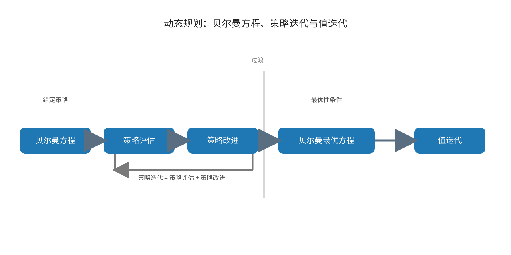
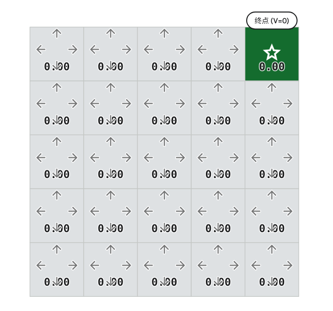
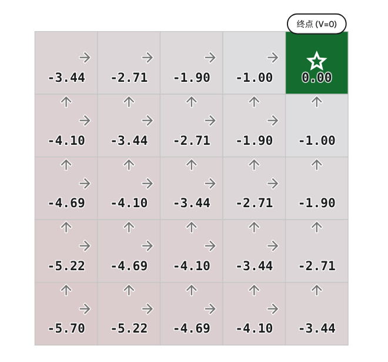

> **来源与同步说明：** 本文同步自作者个人博客[“秦时月”](https://www.qinshiyue.icu/)。个人博客与本网站将并行维护，后续更新会继续同步到本文档中心。

## 从贝尔曼方程到动态规划

上一篇已经讨论过，贝尔曼方程（Bellman Equation）和贝尔曼最优方程（Bellman Optimality Equation）并不只是两个定义，它们真正重要的地方在于：它们把“长期序贯决策”这个问题，转化成了一个关于价值函数的递推关系。换句话说，**一旦价值函数满足了正确的贝尔曼关系，策略评估和最优控制的问题就都有了可以计算的数学表达**。上一篇最后也已经点明，后续大量强化学习算法，本质上都可以理解为以不同方式逼近满足这些方程的价值函数。

因此，在贝尔曼方程和贝尔曼最优方程之后，下一步最自然的话题就是：**既然方程已经有了，那么应该怎样真正把它解出来？**

这正是动态规划（Dynamic Programming）出现的位置。

如果只停留在定义层面，我们已经知道：

- 给定策略时，状态价值函数 $V_\pi(s)$ 和动作价值函数 $Q_\pi(s,a)$ 满足贝尔曼方程；
- 讨论最优控制时，最优状态价值函数 $V_*(s)$ 和最优动作价值函数 $Q_*(s,a)$ 满足贝尔曼最优方程。

但“满足某个方程”和“已经得到这个方程的解”是两回事。前者告诉我们正确答案应当具备什么性质，后者才真正对应算法上的求解。也就是说，到上一篇结束为止，我们其实已经完成了问题的数学建模，但还没有进入求解过程本身。

这时，动态规划就成为第一种最直接的求解思路。原因很简单：贝尔曼方程的结构本身就是递推式。当前状态的价值由“当前奖励”和“下一状态的价值”共同决定；而下一状态的价值又可以继续按同样方式展开。这样的结构天然适合用迭代方式逐步逼近解，而这正是动态规划最核心的思想。

更具体地说，在最理想的情况下，如果环境模型已知，那么最优控制问题就可以直接转化为一个方程求解问题。此时可以利用贝尔曼最优方程反复更新价值函数，直到收敛到最优价值函数；如果把“先评估当前策略，再改进当前策略”拆开处理，就得到策略迭代（Policy Iteration）；如果更直接地把贝尔曼最优方程当作更新目标反复作用，就得到值迭代（Value Iteration）。这也是很多教材会把“贝尔曼方程 / 贝尔曼最优方程”之后紧接着安排“动态规划”的原因：前者提供了价值函数应满足的关系，后者则开始回答“如何利用这种关系进行计算”。

从逻辑上看，这里有一个很重要的递进关系。

贝尔曼方程解决的是“给定一个策略，它的长期价值如何表示”；贝尔曼最优方程解决的是“如果每一步都朝最优方向选择，那么最优价值应满足什么关系”；而动态规划解决的则是“在模型已知的前提下，如何利用这些关系把价值函数一步步算出来”。所以，动态规划不是独立于贝尔曼方程之外突然出现的新主题，而是对前面理论结果的直接求解。

也正因为如此，动态规划在强化学习里有一种很特殊的位置。它通常不是最适合真实复杂环境的方法，因为它要求已知状态转移概率和奖励函数，而且通常更适合有限离散的马尔可夫决策过程（Markov Decision Process, MDP）。但从概念上，它是最干净、最直接的一步：在这里，贝尔曼方程第一次从“理论上的递推关系”变成“可以执行的算法更新规则”。

所以，理解动态规划，本质上就是理解这样一件事：**当价值函数已经被贝尔曼方程刻画出来之后，我们如何真正利用这种递推结构来做计算。**

接下来，最自然的问题就是：既然动态规划是在“求解”贝尔曼关系，那么它到底需要什么前提？为什么它不像后面的很多强化学习算法那样，直接通过与环境交互采样就能工作？

## 为什么动态规划要求已知环境模型

既然动态规划是沿着贝尔曼方程和贝尔曼最优方程继续展开的，那么接下来最需要说明的一点就是：**为什么这种方法有一个非常强的前提——环境模型必须已知。**

这里先明确“环境模型（Model）”指的是什么。

在马尔可夫决策过程（Markov Decision Process, MDP）里，一个环境通常至少包含两类关键信息：

- **状态转移概率（State Transition Probability）**，即
  $$
  P(s' \mid s,a)
  $$
  它表示在状态 $s$ 下执行动作 $a$ 后，转移到下一状态 $s'$ 的概率。

- **奖励函数（Reward Function）**，例如写成
  $$
  r(s,a,s')
  $$
  或者某些场合下写成 $r(s,a)$。它描述的是在状态转移过程中会得到怎样的即时奖励。

当我们说“环境模型已知”时，本质上就是说：**对于每个状态、每个动作，系统会如何转移、会给出什么奖励，这些信息都是可以直接查询或计算的。**

现在再回头看状态价值函数的贝尔曼方程：
$$
V_\pi(s)=\sum_a \pi(a\mid s)\sum_{s'} P(s'\mid s,a)\Big[r(s,a,s')+\gamma V_\pi(s')\Big]
$$
这个式子里最关键的操作，不是写出公式本身，而是右侧的“求期望”。为了真的算出这个期望，需要知道两件事：

第一，要知道策略在状态 $s$ 下选择动作 $a$ 的概率 $\pi(a\mid s)$。这一点通常没有问题，因为策略本身是我们给定或维护的对象。

第二，要知道在动作 $a$ 之后，环境会以多大概率转移到各个 $s'$，以及对应奖励是多少。也就是说，需要知道
$$
P(s' \mid s,a), \quad r(s,a,s')
$$
如果这些量不知道，那么右侧这个求和就无法真正计算。此时我们只能知道“价值函数应该满足这样一个关系”，却不能把它当作一个可以直接执行的更新公式。

这正是动态规划依赖模型的根本原因。它不是通过真实交互采样某一次结果，然后做近似更新；它做的是**对所有可能后果求完整期望**。而要做完整期望，就必须提前知道每种后果发生的概率以及对应收益。

动态规划的更新方式，本质上是：

- 不去真正和环境试一次；
- 而是假设我已经知道“如果试了，会发生什么，以及各种情况的概率是多少”；
- 然后直接在数学上把这些结果全部加权平均出来。

因此，动态规划可以被理解为一种**基于模型（Model-based）**的方法。它依赖的不是经验样本，而是环境的显式描述。

可以用一个很小的例子理解这一点。

假设某个状态 $s$ 下只有一个动作 $a$，执行后有两种可能：

- 以 $0.8$ 的概率转移到状态 $s_1$，奖励为 $2$；
- 以 $0.2$ 的概率转移到状态 $s_2$，奖励为 $-1$。

那么根据贝尔曼方程，这一步对应的期望回报部分就是
$$
0.8\big[2+\gamma V_\pi(s_1)\big] + 0.2\big[-1+\gamma V_\pi(s_2)\big]
$$
这里之所以能直接写出来，是因为我们已经知道“0.8”和“0.2”这两个转移概率，也知道两种情况下的奖励。如果这些信息不知道，就不能这样直接算，只能通过反复与环境交互，观察大量样本后再去估计。这就已经不是动态规划的范畴，而会走向后面的蒙特卡洛（Monte Carlo）方法或时序差分（Temporal Difference, TD）方法。

所以可以把动态规划与后续强化学习方法之间的差别先提前概括为一句话：

**动态规划是“已知模型，直接求期望”；后面的很多强化学习方法是“未知模型，通过样本逼近期望”。**

这一点也是动态规划在强化学习中位置特殊的原因。它常常不是为了直接解决真实复杂问题，而是为了先把最基本的计算逻辑讲清楚。因为一旦环境模型已知，很多问题都可以写成清晰、确定的迭代更新；而一旦环境模型未知，同样的问题就必须转化为基于采样的近似求解。

> 💡“已知模型”不等于“环境是确定性的”
>
> 很多初学者会把两者混在一起。其实不是这样。环境完全可以是随机的，只要这种随机性本身是已知的，就仍然可以做动态规划。比如刚才那个例子里，状态转移显然带有随机性，但因为转移概率是已知的，所以仍然可以精确计算期望。动态规划真正要求的，不是环境没有随机性，而是**环境的随机规律本身是已知的**。

## 策略评估：给定策略时，如何计算它的价值

在说明了动态规划为什么要求已知环境模型之后，下一步自然要解决的就是最基础的子问题：**如果一个策略已经给定，怎样计算这个策略对应的价值函数？**

这件事就叫作**策略评估（Policy Evaluation）**。

这里的“评估”，意思不是做口头判断，也不是凭经验觉得一个策略“还不错”或“不太好”，而是更严格地说：**在给定策略 $\pi$ 的前提下，求出它对应的状态价值函数 $V_\pi(s)$，或者动作价值函数 $Q_\pi(s,a)$。**

换句话说，策略评估回答的是这样的问题：

> 如果智能体从现在开始始终按照策略 $\pi$ 行动，那么在每个状态下，它未来能够获得的长期期望回报是多少？

这个问题之所以重要，是因为后面无论要不要改进策略，都必须先知道“当前策略到底表现如何”。如果连当前策略的价值都不知道，那么也就谈不上判断哪里该改、朝什么方向改。

先看状态价值函数的贝尔曼方程：
$$
V_\pi(s)=\sum_a \pi(a\mid s)\sum_{s'} P(s'\mid s,a)\Big[r(s,a,s')+\gamma V_\pi(s')\Big]
$$
在这一节里，策略 $\pi$ 是固定的，环境模型
$$
P(s' \mid s,a), \quad r(s,a,s')
$$
也是已知的，因此这个式子中真正未知的，其实只有各个状态的价值 $V_\pi(s)$。

这意味着什么？

这意味着策略评估本质上不是“再去找策略”，而是一个**求解价值函数**的问题。更具体地说，它是在求一组联立方程的解。因为对于每一个状态 $s$，都有一个对应的贝尔曼方程；所有状态连在一起，就构成一个关于所有 $V_\pi(s)$ 的方程组。

所以，从数学上看，策略评估就是：**在给定策略下，求满足贝尔曼方程的价值函数。**

---

这里可以先停一下，强调一个容易混淆的点：

**策略评估不是在求最优价值函数，也不是在找最优策略。**

它只做一件事：给定当前策略，计算这个策略“实际上有多好”。

例如，假设有两个策略：

- 一个策略在很多状态下都倾向于向目标前进；
- 另一个策略则经常做出绕远路甚至退后的动作。

那么通过策略评估，我们可以分别得到它们对应的 $V_\pi(s)$。通常前者会在更多状态上得到更高的价值，后者则会更低。但在这一步里，我们还没有开始修改策略，只是在“把当前策略的长期效果算清楚”。

因此，策略评估对应的是一个**预测（Prediction）**问题，而不是控制（Control）问题。这一点在很多教材里都会特别强调：给定策略求价值，是预测；寻找更优策略，才进入控制。

---

接下来再进一步看，为什么贝尔曼方程正好给了我们策略评估的方法。

回忆上一篇的逻辑，贝尔曼方程的含义是：一个状态的价值，等于该状态下按策略选动作、再经过环境转移后，得到的“即时奖励 + 折扣后的下一状态价值”的期望。

对于策略评估来说，这个关系有两个关键作用。

第一，它给出了价值函数应当满足的**一致性条件**。
也就是说，如果某个函数真的是策略 $\pi$ 下的状态价值函数，那么它一定满足贝尔曼方程。不是“差不多满足”，而是必须严格满足。

第二，它把原本看起来依赖整个未来奖励序列的问题，转化成了一个局部递推问题。
我们不需要把未来所有可能轨迹一条条列出来，而只需要根据“当前一步的奖励”和“下一状态的价值”递推下去。正因为有这个递推结构，策略评估才可以通过迭代的方式实现。

最直接的思路是这样的：

假设一开始我们并不知道真正的 $V_\pi(s)$，于是先随便给每个状态一个初始估计，例如都设为 $0$：
$$
V_0(s)=0
$$
然后利用贝尔曼方程去反复更新：
$$
V_{k+1}(s)=\sum_a \pi(a\mid s)\sum_{s'} P(s'\mid s,a)\Big[r(s,a,s')+\gamma V_k(s')\Big]
$$
这个更新式的含义很直接：

- 第 $k$ 轮时，我们手头有一个当前的价值估计 $V_k$；
- 利用它来估计每个状态执行一步之后的长期效果；
- 得到新的估计 $V_{k+1}$；
- 不断重复，直到数值基本不再变化。

这就是动态规划中最基本的**迭代策略评估（Iterative Policy Evaluation）**思想。

可以把它理解成一种“反复传播价值信息”的过程。某个状态的价值依赖下一状态的价值，而下一状态的价值又依赖再下一状态的价值。刚开始所有状态价值都不准确，但随着一轮轮更新，终止状态、低层状态、再到更早状态的信息会逐渐向前传播，整个价值函数会越来越接近真实的 $V_\pi$。

> 💡为什么这种迭代是合理的？
>
> 因为对于固定策略 $\pi$，贝尔曼方程对应的是一个固定点方程。也就是说，真正的 $V_\pi$ 是这个更新算子的一个不动点：把 $V_\pi$ 代回右边，仍然得到 $V_\pi$ 本身。动态规划中的迭代策略评估，本质上就是不断应用这个算子，逐步逼近它的固定点。
>
> 对初学者来说，这里不用展开证明，但要抓住结论：
>
> **策略固定时，价值函数不是任意定义的，而是被贝尔曼方程唯一确定的。策略评估做的事情，就是把这个唯一确定的价值函数算出来。**

## 策略改进：为什么有了价值，还可以继续改策略

当策略评估完成之后，我们已经知道了一件事：对于当前策略 $\pi$，每个状态的价值 $V_\pi(s)$，或者每个状态—动作对的价值 $Q_\pi(s,a)$，都可以被计算出来。

但这还不是最终目标。强化学习真正关心的不是“把某个策略评估清楚”，而是“找到更好的策略”。因此，在策略评估之后，下一步自然就是：

**既然已经知道当前策略在各个状态下的长期效果，那么能不能利用这些信息，把策略变得更好一些？**

这就是 **策略改进（Policy Improvement）** 要解决的问题。

---

先从最直接的想法开始。

假设当前策略是 $\pi$，并且我们已经通过策略评估得到了它对应的动作价值函数
$$
Q_\pi(s,a)
$$
那么对于某个状态 $s$，$Q_\pi(s,a)$ 的含义是：在状态 $s$ 下，先执行动作 $a$，之后继续按照原策略 $\pi$ 行动时，未来期望回报是多少。

既然这样，在状态 $s$ 下，不同动作的长期效果就已经可以直接比较了。如果某个动作 $a_1$ 的
$$
Q_\pi(s,a_1)
$$
明显大于另一个动作 $a_2$ 的
$$
Q_\pi(s,a_2),
$$
那么继续按照原策略去选择 $a_2$，就显得不太合理。更自然的做法是：在这个状态下，更倾向于选择那个动作价值更大的动作。

这就是策略改进最基本的思想：

**利用当前策略的价值信息，在每个状态下，把动作选择朝着更高价值的方向调整。**

如果写成最直接的形式，那么从旧策略 $\pi$ 出发，可以构造一个新策略 $\pi'$，使它在每个状态 $s$ 下都选择当前动作价值最大的动作：
$$
\pi'(s)=\arg\max_a Q_\pi(s,a)
$$
如果策略写成概率形式，也可以理解为：把概率全部集中到使 $Q_\pi(s,a)$ 最大的那个动作上。也就是说，新策略对每个状态都采取关于 $Q_\pi$ 的贪心（Greedy）选择。

这里“贪心”这个词的含义要说清楚。它不是指短视地只看即时奖励，而是指：

**在当前已经计算出的动作价值函数 $Q_\pi(s,a)$ 基础上，直接选择那个长期期望回报最大的动作。**

所以这里的贪心，不是对一步奖励贪心，而是对“在旧策略基础上得到的长期价值”贪心。

这一步为什么能叫“改进”？

直觉上已经很明显：如果在每个状态下，我们都尽量改选更高价值的动作，那么新策略整体上应该不会比原策略更差，通常还会更好。

更正式地说，策略改进背后依赖一个核心结论，通常称为**策略改进定理（Policy Improvement Theorem）**。它表达的是：

如果新策略 $\pi'$ 在每个状态下选择的动作，都不比旧策略 $\pi$ 在该状态下按原分布选择动作所对应的期望动作价值更差，那么新策略的状态价值函数就满足
$$
V_{\pi'}(s)\ge V_\pi(s), \quad \forall s
$$
而在最常见的贪心改进里，因为 $\pi'$ 直接选择 $\arg\max_a Q_\pi(s,a)$，所以它在每个状态下都至少不会比原策略的平均选择更差。于是就得到一个非常重要的结论：

**对旧策略做一次基于 $Q_\pi$ 的贪心改进后，得到的新策略一定不劣于旧策略。**

这句话非常关键。它说明策略改进不是拍脑袋改，而是有严格方向性的：只要改法是基于旧策略价值函数做贪心选择，那么策略就会朝更优方向前进。

> 策略改进时使用的是
> 
> $$ Q_\pi(s,a) $$
> 
> 而不是
> 
> $$ Q_{\pi'}(s,a) $$
> 
> 也就是说，我们是在“旧策略的价值评估结果”基础上构造新策略，而不是一边改新策略一边立刻知道新策略的真实价值。
>
> 这看起来像有一点“滞后”，但正是这种分步结构，使得整个过程清晰可操作：
>
> 1. 先固定策略，认真把它评估清楚；
> 2. 再基于这个评估结果，构造一个更好的策略；
> 3. 然后重新评估这个新策略；
> 4. 再继续改进。
>
> 也正是因为这个过程天然分成“评估”和“改进”两步，后面才会自然得到策略迭代。

从形式上看，策略评估和策略改进分别回答的是两个不同问题：

- **策略评估（Policy Evaluation）**：当前策略有多好？
- **策略改进（Policy Improvement）**：已知当前策略的价值后，怎样把它变得更好？

前者是“算清楚”，后者是“改得更优”。两者缺一不可。

如果只有策略评估，而没有策略改进，那么我们最多只能分析某个给定策略，却不能朝最优策略前进。如果只有策略改进，而没有策略评估，那么我们又没有可靠依据判断哪些动作更值得选。

因此，动态规划中的控制方法，本质上就是让这两步反复交替进行。

## 策略迭代：把评估与改进连起来

前面已经分别讨论了两件事：

- **策略评估（Policy Evaluation）**：给定策略 $\pi$，计算它的价值函数；
- **策略改进（Policy Improvement）**：利用当前策略的价值信息，构造一个更优的新策略。

如果把这两步单独看，它们分别只是“分析”和“调整”。但一旦把它们连接起来，并反复执行，就得到动态规划中最经典的求解方法之一：**策略迭代（Policy Iteration）**。

它的思想非常直接：

1. 先选一个初始策略 $\pi_0$；
2. 对 $\pi_0$ 做策略评估，得到 $V_{\pi_0}$ 或 $Q_{\pi_0}$；
3. 再根据这个评估结果做策略改进，得到新策略 $\pi_1$；
4. 对 $\pi_1$ 再做评估；
5. 再继续改进；
6. 如此反复，直到策略不再发生变化。

所以，策略迭代本质上就是一个“**评估 — 改进 — 再评估 — 再改进**”的循环过程。

如果用状态价值函数来写，它通常可以概括为两步循环。

第一步是**策略评估**：对当前策略 $\pi_k$，求解
$$
V_{\pi_k}(s)=\sum_a \pi_k(a\mid s)\sum_{s'} P(s'\mid s,a)\Big[r(s,a,s')+\gamma V_{\pi_k}(s')\Big]
$$
第二步是**策略改进**：利用评估得到的价值函数，构造新策略
$$
\pi_{k+1}(s)=\arg\max_a \sum_{s'} P(s'\mid s,a)\Big[r(s,a,s')+\gamma V_{\pi_k}(s')\Big]
$$
这里第二步的式子可以稍微解释一下。它的意思是：在状态 $s$ 下，枚举每个可能动作 $a$，计算“执行这个动作后，一步奖励加上折扣后的下一状态价值”的期望，然后选取使这个量最大的动作作为新策略在该状态下的动作选择。

如果写成动作价值的语言，其实就是
$$
\pi_{k+1}(s)=\arg\max_a Q_{\pi_k}(s,a)
$$
两种写法本质等价。前一种直接用状态价值和环境模型写出来，后一种则更紧凑，更容易看出它是在对旧策略的动作价值做贪心改进。

从流程上看，策略迭代并不复杂，但它有几个非常重要的性质。

第一，**每一轮改进都会让策略不变差**。  
这是前面策略改进定理已经说明的。也就是说，
$$
V_{\pi_{k+1}}(s)\ge V_{\pi_k}(s),\quad \forall s
$$
因此，策略迭代不是在随机尝试不同策略，而是在沿着一个有保证的方向不断前进。

第二，**在有限状态、有限动作的情形下，如果每次都精确完成策略评估和策略改进，那么策略迭代会在有限步内收敛到最优策略。**  
直观上，这是因为可能的确定性策略总数有限，而每次策略改进都会让策略严格变好或保持不变；一旦某一轮改进后策略不再变化，就说明已经不能继续改进，此时得到的就是最优策略。

第三，**它把“求最优策略”分解成了一系列更容易处理的子问题。**  
直接从一开始就求最优策略往往不容易，但“给定策略算价值”和“给定价值改策略”都相对清楚。策略迭代正是通过反复交替这两步，逐渐逼近并最终得到最优策略。

> **为什么策略迭代看起来像是在做两件事，最后却能解最优控制问题？**
>
> 原因在于，这两件事分别对应最优控制中的两个必要方面：
>
> - 评估负责告诉我们“当前策略到底会带来什么长期结果”；
> - 改进负责根据这个结果把策略朝更优方向推。
>
> 如果只做评估，就永远停留在分析当前策略；
> 如果只做改进，又缺乏可靠依据来判断应该怎么改。
>
> 策略迭代之所以有效，就是因为它把这两部分闭合成了一个循环。旧策略产生旧价值，旧价值指导新策略，新策略再产生新价值，直到这个循环达到稳定点。这个稳定点恰好对应“价值和策略彼此一致，且已经无法再改进”的状态，也就是最优解。

从更高一层看，策略迭代和前面的贝尔曼方程、贝尔曼最优方程也有很清楚的对应关系。

- **策略评估**对应的是贝尔曼方程：给定策略，价值函数满足一个期望递推关系；
- **策略改进**则利用这些价值信息，让策略更接近满足最优性条件；
- 当整个过程收敛时，得到的价值函数和策略就不再只是满足“给定策略下的贝尔曼方程”，而会进一步满足**贝尔曼最优方程**。

也就是说，策略迭代可以理解为：  
**通过一系列“普通策略”的贝尔曼评估与改进，逐步逼近满足最优性条件的解。**

这里还需要提一个实际上的特点。

虽然策略迭代概念上非常清晰，但它有一个代价：**每做一次策略改进之前，通常都要求先把当前策略评估得比较充分，理想情况下甚至要精确求出 $V_{\pi_k}$。**

这就意味着，如果状态空间较大，那么每轮完整评估都可能比较耗时。也正因为如此，后面会看到一种更“直接”的方法：不把评估和改进分得那么彻底，而是更快地把价值朝最优方向推进，这就是值迭代（Value Iteration）。

所以可以先提前概括两者的区别：

- 策略迭代：先把当前策略评估清楚，再改进策略；
- 值迭代：把评估和改进进一步压缩合并，直接朝最优价值推进。

但在讲值迭代之前，策略迭代仍然是最好的过渡，因为它把“为什么控制问题可以拆成评估与改进两部分”这件事讲得最清楚。

## 值迭代：直接朝最优价值推进

理解了策略迭代之后，再看值迭代（Value Iteration），就会发现它并不是一种完全不同的思路，而更像是在策略迭代基础上做了一步压缩。

前面提到，策略迭代的流程是：

1. 对当前策略做策略评估；
2. 根据评估结果做策略改进；
3. 再评估，再改进，直到收敛。

这个方法逻辑很清楚，但也有一个明显特点：**每一轮策略改进之前，都要先把当前策略的价值函数算得比较充分。** 在状态空间不大时这没有问题，但如果状态较多，那么“先完整评估、再改进”这件事本身就可能比较耗时。

这时一个很自然的问题就出现了：

**如果我们的最终目标本来就是最优价值函数和最优策略，那么有没有必要每一轮都先把某个中间策略完全评估清楚？能不能跳过这一步，直接让价值函数朝最优方向更新？**

这就是值迭代的出发点。

回忆上一篇讨论过的最优状态价值函数满足的贝尔曼最优方程：
$$
V_*(s)=\max_a \sum_{s'} P(s'\mid s,a)\Big[r(s,a,s')+\gamma V_*(s')\Big]
$$
这个方程和普通贝尔曼方程的区别在于，右边不再是对当前策略的动作分布求期望，而是直接在动作上取最大值。它表达的是：在状态 $s$ 下，最优价值等于所有可能动作中，那个能够带来最大长期期望回报的动作所对应的结果。

如果把这个方程直接当成更新规则，就得到值迭代最核心的形式：
$$
V_{k+1}(s)=\max_a \sum_{s'} P(s'\mid s,a)\Big[r(s,a,s')+\gamma V_k(s')\Big]
$$
这个式子的意义很清楚：

- 当前我们手上有一版价值估计 $V_k$；
- 对每个状态 $s$，枚举所有动作 $a$；
- 计算每个动作对应的“一步奖励 + 折扣后的下一状态价值”的期望；
- 选取其中最大的那个，作为新的价值估计 $V_{k+1}(s)$。

和策略迭代相比，这一步里已经把“评估”和“改进”压缩到了一起。因为一边在利用当前价值估计 $V_k$ 计算回报，一边就在动作上直接做最大化选择。它不再先固定某个策略、把这个策略完整评估出来，而是每次更新都立即朝着当前看起来最优的方向推进。

这就是值迭代和策略迭代最核心的区别：

- **策略迭代**：先对当前策略做较充分的评估，再进行一次改进；
- **值迭代**：不做完整的中间策略评估，而是每次更新都直接使用贝尔曼最优方程，把改进作用到价值更新里。

所以，从结构上说，值迭代可以理解为一种“更激进”的策略迭代。它不愿意在中间策略上花太多时间，而是直接逼近最优价值函数 $V_*(s)$。

这里把这种区别说的更具体一些：

在策略迭代里，策略评估阶段本质上是在反复应用
$$
V_{k+1}(s)=\sum_a \pi(a\mid s)\sum_{s'} P(s'\mid s,a)\Big[r(s,a,s')+\gamma V_k(s')\Big]
$$
直到收敛为当前策略的真实价值函数，然后才做一次策略改进。

而值迭代可以被看成是：**每次只做一次非常短的策略评估，但立刻接上一轮贪心改进。**
也就是说，它相当于没有把“评估”这件事做到底，而是每推进一步，就立刻重新朝最优方向调整。于是，原本分开的两步被揉成了一步。

从这个角度看，值迭代其实并不神秘，它只是把策略迭代中的“评估做多彻底”这件事推到了另一个极端。

那么，值迭代最后得到的策略是什么？

注意，值迭代过程中直接更新的是状态价值函数 $V_k(s)$，而不是显式维护一个策略。但当价值函数收敛到最优状态价值函数 $V_*(s)$ 后，就可以通过一次贪心选择恢复出最优策略：
$$
\pi_*(s)=\arg\max_a \sum_{s'} P(s'\mid s,a)\Big[r(s,a,s')+\gamma V_*(s')\Big]
$$
这说明值迭代虽然表面上只在更新价值，但它最终仍然是在为最优策略服务。只是它选择的路径不是“策略 — 价值 — 新策略”这样显式交替，而是“先把价值逼近到最优，再从中抽取最优策略”。

> **值迭代并不是只算价值、不关心策略。**
>
> 它只是把策略的更新“隐含”在了每一步的最大化操作里。每次对动作取最大值，其实就已经在体现“当前状态下应该选哪个动作更好”这一决策倾向了。只是这种倾向没有被单独写成一个中间策略，而是直接体现在价值更新公式中。
>
> 所以更准确地说，值迭代是在**隐式地进行策略改进**。

从计算风格上看，策略迭代和值迭代各有特点。

策略迭代的优点是逻辑分明，每一轮策略改进都有清楚的依据；缺点是每轮评估可能比较重。  
值迭代的优点是更新更直接，通常单轮更简单；但它每一步只推进一点点价值，因此有时需要较多轮迭代才能收敛。

因此，两者并不是谁绝对优于谁，而是在“每轮更新的计算量”和“需要多少轮迭代”之间做不同平衡。

但从教学上说，值迭代非常重要，因为它直接把贝尔曼最优方程变成了算法。到这里，贝尔曼最优方程不再只是“最优价值应该满足什么条件”的理论表达，而第一次变成了一个可以反复执行的最优更新规则。

## 它们与贝尔曼方程、贝尔曼最优方程的关系

到这里，动态规划中的几个核心概念已经分别出现了：策略评估（Policy Evaluation）、策略改进（Policy Improvement）、策略迭代（Policy Iteration）和值迭代（Value Iteration）。接下来还需要把整条逻辑线再收拢一次，也就是回答一个非常关键的问题：

**这些方法和贝尔曼方程、贝尔曼最优方程之间，到底是什么关系？**

如果这一点不理清，前面的内容很容易被看成几组彼此并列的定义和算法；但实际上，它们之间是非常紧密的一条链。

先从最基础的关系说起。

### 贝尔曼方程对应“给定策略下的价值计算”

对于任意一个给定策略 $\pi$，状态价值函数 $V_\pi(s)$ 和动作价值函数 $Q_\pi(s,a)$ 都满足各自的贝尔曼方程。以前面主要使用的状态价值形式为例：
$$
V_\pi(s)=\sum_a \pi(a\mid s)\sum_{s'} P(s'\mid s,a)\Big[r(s,a,s')+\gamma V_\pi(s')\Big]
$$
这个方程的关键词是“**给定策略**”。

它并没有讨论怎样选择最优动作，也没有做动作上的最大化，而只是描述：**如果以后一直按策略 $\pi$ 行动，那么当前状态的价值应当满足什么递推关系。**

因此，贝尔曼方程的主要作用是刻画**策略评估问题**。
也就是说，策略评估并不是凭空定义出来的一步，而是因为给定策略之后，价值函数必须满足贝尔曼方程；所以我们可以通过求解这个方程来得到 $V_\pi(s)$ 或 $Q_\pi(s,a)$。

从这个角度看，策略评估和贝尔曼方程之间的关系可以概括成一句话：

**策略评估是在求解给定策略下的贝尔曼方程。**

### 贝尔曼最优方程对应“最优价值的刻画”

如果把问题从“评价某个固定策略”推进到“寻找最优策略”，那么对应的价值函数就不再是 $V_\pi(s)$，而是最优状态价值函数 $V_*(s)$。它满足贝尔曼最优方程：
$$
V_*(s)=\max_a \sum_{s'} P(s'\mid s,a)\Big[r(s,a,s')+\gamma V_*(s')\Big]
$$
与普通贝尔曼方程相比，这里最本质的变化只有一个：  
右侧不再是对策略 $\pi(a\mid s)$ 求期望，而是直接对动作取最大值。

这一步变化非常重要，因为它意味着问题已经从“描述一个给定策略的长期表现”，转变为“在所有可能动作中选择最优结果”。因此，贝尔曼最优方程不再对应纯粹的评估问题，而是在刻画**最优控制问题**。

从这个角度看，可以把两类方程对比得很明确：

- **贝尔曼方程**：当前策略下，价值应满足什么关系；
- **贝尔曼最优方程**：最优价值应满足什么关系。

前者面向“预测”，后者面向“控制”。

### 策略评估对应贝尔曼方程，策略改进对应“朝最优性靠近”

有了这两个方程之后，前面提到的几种动态规划操作就都能被放到正确位置上。

首先，**策略评估**直接建立在贝尔曼方程上。  
因为对于固定策略 $\pi$，真正的 $V_\pi(s)$ 就是贝尔曼方程的解。迭代策略评估所做的事情，就是不断应用这个递推关系，逐步逼近这个解：
$$
V_{k+1}(s)=\sum_a \pi(a\mid s)\sum_{s'} P(s'\mid s,a)\Big[r(s,a,s')+\gamma V_k(s')\Big]
$$
所以，策略评估是“沿着贝尔曼方程求值”。

接着，**策略改进**本身虽然不是在直接求解贝尔曼最优方程，但它的方向是明确的：它通过
$$
\pi'(s)=\arg\max_a Q_\pi(s,a)
$$
把策略朝“更优动作”推进。也就是说，它是在利用当前策略的价值信息，逐步让策略更接近最优性条件。

因此，策略改进可以理解为一种从贝尔曼方程走向贝尔曼最优方程的过渡动作。  
它本身还没有一步到位地解出最优方程，但它在不断减少“当前策略”与“最优策略”之间的差距。

### 策略迭代：通过反复求解贝尔曼方程，逐步逼近贝尔曼最优方程的解

这样一来，策略迭代的位置就很清楚了。

策略迭代的每一轮都包含两步：

1. 对当前策略做策略评估，也就是求解当前策略对应的贝尔曼方程；
2. 再基于评估结果做贪心改进，使策略朝更优方向前进。

所以，策略迭代并不是直接去解贝尔曼最优方程，而是通过一系列“给定策略下的贝尔曼方程”反复求解和改进，最终逼近最优解。

这可以理解为一种“间接求最优”的方式：

- 每轮评估：严格处理当前策略；
- 每轮改进：把当前策略推向更优；
- 多轮交替后：收敛到最优策略与最优价值。

因此，策略迭代和贝尔曼最优方程之间的关系可以概括为：

**策略迭代不是一次性直接解贝尔曼最优方程，而是通过反复的贝尔曼评估与策略改进，最终达到满足贝尔曼最优方程的结果。**

### 值迭代：直接把贝尔曼最优方程变成更新规则

相比之下，值迭代和贝尔曼最优方程的关系就更直接。

值迭代的更新式
$$
V_{k+1}(s)=\max_a \sum_{s'} P(s'\mid s,a)\Big[r(s,a,s')+\gamma V_k(s')\Big]
$$
本身就是把贝尔曼最优方程中的 $V_*(s)$ 暂时替换成当前估计 $V_k(s)$，再不断迭代。

也就是说，值迭代没有像策略迭代那样，把“评估”和“改进”拆成两步；它是直接把贝尔曼最优方程当成最核心的更新结构来反复作用。因此它与贝尔曼最优方程之间的关系最为直接：

**值迭代就是对贝尔曼最优方程的迭代求解。**

如果说策略迭代是“绕一条更清楚的路径到达最优”，那么值迭代就是“直接沿着最优方程本身推进”。

到这里，可以把整个关系链完整地梳理成下面这样：

1. **回报（Return）** 给出了长期收益的定义；
2. **价值函数（Value Function）** 用期望回报刻画状态和动作的长期好坏；
3. **贝尔曼方程** 给出了给定策略下价值函数的递推关系；
4. **贝尔曼最优方程** 给出了最优价值函数的递推关系；
5. **策略评估** 是在求解贝尔曼方程；
6. **策略改进** 是利用当前价值信息把策略朝更优方向调整；
7. **策略迭代** 是“贝尔曼方程求解 + 策略改进”的循环；
8. **值迭代** 是对贝尔曼最优方程的直接迭代求解。

这样看时，动态规划中的这些概念就不是分散的内容，而是从“定义长期价值”到“真正求解最优策略”的完整推进过程。

## 小结

在贝尔曼方程（Bellman Equation）与贝尔曼最优方程（Bellman Optimality Equation）之后，自然会进入动态规划（Dynamic Programming），原因并不复杂。前两者已经给出了价值函数应当满足的递推关系，而动态规划要解决的，正是**如何在已知环境模型的前提下，把这些关系真正转化为可计算的求解过程**。

沿着这条主线，前文依次讨论了几个层次。

首先，动态规划之所以要求已知环境模型，是因为它不是通过采样近似期望，而是直接利用状态转移概率和奖励函数，对未来结果做完整的数学求期望。没有模型，贝尔曼方程虽然仍然成立，但无法被直接写成可执行的更新规则。

其次，给定策略时，可以通过**策略评估（Policy Evaluation）**求出该策略对应的价值函数。这里求解的对象不是最优策略，而是当前策略的长期表现。对应到理论上，策略评估就是在求解给定策略下的贝尔曼方程。

再往前一步，在已知当前价值函数之后，可以通过**策略改进（Policy Improvement）**，在每个状态下把动作选择朝着更高动作价值的方向调整。于是，策略不再只是被分析的对象，而开始被系统地优化。

当策略评估与策略改进交替进行时，就得到了**策略迭代（Policy Iteration）**。它的特点是：先把当前策略评估清楚，再根据评估结果做一次明确的改进。整个过程逻辑清晰，每一步都有明确含义。

如果不想在每一轮中都对某个中间策略做较充分的评估，而是希望更直接地朝最优价值推进，就得到**值迭代（Value Iteration）**。它直接使用贝尔曼最优方程，把价值更新与动作上的最大化压缩在同一步中，因此可以看成是对策略迭代的一种更紧凑的实现方式。

因此，这篇文章到目前为止，其实已经完成了一个完整的概念闭环：

- 贝尔曼方程对应给定策略下的价值递推关系；
- 贝尔曼最优方程对应最优价值的递推关系；
- 策略评估是在求解前者；
- 值迭代是在直接迭代求解后者；
- 策略迭代则介于两者之间，通过“评估 + 改进”的循环逐步走向最优。

不过，仅仅停留在概念和公式上，读者往往还不容易真正形成算法直觉。尤其是对于初学者来说，虽然已经知道策略迭代和值迭代分别在做什么，但仍然可能不够直观地感受到：它们在一个具体环境里到底是怎样更新的，两者的过程差别又体现在哪里。

因此，接下来最自然的一步，就是放到一个非常小的例子里看一看。与其继续停留在抽象公式层面，不如用一个简单的网格世界（Grid World）来观察：

- 给定一个初始策略，策略评估会怎样传播状态价值；
- 策略改进会怎样改变动作选择；
- 策略迭代如何一步步得到稳定策略；
- 值迭代又是如何更直接地把价值推向最优。

这样，前面讲过的公式就不再只是定义，而会真正变成可感知的更新过程。

## 一个简单网格世界中的策略迭代与值迭代

前面的内容主要停留在概念和公式层面。为了让策略迭代（Policy Iteration）和值迭代（Value Iteration）的区别更直观，接下来不妨放到一个非常小的网格世界（Grid World）中来看。

这里先不给出复杂环境，只考虑一个足够简单、但又能体现动态规划思想的离散环境。

假设有一个有限网格，智能体每次可以执行四个动作：上、下、左、右。某些格子是普通状态，某个格子是终止状态（Terminal State）。智能体进入终止状态后，过程结束。为了简化讨论，可以先设定：

- 每走一步都会得到一个固定的即时奖励，例如 $-1$；
- 如果动作会走出边界，则仍然停在原状态；
- 状态转移是确定的，也就是执行某个动作后会到达哪个状态是已知的；
- 折扣因子 $\gamma$ 取一个固定值，例如接近 $1$。

这个环境虽然简单，但已经足够说明很多问题。

首先，由于每走一步都有代价 $-1$，因此一个状态的好坏，很大程度上取决于：**从这里出发还需要多少步才能到达终止状态。** 越接近终止状态的格子，长期回报通常越高；越远的格子，价值通常越低。这样一来，价值函数在空间上就会形成某种梯度，而策略的作用，就是尽量沿着这个梯度朝更优方向行动。

这正好适合作为观察策略迭代和值迭代的例子。

### 策略迭代在这个环境中做了什么

如果使用策略迭代，那么过程会从一个初始策略开始。这个初始策略可以很随意，例如在每个状态下都等概率选择四个方向，或者预先指定一个简单但不一定合理的移动规则。

在这个前提下，第一步是策略评估。
也就是说，固定当前策略不变，计算在这个策略下每个格子的状态价值 $V_\pi(s)$。

在网格世界中，这一步的含义很直观。假设某个格子按照当前策略经常会绕远路、撞边界，或者走很多步才能到终点，那么这个格子的价值就会比较低。相反，如果某个格子在当前策略下通常能够较快到达终点，那么它的价值就会更高。

经过若干轮评估之后，我们就会得到一张“状态价值图”。这张图反映的是：**在当前策略下，整个网格中各位置的长期收益分布。**

接下来是策略改进。
在每个格子上，重新比较四个动作各自对应的长期效果，也就是比较
$$
\sum_{s'} P(s'\mid s,a)\Big[r(s,a,s')+\gamma V_\pi(s')\Big]
$$
在这个例子里，由于状态转移是确定的，求和其实会退化成对唯一下一状态的计算，因此更容易理解。哪个动作能带来更高的“即时奖励加下一状态价值”，新策略就更倾向于选择哪个动作。

于是，策略会发生变化。某些原本绕远的动作会被替换，某些原本无效的边界动作也会被放弃，策略开始更明确地指向终点方向。

之后，再对这个新策略重新评估，再改进。随着这个过程不断重复，整张策略图会越来越稳定，最终在每个格子上给出一条更合理的前进方向。

所以在网格世界里，策略迭代可以被非常直观地理解成：

**先看“当前这套走法”整体效果如何，再根据这个整体效果，局部修改每个格子的走法。**

### 值迭代在这个环境中做了什么

如果使用值迭代，那么思路就不同了。

它不会先固定一整套策略，再把这套策略完整评估清楚。它做的是：直接对每个格子的状态价值做最优更新：
$$
V_{k+1}(s)=\max_a \sum_{s'} P(s'\mid s,a)\Big[r(s,a,s')+\gamma V_k(s')\Big]
$$
在网格世界里，这意味着什么？

意味着在每一轮更新时，对于某个格子 $s$，我们都会直接去看：

- 如果向上走，会得到什么结果；
- 如果向下走，会得到什么结果；
- 如果向左走，会得到什么结果；
- 如果向右走，会得到什么结果；

然后不再考虑“当前策略原本想怎么走”，而是直接把四个候选结果里最好的那个拿来作为新的价值估计。

因此，值迭代更像是在问：

**如果此刻就允许我在这个格子里做最优选择，那么它应该有多大价值？**

这样一来，价值信息会从终止状态附近开始，一轮一轮向外传播。离终点最近的格子会最早获得较高的价值估计，再远一点的格子会在后续更新中逐渐被修正，整个网格的价值分布会逐渐逼近最优状态价值函数 $V_*(s)$。

等价值函数基本收敛之后，只需要在每个格子上再做一次贪心动作选择，就可以恢复出最优策略。

所以，在同一个网格世界里，值迭代可以直观地理解为：

**不先研究某套具体策略，而是直接让每个格子的价值朝“最优情况下应有的值”逼近。**

### 两者在这个例子中的直观区别

放在这个小环境里看，策略迭代和值迭代的区别会比公式里更清楚。

策略迭代关心的是：

- 当前整套策略是什么；
- 这套策略下每个状态价值是多少；
- 在此基础上怎样把策略改好一点。

值迭代关心的是：

- 不必先承认某套中间策略；
- 每一轮都直接把状态价值往最优方向推；
- 最后再从最优价值中提取策略。

因此，在网格世界这种小例子里，二者虽然最终都能得到同一个最优策略，但“中间过程”看起来并不一样：

- 策略迭代更像是在不断修正“走法图”；
- 值迭代更像是在不断修正“价值地形图”。

前者先显式处理策略，再得到价值；后者先逼近最优价值，再隐式得到策略。

## 策略迭代与值迭代的比较

在具体例子中看过两种方法之后，再回头比较策略迭代（Policy Iteration）和值迭代（Value Iteration），它们之间的区别会更清楚一些。

两者的共同点首先是明确的。它们都属于动态规划（Dynamic Programming）方法，都建立在**已知环境模型**的前提之上，也都依赖贝尔曼关系来更新价值函数。最终目标也一致：都是为了得到最优价值函数，以及由此导出的最优策略。

真正的区别，主要体现在“如何逼近最优”这件事上。

策略迭代把过程拆成两步：先评估当前策略，再改进当前策略。也就是说，它显式维护一套中间策略，并且在每一轮中都认真回答“这套策略到底怎么样”，然后再回答“基于这个结果，怎样把它改得更好”。因此，策略迭代的逻辑通常更清晰，也更符合人对“先分析、再修改”的直觉。

值迭代则更直接。它不愿意在某个中间策略上做较完整的评估，而是每一轮都直接使用贝尔曼最优方程进行最大化更新，让状态价值朝最优方向推进。策略并没有在中间被单独拿出来维护，而是隐含在每一步的最大化操作中，直到价值函数接近收敛后，才从中恢复出最优策略。

如果用一句更紧凑的话概括，可以写成：

- 策略迭代更像是**先把当前策略看清楚，再把它改好**；
- 值迭代更像是**直接推动价值函数朝最优解收敛**。

这也决定了两者在计算风格上的差异。策略迭代每一轮通常更“重”，因为它往往需要较充分的策略评估；但由于每轮改进更明确，有时总轮数会较少。值迭代每一轮通常更“轻”，因为更新更紧凑；但也可能需要更多轮才能达到足够稳定的结果。因此，两者并不是简单的谁优谁劣，而是在每轮开销和迭代轮数之间采取了不同平衡。

对于初学者来说，更重要的其实不是记住哪一种方法更快，而是理解两者分别体现了什么思想。策略迭代把“策略评估”和“策略改进”这两个基本操作明确地区分开了，因此更适合用来理解动态规划中的控制问题是怎样一步步建立起来的。值迭代则展示了另一种更紧凑的可能：一旦最优性条件已经明确，就可以直接围绕贝尔曼最优方程来组织更新过程。

> 为什么动态规划重要，但又不是终点？

动态规划在强化学习中地位很高，不是因为真实问题里总是直接使用它，而是因为它把许多最核心的概念都讲得最清楚：价值函数是什么，策略评估在做什么，策略改进为什么成立，最优价值函数为什么满足贝尔曼最优方程，以及策略与价值之间怎样相互推动。

换句话说，动态规划提供的是一种最干净、最理想化的求解框架。在这个框架中，状态转移概率和奖励函数都是已知的，因此一切都可以写成明确的递推和更新。

但真实强化学习问题往往并不满足这个前提。很多时候，我们并不知道
$$
P(s' \mid s,a)
$$
和
$$
r(s,a,s')
$$
的显式形式，只能通过与环境不断交互获得样本。在这种情况下，动态规划的思路仍然重要，但具体计算方式就不能再依赖完整模型，而必须转向基于采样的近似方法。

也正因为如此，动态规划通常被看作后续方法的起点，而不是终点。后面的蒙特卡洛（Monte Carlo）方法、时序差分（Temporal Difference, TD）方法，以及更进一步的深度强化学习方法，本质上都可以看成是在放松“模型已知”这一前提后，对动态规划思想的延伸。

从这个意义上说，理解值迭代和策略迭代，不只是为了掌握两个表格型算法，更是为了真正理解强化学习中“价值如何被定义、如何被计算、又如何反过来指导策略改进”这条主线。

## 总结

回到本文一开始的问题：为什么在贝尔曼方程和贝尔曼最优方程之后，下一步自然就是动态规划？

现在这个问题已经可以比较完整地回答了。因为贝尔曼方程和贝尔曼最优方程给出的，不只是价值函数的定义，而是价值函数应当满足的递推结构；而动态规划正是利用这种结构，在已知环境模型的前提下，把价值函数和最优策略一步步计算出来。

沿着这条思路，本文依次讨论了动态规划为什么要求已知环境模型、什么是策略评估、什么是策略改进、什么是策略迭代、什么是值迭代，以及它们与贝尔曼方程、贝尔曼最优方程之间的关系。进一步通过简单网格世界的例子，可以更直观地看到：策略迭代是在“评估与改进”的循环中逐步优化策略，而值迭代则是在贝尔曼最优方程的更新下直接逼近最优价值。

如果把它们放在更大的上下文中看，那么这两种方法真正重要的地方并不只是公式本身，而是它们展示了强化学习中一个非常核心的思想：**长期价值可以通过递推关系来刻画，而策略优化可以通过价值信息来推进。**

这正是后续许多强化学习方法的出发点。

因此，从动态规划继续往下走，一个最自然的问题就是：**如果环境模型并不知道，我们还能不能完成类似的价值估计与策略改进？**
这也正是下一阶段方法要解决的问题。
