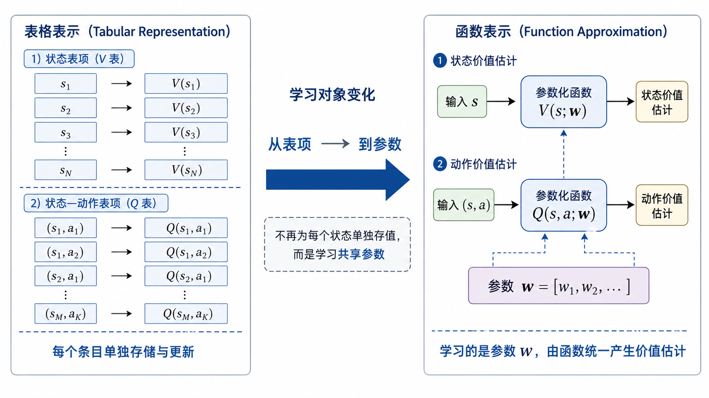

> **来源与同步说明：** 本文同步自作者个人博客[“秦时月”](https://www.qinshiyue.icu/)。个人博客与本网站将并行维护，后续更新会继续同步到本文档中心。

## 从表格价值到函数表示

前面几篇文章已经讨论了强化学习中一组基础方法：动态规划（Dynamic Programming）、蒙特卡洛方法（Monte Carlo Method）、时序差分方法（Temporal Difference Method）、多步时序差分方法、TD($\lambda$)，以及把真实经验学习与模型规划结合起来的 Dyna-Q。虽然这些方法在信息来源和更新目标上各不相同，但它们背后默认采用了同一种价值表示方式：**表格型表示（Tabular Representation）**。

所谓表格型表示，指的是直接为每个状态或状态—动作对维护一个独立的价值。对于状态价值函数（State-value Function），可以把 $V_\pi(s)$ 看成一张表：每个状态 $s$ 对应表中的一个位置，表项中存放当前对该状态长期价值的估计。对于动作价值函数（Action-value Function），可以把 $Q_\pi(s,a)$ 或 $Q_*(s,a)$ 看成一张更大的表：每个状态—动作对 $(s,a)$ 对应一个表项，表项中存放当前对该动作价值的估计。

例如，在一个有限网格世界中，如果一共有 $100$ 个状态，那么状态价值函数可以用长度为 $100$ 的数组保存；如果每个状态下有 $4$ 个动作，那么动作价值函数可以用 $100 \times 4$ 的表保存。TD(0) 更新 $V_\pi(s_t)$ 时，本质上是在修改状态 $s_t$ 对应的那一个表项；Sarsa 和 Q-learning 更新 $Q(s_t,a_t)$ 时，本质上是在修改状态—动作对 $(s_t,a_t)$ 对应的那一个表项。

从这个角度看，前面很多更新公式都可以统一理解为：**找到当前经验对应的表项，然后根据目标值对它做一次增量修正**。例如，Q-learning 的更新写作
$$
Q(s_t,a_t)\leftarrow Q(s_t,a_t)+\alpha\Big[r_t+\gamma \max_{a'}Q(s_{t+1},a')-Q(s_t,a_t)\Big]
$$
这个式子中真正被更新的对象，是表中 $(s_t,a_t)$ 这一格的数值。其他状态—动作对的数值不会在这一步中直接改变。也就是说，表格方法的学习具有很强的局部性：经历了哪个状态或状态—动作对，就主要更新哪个对应表项。

这种方式非常清晰，也很适合用来理解强化学习的基本思想。因为在表格型表示下，价值函数没有额外的模型结构，更新对象也非常明确。只要状态数量和动作数量有限，并且规模不大，就可以直接把所有价值存下来，然后通过反复交互或迭代逐步修正这些数值。前面讨论贝尔曼方程、动态规划、TD 更新和 Dyna-Q 时，正是依托这种表示方式，很多算法的核心逻辑才显得比较直接。

但这里也埋下了下一步必须面对的限制。表格方法能够成立，依赖一个很强的前提：**状态或状态—动作对必须能够被逐一枚举，并且每一项都能够被单独存储和充分更新**。在小规模离散环境中，这个前提通常可以满足；但一旦进入更复杂的任务，这个前提就会迅速变得不现实。

如果状态空间很大，表格会变得难以存储；如果状态是连续的，例如机器人的关节角、速度、姿态和传感器读数，那么状态数量在理论上可以无限多，根本无法为每个状态单独开一个表项；如果状态是高维的，例如图像输入、激光雷达点云或复杂的历史观测序列，那么即使把它们离散化，也会得到极其庞大的组合空间。此时，仍然试图为每个状态或状态—动作对单独维护价值，就会遇到存储、采样和泛化上的困难。

更关键的是，表格方法没有自动泛化能力。假设智能体已经多次访问过某个状态 $s$，并把 $V_\pi(s)$ 或 $Q_\pi(s,a)$ 学得比较准确。如果后来遇到一个和 $s$ 很相似的新状态 $s'$，表格方法通常不会自动把关于 $s$ 的经验迁移到 $s'$ 上。除非 $s'$ 自己也被访问并更新过，否则它对应的表项仍然可能保持初始值。这种“每一格独立学习”的方式，在小环境中可以接受，在大规模环境中会带来很低的样本利用率。

因此，强化学习如果想从小规模离散问题走向连续控制、高维感知和真实机器人任务，就需要改变价值函数的表示方式。我们希望价值估计不再完全依赖逐项存储，而能够从已经见过的状态中提取规律，并对未充分访问过的相似状态给出合理估计。

这就引出了这一篇文章的核心主题：**函数逼近（Function Approximation）**。

它的基本想法是：用一个带参数的函数来表示价值函数。也就是说，不再把 $V_\pi(s)$ 或 $Q_\pi(s,a)$ 看成一张需要逐格填写的表，而是把它们写成类似
$$
V(s;\mathbf{w}),\qquad Q(s,a;\mathbf{w})
$$
这样的函数形式。其中，$\mathbf{w}$ 表示需要学习的参数。这样一来，学习的对象就从“某一个表项的数值”转向了“整个函数的参数”。当参数发生变化时，受影响的也不再只是单个状态或状态—动作对，而是这个函数在许多输入上的输出。

这一变化是从表格强化学习走向深度强化学习的重要一步。因为一旦价值函数可以由参数化函数表示，线性函数、特征工程和神经网络都可以进入强化学习框架。后面的 DQN 以及更多深度强化学习方法，本质上都建立在这个转变之上：用可训练的函数近似价值或策略，再通过样本构造目标，对函数参数进行更新。

 ##  表格方法的适用前提

表格型方法之所以能够工作，首先依赖于一个基本条件：状态空间（State Space）和动作空间（Action Space）必须是有限且规模可控的。

如果状态集合记为 $\mathcal{S}$，动作集合记为 $\mathcal{A}$，那么表格型动作价值函数通常需要为每个 $(s,a)$ 存储一个数值。也就是说，需要维护的表项数量大致为
$$
|\mathcal{S}|\times |\mathcal{A}|
$$
其中，$|\mathcal{S}|$ 表示状态数量，$|\mathcal{A}|$ 表示动作数量。只要这两个量都不大，表格方法就很自然。例如在悬崖漫步、冰湖、简单网格世界这类环境中，状态可以明确编号，动作也只有上下左右等少数选择。此时，直接维护 $V(s)$ 或 $Q(s,a)$ 没有太大困难。

但如果状态数量开始增大，表格方法的代价会迅速上升。假设一个环境有 $10^6$ 个状态，每个状态有 $10$ 个动作，那么动作价值表就需要维护 $10^7$ 个数值。单看存储也许还可以勉强接受，但真正的问题在于：这些表项都需要通过经验逐步更新。大量状态—动作对可能很少被访问，甚至从未被访问。对于这些表项，智能体几乎没有足够样本去估计其价值。

这说明表格方法还隐含了第二个前提：**每个重要的状态或状态—动作对，都需要能够被充分访问。**

在小规模环境中，智能体经过较多回合交互后，有机会反复访问大部分状态—动作对，因此每个表项都能得到一定程度的修正。但在大状态空间中，经验会被分散到大量表项上。即使总采样数量不少，落到每个具体表项上的样本数也可能很少。这样一来，价值估计会变得稀疏而不稳定。

这个限制在连续状态空间（Continuous State Space）中更加明显。机器人控制任务就是典型例子。机器人的状态可能包含关节角、关节速度、机身姿态、足端接触信息、传感器读数等变量。这些变量通常是连续值，状态不再是有限编号的离散格子，而是一个高维连续向量。例如可以写成
$$
s =
\begin{bmatrix}
q \\
\dot{q} \\
\theta \\
\omega
\end{bmatrix}
$$
其中，$q$ 表示关节位置，$\dot{q}$ 表示关节速度，$\theta$ 表示姿态信息，$\omega$ 表示角速度信息。这样的状态无法逐个列出，也无法为每一种可能取值单独维护一个价值表项。

一种直接想法是把连续状态离散化，例如把每个变量划分成若干区间，再把每个区间组合看成一个离散状态。但这种做法很快会受到维度影响。假设状态有 $d$ 个维度，每个维度划分成 $m$ 个区间，那么离散化后的状态数量是
$$
m^d
$$
当 $d$ 稍微增大时，状态数量会快速膨胀。比如 $d=10$，每个维度只划分成 $10$ 个区间，也会得到 $10^{10}$ 个离散状态。这样的规模已经很难用表格方法处理。更实际的高维观测，例如图像、点云、历史传感器序列，维度还会更高。

因此，表格方法的局限可以概括为三点。

第一，存储开销随状态和动作数量直接增长。状态—动作对越多，需要维护的表项越多。

第二，采样效率低。每个表项都需要依赖自身被访问后的经验更新，未访问或少访问的表项很难得到可靠估计。

第三，缺乏泛化。相似状态之间没有天然联系，一个状态中学到的价值信息通常不会自动影响另一个相似状态。

这三点共同说明，表格方法适合作为强化学习基础算法的说明工具，也适合小规模离散任务。但如果希望处理连续控制、高维输入或更复杂的真实任务，就需要一种能够压缩表示、共享经验并产生泛化能力的方法。

函数逼近正是在这个位置进入强化学习的。它要解决的核心问题是：**如何用有限数量的参数，表示大量甚至连续状态上的价值函数。**

## 函数逼近的基本思想

表格方法把价值函数看成一组离散数值。每个状态 $s$ 或状态—动作对 $(s,a)$ 都有一个独立位置，用来存放当前估计的价值。函数逼近的出发点则不同：它希望用一个**参数化函数（Parameterized Function）**来统一表示这些价值。

对于状态价值，可以写成
$$
V(s;\mathbf{w})
$$
其中，$s$ 是输入状态，$\mathbf{w}$ 是函数的参数，$V(s;\mathbf{w})$ 是当前参数下对状态 $s$ 的价值估计。这个式子表示：价值不再由“表中某一格”直接给出，而是由一个函数根据状态输入计算出来。

对于动作价值，可以写成
$$
Q(s,a;\mathbf{w})
$$
其中，输入变成状态—动作对 $(s,a)$，输出是当前对该状态下执行动作 $a$ 的长期价值估计。后续如果要根据动作价值选择动作，就可以比较同一状态下不同动作对应的估计值：
$$
Q(s,a_1;\mathbf{w}),\quad Q(s,a_2;\mathbf{w}),\quad \dots
$$
然后再按照贪心策略、$\epsilon$-贪心策略或其他探索策略选择动作。

这里的关键变化在于：价值函数从“显式存储”变成了“函数计算”。在表格方法中，$V(s)$ 或 $Q(s,a)$ 的值直接保存在表里；在函数逼近中，$V(s;\mathbf{w})$ 或 $Q(s,a;\mathbf{w})$ 的值由参数 $\mathbf{w}$ 和输入共同决定。

这带来一个重要结果：不同状态的价值估计不再完全独立。只要多个状态共享同一组参数 $\mathbf{w}$，那么一次参数更新就可能同时影响函数在许多状态上的输出。也就是说，智能体在某些状态上获得的经验，有机会通过参数共享影响其他相似状态的价值估计。

例如，假设使用一个线性函数表示状态价值：
$$
V(s;\mathbf{w})=\mathbf{w}^\top \mathbf{x}(s)
$$
这里，$\mathbf{x}(s)$ 是由状态 $s$ 提取出的特征向量（Feature Vector），$\mathbf{w}$ 是权重参数。这个式子表示：先把状态转化成一组特征，再用这些特征的加权和作为状态价值估计。

如果两个状态 $s_1$ 和 $s_2$ 的特征向量比较接近，即 $\mathbf{x}(s_1)$ 和 $\mathbf{x}(s_2)$ 相似，那么它们通过同一组参数计算出的价值也会存在联系。对 $\mathbf{w}$ 的一次更新，不只改变 $V(s_1;\mathbf{w})$，也可能改变 $V(s_2;\mathbf{w})$。这就是函数逼近带来泛化能力的基础。

当然，函数逼近并不要求函数一定是线性的。更一般地，可以把价值函数写成
$$
V(s;\mathbf{w})\approx V_\pi(s)
$$
或
$$
Q(s,a;\mathbf{w})\approx Q_\pi(s,a)
$$
这表示我们希望用参数化函数去逼近真实的价值函数。这里使用近似符号 $\approx$，是因为在复杂环境中，参数化函数通常无法完全精确表示真实价值，只能在一定范围内尽量接近它。

如果进一步使用神经网络（Neural Network）作为函数形式，那么 $\mathbf{w}$ 就表示网络中的全部可训练参数，输入可以是低维状态向量，也可以是图像、传感器数据等高维观测。此时，价值函数就变成了深度强化学习中常见的价值网络（Value Network）或动作价值网络（Action-value Network）。

从这里开始，就带来了表示方式的变化：

表格方法中，价值由表项保存；

函数逼近中，价值由参数化函数输出。

这一变化看起来只是表示形式不同，但它会直接改变后续学习过程。因为表格方法更新的是某个具体表项，而函数逼近更新的是参数 $\mathbf{w}$。参数一旦变化，整个函数都会随之变化。这也是下一节需要重点讨论的内容：**学习对象如何从表项变成函数参数**。

## 学习对象的变化

从表格方法过渡到函数逼近后，最核心的变化并不只是把 $V(s)$ 写成 $V(s;\mathbf{w})$，或者把 $Q(s,a)$ 写成 $Q(s,a;\mathbf{w})$。更重要的是，学习对象发生了变化：表格方法学习的是表项的数值，函数逼近学习的是函数参数。

先看表格方法中的更新。以状态价值为例，TD(0) 的表格型更新可以写成
$$
V(s_t)\leftarrow V(s_t)+\alpha\Big[r_t+\gamma V(s_{t+1})-V(s_t)\Big]
$$
这里被更新的对象非常明确，就是状态 $s_t$ 对应的表项 $V(s_t)$。如果当前经验访问的是 $s_t$，那么这一步主要修改的就是这一项。其他状态 $s$ 对应的 $V(s)$ 不会因为这一步更新而直接改变。

动作价值也是类似的。Q-learning 的表格型更新为
$$
Q(s_t,a_t)\leftarrow Q(s_t,a_t)+\alpha\Big[r_t+\gamma \max_{a'}Q(s_{t+1},a')-Q(s_t,a_t)\Big]
$$
这一步只针对 $(s_t,a_t)$ 对应的表项进行修正。表格中的其他状态—动作对不会被直接更新。也就是说，表格方法的基本单位是“表项”。

函数逼近下，情况发生了变化。以状态价值近似为例，当前估计写作
$$
V(s_t;\mathbf{w})
$$
其中真正可以被学习和修改的对象是参数 $\mathbf{w}$。当一次经验到来时，算法不能再直接修改“状态 $s_t$ 的表项”，因为此时已经没有独立表项可以修改。它只能通过调整 $\mathbf{w}$，使函数在输入 $s_t$ 时输出的价值更接近当前目标。

因此，更新的基本形式会变成
$$
\mathbf{w}\leftarrow \mathbf{w}+\Delta \mathbf{w}
$$
其中 $\Delta \mathbf{w}$ 表示根据当前样本计算出来的参数修正量。参数更新之后，$V(s_t;\mathbf{w})$ 会发生变化；同时，由于其他状态的价值也由同一组参数计算，$V(s;\mathbf{w})$ 在其他状态上的输出也可能发生变化。

这就是函数逼近中非常关键的一点：**一次更新不再只影响单个表项，而可能影响整个价值函数。**

这种变化同时带来好处和风险。

好处在于，经验可以被泛化。如果状态 $s_t$ 和另一个状态 $s'$ 在函数表示中具有相似结构，那么对 $\mathbf{w}$ 的更新可能同时改善这两个状态附近的价值估计。这样，智能体就不必对每一个状态都进行大量重复访问，才能得到有意义的价值估计。

风险在于，更新也可能相互干扰。某一次参数调整虽然改善了 $V(s_t;\mathbf{w})$，但可能破坏另一些状态上的估计。表格方法中，不同表项之间相互独立，这类干扰较少；函数逼近中，多个输入共享参数，价值估计之间天然存在耦合关系。因此，函数逼近提高了表示能力和泛化能力，也使训练过程更复杂。

对于动作价值函数也是同样道理。函数逼近形式下，动作价值写作
$$
Q(s,a;\mathbf{w})
$$
一次 Q-learning 风格的更新，不再是直接修改表格中的 $Q(s_t,a_t)$，而是调整参数 $\mathbf{w}$，使当前输出 $Q(s_t,a_t;\mathbf{w})$ 更接近由 TD 目标给出的数值。例如目标可以写作
$$
y_t = r_t+\gamma \max_{a'}Q(s_{t+1},a';\mathbf{w})
$$
当前估计是
$$
Q(s_t,a_t;\mathbf{w})
$$
学习的方向就是让当前估计向目标 $y_t$ 靠近。此时，误差可以写成
$$
y_t-Q(s_t,a_t;\mathbf{w})
$$
这和表格方法中的 TD 误差形式非常相似。区别在于，表格方法可以直接把这个误差加到对应表项上；函数逼近方法需要把这个误差转化为对参数 $\mathbf{w}$ 的更新。

## 价值学习的误差形式

在表格方法中，更新公式通常可以直接写成“旧值加上误差修正”。例如 TD(0) 中有
$$
V(s_t)\leftarrow V(s_t)+\alpha\delta_t
$$
其中 TD 误差（TD Error）为
$$
\delta_t=r_t+\gamma V(s_{t+1})-V(s_t)
$$
这个式子在表格方法中很容易理解：如果当前估计 $V(s_t)$ 比目标值低，就把它调高；如果当前估计比目标值高，就把它调低。由于 $V(s_t)$ 是一个独立表项，所以可以直接对它做数值修正。

进入函数逼近之后，仍然可以保留“当前估计逼近目标值”这一思想，只是不能再直接修改某个表项。此时更自然的写法，是把价值学习看成一个误差最小化问题。

以状态价值近似为例，当前估计为
$$
V(s_t;\mathbf{w})
$$
如果根据当前经验构造出一个目标值 $y_t$，那么希望函数输出尽量接近这个目标，即
$$
V(s_t;\mathbf{w}) \approx y_t
$$
为了衡量两者之间的差距，可以定义平方误差：
$$
L(\mathbf{w})=\frac{1}{2}\Big(y_t-V(s_t;\mathbf{w})\Big)^2
$$
这里的 $L(\mathbf{w})$ 是损失函数（Loss Function），它表示当前参数 $\mathbf{w}$ 下，价值估计与目标值之间的误差大小。前面的系数 $\frac{1}{2}$ 没有特殊含义，只是为了后续求导时形式更简洁。

这样一来，价值学习就可以转化为：
$$
\min_{\mathbf{w}} \frac{1}{2}\Big(y_t-V(s_t;\mathbf{w})\Big)^2
$$
也就是说，学习目标变成了寻找一组参数 $\mathbf{w}$，使得函数输出尽量接近样本提供的目标值。

对于动作价值函数，形式完全类似。当前估计为
$$
Q(s_t,a_t;\mathbf{w})
$$
目标值为 $y_t$，则可以定义
$$
L(\mathbf{w})=\frac{1}{2}\Big(y_t-Q(s_t,a_t;\mathbf{w})\Big)^2
$$
对应的优化目标为
$$
\min_{\mathbf{w}} \frac{1}{2}\Big(y_t-Q(s_t,a_t;\mathbf{w})\Big)^2
$$
这里需要注意一个关键点：这个目标值 $y_t$ 并不是固定不变的标签。它通常由当前交互经验和已有价值估计共同构造出来。例如在 TD 方法中，目标值可能包含下一状态的价值估计；在 Q-learning 中，目标值还会包含下一状态下最大动作价值的估计。因此，强化学习中的误差最小化和普通监督学习形式相似，但目标来源不同。

在监督学习中，训练数据通常给出明确标签，比如样本 $(x_i,y_i)$ 中的 $y_i$。模型要做的是让预测值 $f(x_i;\mathbf{w})$ 接近这个标签。

而在价值函数近似中，样本通常来自交互过程，例如
$$
(s_t,a_t,r_t,s_{t+1})
$$
目标值 $y_t$ 需要由这条经验构造。也就是说，强化学习并没有直接告诉智能体“这个状态的真实价值是多少”，智能体只能利用奖励和后继状态估计出一个学习目标。

因此，函数逼近下的价值学习可以概括为三步：

第一，根据当前经验构造目标值 $y_t$；

第二，计算当前估计与目标值之间的误差；

第三，调整参数 $\mathbf{w}$，使当前估计更接近目标值。

## TD 目标的参数更新

有了误差最小化的视角之后，就可以把前面学过的 TD(0)、Sarsa 和 Q-learning 接到函数逼近框架中。它们的基本目标结构并没有改变，变化主要发生在更新对象上：原来更新表项，现在更新参数 $\mathbf{w}$。

先看 TD(0) 的状态价值估计。表格形式中，TD(0) 的目标为
$$
y_t=r_t+\gamma V(s_{t+1})
$$
对应的 TD 误差为
$$
\delta_t=r_t+\gamma V(s_{t+1})-V(s_t)
$$
在函数逼近下，状态价值由 $V(s;\mathbf{w})$ 给出，所以目标可以写成
$$
y_t=r_t+\gamma V(s_{t+1};\mathbf{w})
$$
当前估计为
$$
V(s_t;\mathbf{w})
$$
于是 TD 误差变为
$$
\delta_t=r_t+\gamma V(s_{t+1};\mathbf{w})-V(s_t;\mathbf{w})
$$
此时不能直接更新 $V(s_t)$ 这个表项，而是要调整参数 $\mathbf{w}$，使 $V(s_t;\mathbf{w})$ 更接近目标 $y_t$。如果采用梯度下降思想，可以从平方误差出发：
$$
L(\mathbf{w})=\frac{1}{2}\Big(y_t-V(s_t;\mathbf{w})\Big)^2
$$
为了减小这个误差，参数更新方向与 $V(s_t;\mathbf{w})$ 对参数的梯度有关。常见的半梯度（Semi-gradient）更新形式可以写成
$$
\mathbf{w}\leftarrow \mathbf{w}+\alpha\delta_t\nabla_{\mathbf{w}}V(s_t;\mathbf{w})
$$
这里，$\nabla_{\mathbf{w}}V(s_t;\mathbf{w})$ 表示当前状态价值估计对参数 $\mathbf{w}$ 的梯度。这个梯度说明：如果参数发生微小变化，当前状态的价值估计会怎样变化。更新公式中的 $\delta_t$ 则决定修正方向和幅度。

如果 $\delta_t>0$，说明当前估计 $V(s_t;\mathbf{w})$ 低于 TD 目标，参数应当朝提高该输出的方向调整；如果 $\delta_t<0$，说明当前估计偏高，参数应当朝降低该输出的方向调整。

> **半梯度：** 在一次更新中，把 TD 目标 $y_t$ 暂时看成固定目标，只对当前估计项 $V(s_t;\mathbf{w})$ 求梯度。

再看 Sarsa。表格形式下，Sarsa 的目标为
$$
y_t=r_t+\gamma Q(s_{t+1},a_{t+1})
$$
在函数逼近下，动作价值由 $Q(s,a;\mathbf{w})$ 给出，因此目标变为
$$
y_t=r_t+\gamma Q(s_{t+1},a_{t+1};\mathbf{w})
$$
TD 误差为
$$
\delta_t=r_t+\gamma Q(s_{t+1},a_{t+1};\mathbf{w})-Q(s_t,a_t;\mathbf{w})
$$
对应的参数更新可以写成
$$
\mathbf{w}\leftarrow \mathbf{w}+\alpha\delta_t\nabla_{\mathbf{w}}Q(s_t,a_t;\mathbf{w})
$$
这说明 Sarsa 在函数逼近下仍然保留了原来的同策略（On-policy）结构。它的目标使用的是实际按照当前策略选出的下一动作 $a_{t+1}$，只是更新对象从表中的 $Q(s_t,a_t)$ 变成了参数 $\mathbf{w}$。

Q-learning 的形式也类似。表格形式下，它的目标为
$$
y_t=r_t+\gamma \max_{a'}Q(s_{t+1},a')
$$
在函数逼近下，目标写成
$$
y_t=r_t+\gamma \max_{a'}Q(s_{t+1},a';\mathbf{w})
$$
TD 误差为
$$
\delta_t=r_t+\gamma \max_{a'}Q(s_{t+1},a';\mathbf{w})-Q(s_t,a_t;\mathbf{w})
$$
对应的参数更新为
$$
\mathbf{w}\leftarrow \mathbf{w}+\alpha\delta_t\nabla_{\mathbf{w}}Q(s_t,a_t;\mathbf{w})
$$
可以看到，TD(0)、Sarsa 和 Q-learning 在函数逼近下的形式非常统一：

第一，先根据原有算法构造 TD 目标；

第二，用目标值减去当前估计，得到 TD 误差 $\delta_t$；

第三，用 TD 误差乘以当前估计对参数的梯度，更新 $\mathbf{w}$。

因此，函数逼近并没有改变这些算法的核心目标。TD(0) 仍然用一步奖励和下一状态价值构造目标；Sarsa 仍然使用当前策略实际选出的下一动作；Q-learning 仍然使用下一状态的最大动作价值。真正改变的是价值的表示方式和更新方式。

这一点很重要。它说明，从表格方法到函数逼近，并不是推翻前面的方法，而是把前面的方法放到更一般的参数化表示中。表格方法可以看成函数逼近的一个特殊情形：每个状态或状态—动作对都有独立参数，因此一次更新只影响一个表项。而一般函数逼近让多个输入共享参数，于是一次更新可能影响多个状态或状态—动作对的价值估计。

## 泛化能力与训练难点

函数逼近带来的直接意义，是让价值函数具备了**泛化能力（Generalization）**。

在表格方法中，不同状态或状态—动作对通常对应不同表项。即使两个状态非常相似，只要它们不是同一个状态编号，就会被当作两个独立对象处理。智能体在状态 $s$ 上学到的价值，不会自动迁移到另一个相似状态 $s'$ 上。

函数逼近改变了这一点。由于多个状态共享同一组参数 $\mathbf{w}$，一次参数更新可能同时影响多个输入上的价值估计。例如，当价值函数写成
$$
V(s;\mathbf{w})
$$
时，参数 $\mathbf{w}$ 并不只属于某一个状态，而是属于整个函数。只要状态 $s$ 和 $s'$ 在特征表示或函数结构中具有相似性，那么对 $s$ 的学习就可能影响 $s'$ 的估计结果。

这正是函数逼近在大规模强化学习中重要的原因。它使智能体不必为每个状态单独积累大量经验，而可以利用已有经验对未充分访问的状态进行估计。对于连续控制任务，这一点尤其关键。机器人不可能经历每一种精确的关节角、速度和姿态组合，但它可以通过函数逼近，在相近状态之间共享价值信息。

从这个角度看，函数逼近解决的不是单纯的存储问题，而是价值表示方式的问题。它把大量离散的表项压缩到有限参数中，使价值函数可以在状态空间上形成连续或结构化的估计。这样，强化学习才有可能处理连续状态、高维输入以及真实任务中的复杂观测。

但泛化能力也会带来新的训练难点。

第一，参数共享会引入估计干扰。一次更新可能改善当前样本附近的价值估计，也可能破坏其他区域已有的估计。表格方法中，不同表项相互独立，这种干扰较少；函数逼近中，不同输入通过同一组参数耦合在一起，因此更新之间会相互影响。

第二，目标值本身并不稳定。TD 方法中的目标通常包含后继状态的价值估计，例如
$$
r_t+\gamma V(s_{t+1};\mathbf{w})
$$
或者
$$
r_t+\gamma \max_{a'}Q(s_{t+1},a';\mathbf{w})
$$
这些目标不是外部给定的固定标签，而是由当前价值函数的一部分计算出来的。当参数 $\mathbf{w}$ 更新时，当前估计会变，目标值也可能随之变化。因此，价值函数近似中的学习目标具有一定的移动性。

第三，采样数据分布会随策略变化。强化学习中的样本来自智能体与环境的交互，而智能体的策略通常又依赖当前价值估计。当价值函数变化时，策略可能变化；策略变化后，智能体访问到的状态分布也会变化。这样，训练数据并不像普通监督学习那样来自一个固定数据集，而是会随着学习过程不断改变。

这三点共同说明，函数逼近虽然提升了强化学习的表达能力，但也让训练过程更难分析和控制。尤其当函数形式变得复杂，例如使用深度神经网络近似 $Q(s,a;\mathbf{w})$ 时，这些问题会更加突出。后续的 DQN 之所以引入经验回放、目标网络等机制，正是为了缓解这类训练不稳定问题。

因此，函数逼近在强化学习中的地位可以概括为两方面。

一方面，它使价值函数不再受限于有限表格，让强化学习能够处理大规模、连续和高维问题。另一方面，它把原来简单的表项更新转化为参数优化问题，使泛化、稳定性和样本分布变化成为必须面对的新问题。

这也为后面的深度强化学习铺垫了核心逻辑：深度强化学习并不是简单地把神经网络加到强化学习里，而是把价值函数或策略表示成可训练的复杂函数，并围绕这种参数化表示重新设计稳定的学习机制。

## 通向深度强化学习

有了函数逼近之后，强化学习就获得了进入深度强化学习（Deep Reinforcement Learning）的基本接口。

这里的“深度”主要来自深度神经网络（Deep Neural Network）。如果把价值函数表示成神经网络，就可以写成
$$
V(s;\mathbf{w})
$$
或
$$
Q(s,a;\mathbf{w})
$$
其中，$\mathbf{w}$ 表示神经网络中的全部参数。网络接收状态 $s$，或者状态—动作对 $(s,a)$，输出对应的价值估计。这样一来，原来由表格保存的价值函数，就被一个可训练的神经网络替代。

在动作价值学习中，一个常见形式是直接让网络输入状态 $s$，同时输出该状态下所有离散动作的动作价值：
$$
Q(s,a_1;\mathbf{w}),\;Q(s,a_2;\mathbf{w}),\;\dots,\;Q(s,a_m;\mathbf{w})
$$
其中，$a_1,a_2,\dots,a_m$ 是所有可选动作。这样做的好处是，在给定状态 $s$ 后，只需要一次前向计算，就可以得到所有动作的价值估计。随后可以根据
$$
\arg\max_a Q(s,a;\mathbf{w})
$$
选择当前估计下价值最高的动作。

这正是 DQN（Deep Q-Network）的基本出发点：用深度神经网络近似动作价值函数，并保留 Q-learning 的目标结构。也就是说，DQN 并不是重新定义了一个完全不同的强化学习问题，而是把表格 Q-learning 中的动作价值表替换成了神经网络。

从表格 Q-learning 到 DQN，可以对应地看成下面这个变化：
$$
Q(s,a)
\quad\longrightarrow\quad
Q(s,a;\mathbf{w})
$$
表格方法中，$Q(s,a)$ 是表中的一个数值；DQN 中，$Q(s,a;\mathbf{w})$ 是神经网络在输入状态后给出的一个输出。学习的目标仍然可以写成 TD 目标：
$$
y_t=r_t+\gamma\max_{a'}Q(s_{t+1},a';\mathbf{w})
$$
当前估计仍然是
$$
Q(s_t,a_t;\mathbf{w})
$$
误差仍然来自两者之间的差距：
$$
y_t-Q(s_t,a_t;\mathbf{w})
$$
所以，深度强化学习在这里的关键变化不是“目标结构完全改变”，而是“价值函数的表达能力大幅增强”。神经网络可以处理高维输入，也可以学习复杂的非线性关系。因此，当状态不再是简单编号，而是图像、传感器数据或连续状态向量时，深度网络就可以作为价值函数的近似器。

但前面提到的训练难点也会随之放大。神经网络参数多、非线性强，更新一次参数可能影响大量状态上的估计；TD 目标又依赖网络自身的输出，目标值会随训练过程变化；交互数据还受到当前策略影响，样本之间往往存在相关性。因此，直接把 Q-learning 和神经网络结合起来，训练过程可能并不稳定。

这也解释了为什么后续 DQN 需要引入一些额外机制。例如，经验回放（Experience Replay）用于打散样本相关性、提高经验复用率；目标网络（Target Network）用于让 TD 目标在一段时间内相对稳定。这些设计并不是附加技巧，而是围绕“用神经网络近似价值函数”后出现的训练问题展开的。

## 小结

这一篇围绕一个核心变化展开：**价值函数的表示方式从表格转向函数**。

在表格方法中，价值函数由一组独立表项组成。状态价值 $V(s)$ 对应状态表中的一个数值，动作价值 $Q(s,a)$ 对应状态—动作对表中的一个数值。前面讨论过的 TD(0)、Sarsa、Q-learning 等方法，本质上都是根据当前经验构造目标，再修正对应表项。

这种方法在小规模离散环境中非常清晰，但它依赖几个强前提：状态和动作能够枚举，表项数量可以接受，每个重要表项都能被充分访问。对于状态空间很大、连续或高维的任务，这些前提很难满足。更重要的是，表格方法缺乏泛化能力，一个状态中学到的价值通常不能自动迁移到相似状态。

函数逼近的引入，就是为了解决这一限制。它不再为每个状态或状态—动作对单独存值，而是用参数化函数表示价值：
$$
V(s;\mathbf{w})
$$
或
$$
Q(s,a;\mathbf{w})
$$
这里的 $\mathbf{w}$ 是需要学习的参数。于是，学习对象从表项变成了参数。一次更新不再只是修改某个独立位置的数值，而是调整整个函数，使当前输入上的输出更接近目标值。

从误差最小化角度看，价值学习可以写成让当前估计逼近目标值的过程。例如状态价值近似中，可以构造
$$
L(\mathbf{w})=\frac{1}{2}\Big(y_t-V(s_t;\mathbf{w})\Big)^2
$$
动作价值近似中，可以构造
$$
L(\mathbf{w})=\frac{1}{2}\Big(y_t-Q(s_t,a_t;\mathbf{w})\Big)^2
$$
其中目标值 $y_t$ 可以来自 Monte Carlo 回报，也可以来自 TD 目标。TD(0)、Sarsa 和 Q-learning 在函数逼近下仍然保留原有目标结构，只是更新形式变成了参数更新。采用半梯度时，常见形式为
$$
\mathbf{w}\leftarrow \mathbf{w}+\alpha\delta_t\nabla_{\mathbf{w}}\hat{v}(x_t;\mathbf{w})
$$
其中 $\hat{v}(x_t;\mathbf{w})$ 可以表示 $V(s_t;\mathbf{w})$，也可以表示 $Q(s_t,a_t;\mathbf{w})$。

函数逼近的重要意义在于泛化。多个状态或状态—动作对共享同一组参数，经验可以通过参数更新影响相似输入上的价值估计。这使强化学习能够处理更大的状态空间、连续变量和高维观测。

但函数逼近也引入了新的难点。参数共享会造成估计之间的相互影响；TD 目标依赖当前价值函数，目标本身会随训练变化；样本分布又会受到策略变化影响。因此，函数逼近并不只是“把表换成函数”这么简单，它也改变了强化学习的训练性质。

这一步为深度强化学习打下了基础。后续的 DQN 可以理解为：用神经网络近似 $Q(s,a)$，并在此基础上继续使用 Q-learning 的 TD 目标。经验回放、目标网络等机制，也正是为了解决函数逼近尤其是神经网络函数逼近带来的稳定性问题。

到这里，前面几篇文章中的主线就完成了一次重要扩展：从有限表格中的价值更新，推进到了参数化函数上的价值学习。下一步就可以进入深度 Q 网络，讨论当 $Q(s,a;\mathbf{w})$ 由神经网络表示时，Q-learning 具体需要怎样改造才能稳定训练。
