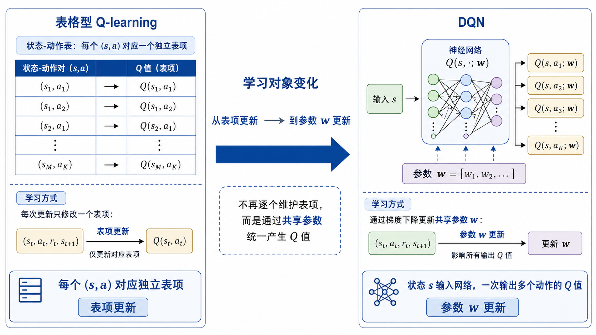

## 从值函数近似到 DQN

上一篇讨论了值函数近似（Value Function Approximation）。在更早的表格型方法中，状态价值或动作价值通常被直接存储在表中。对于动作价值函数来说，表格方法会为每个状态—动作对 $(s,a)$ 维护一个独立数值：
$$
Q(s,a)
$$
这个数值表示在状态 $s$ 下执行动作 $a$ 的长期价值估计。

这种表示方式很清晰，也和前面讨论过的蒙特卡洛方法、时序差分方法以及 Q-learning 直接对应。每当智能体采样到一次转移经验，就可以找到表中对应的条目，然后对这个条目做更新。例如，在表格 Q-learning 中，每个 $(s,a)$ 都有自己独立的存储位置，算法只需要根据当前经验修改对应的 $Q(s,a)$。

但是，表格表示有一个强前提：状态空间和动作空间必须能够被枚举，并且规模不能太大。对于网格世界、悬崖漫步这类小规模离散环境，这个前提通常可以满足。但在更复杂的任务中，状态可能是连续变量，也可能是高维观测，例如图像、激光雷达点云、机器人关节状态和速度等。此时，想要为每个可能状态都建立独立表项，基本不可行。

因此，上一篇引入了参数化表示。核心变化是：学习对象从“表中的每个独立条目”转向“一组可以共享的参数”。对于动作价值函数，我们不再把它写成单纯的 $Q(s,a)$，而是写成
$$
Q(s,a;\mathbf{w})
$$
其中，$\mathbf{w}$ 表示函数近似器的参数。这个函数近似器可以是线性函数，也可以是更复杂的非线性函数。它接收状态 $s$ 和动作 $a$ 的信息，输出对应的动作价值估计。

这种表示方式带来的关键变化是泛化能力。表格方法中，不同状态—动作对的价值通常彼此独立；而在函数近似中，不同输入之间会共享同一组参数 $\mathbf{w}$。因此，当某些状态—动作对被更新时，参数的变化也可能影响到相似状态或相关动作的价值估计。这使得算法有机会处理更大的状态空间。

DQN 所处的位置，正是在这个逻辑之后。

如果我们已经接受用参数化函数 $Q(s,a;\mathbf{w})$ 表示动作价值函数，那么一个自然的选择就是使用神经网络作为这个函数近似器。当神经网络被用来近似动作价值函数时，就得到 **深度 Q 网络（Deep Q-Network, DQN）** 。

从这个角度看，DQN 可以先被理解为下面这句话：

**DQN 是用神经网络表示动作价值函数 $Q(s,a;\mathbf{w})$ 的 Q-learning 方法。**

这一定义里包含两层含义。

第一，它仍然延续 Q-learning 的价值学习思想。DQN 学习的目标仍然是动作价值函数，并且仍然通过“当前奖励 + 下一状态最大动作价值”构造时序差分目标。

第二，它不再使用动作价值表，而是用神经网络来输出 Q 值。也就是说，原来表格中的一项 $Q(s,a)$，现在由网络前向计算得到；原来对表项的增量更新，现在转化为对神经网络参数 $\mathbf{w}$ 的梯度更新。

因此，DQN 并不是完全脱离前面方法的新算法。它更适合作为从表格 Q-learning 到深度强化学习的第一步：保留 Q-learning 的基本目标，同时把动作价值函数的表示方式从表格扩展到神经网络。

## 表格 Q-learning

在进入 DQN 之前，需要先回到表格 Q-learning。因为 DQN 的核心目标和更新结构，仍然来自 Q-learning。只有先把表格 Q-learning 的逻辑重新梳理清楚，后面才能自然看出 DQN 改动了什么。

Q-learning 是一种基于动作价值函数的时序差分控制方法。它学习的对象是最优动作价值函数：
$$
Q_*(s,a)
$$
这个函数表示：在状态 $s$ 下先执行动作 $a$，之后都按照最优方式继续行动时，能够获得的长期期望回报。

如果已经得到了 $Q_*(s,a)$，那么最优动作选择就很直接。在任意状态 $s$ 下，只需要选择 Q 值最大的动作：
$$
a_*=\arg\max_a Q_*(s,a)
$$
因此，Q-learning 的基本思路就是：不直接学习策略，而是先学习每个状态—动作对的最优动作价值，再通过最大 Q 值对应的动作得到策略。

在表格设定中，算法会维护一张动作价值表。表中的每一项对应一个状态—动作对：
$$
(s,a)\rightarrow Q(s,a)
$$
这里的 $Q(s,a)$ 是对 $Q_*(s,a)$ 的估计。随着智能体不断与环境交互，这张表会被逐步更新。

设在时刻 $t$，智能体处于状态 $s_t$，选择动作 $a_t$，环境返回奖励 $r_t$，并转移到下一状态 $s_{t+1}$。这条经验可以写成：
$$
(s_t,a_t,r_t,s_{t+1})
$$
Q-learning 会利用这条经验更新当前状态—动作对的价值估计 $Q(s_t,a_t)$。

它的更新公式为：
$$
Q(s_t,a_t)\leftarrow Q(s_t,a_t)+\alpha\Big[r_t+\gamma\max_{a'}Q(s_{t+1},a')-Q(s_t,a_t)\Big]
$$
这个公式可以分成三部分理解。

第一部分是当前估计：
$$
Q(s_t,a_t)
$$
它表示算法当前认为，在状态 $s_t$ 下执行动作 $a_t$ 的长期价值是多少。

第二部分是时序差分目标（Temporal Difference Target）：
$$
r_t+\gamma\max_{a'}Q(s_{t+1},a')
$$
它由两项组成。$r_t$ 是当前这一步已经真实获得的奖励，$\gamma\max_{a'}Q(s_{t+1},a')$ 则表示从下一状态 $s_{t+1}$ 开始，如果之后选择当前估计下最优的动作，未来还能获得多少价值。

第三部分是时序差分误差（Temporal Difference Error）：
$$
\delta_t=r_t+\gamma\max_{a'}Q(s_{t+1},a')-Q(s_t,a_t)
$$
它衡量的是“新的目标值”和“当前估计值”之间的差距。如果目标值更大，说明当前的 $Q(s_t,a_t)$ 可能估低了，需要向上修正；如果目标值更小，说明当前估计可能偏高，需要向下修正。

于是 Q-learning 的更新可以简写为：
$$
Q(s_t,a_t)\leftarrow Q(s_t,a_t)+\alpha\delta_t
$$
其中，$\alpha$ 是学习率（Learning Rate），控制每次根据新经验修正 Q 值的幅度。

从形式上看，这仍然延续了前面时序差分方法中的统一结构：
$$
\text{新估计}=\text{旧估计}+\alpha(\text{目标}-\text{旧估计})
$$
区别在于，Q-learning 的目标中使用了下一状态的最大动作价值：
$$
\max_{a'}Q(s_{t+1},a')
$$
这使它直接朝最优动作价值函数 $Q_*(s,a)$ 靠近。

这里还需要注意一个细节：Q-learning 在更新目标中使用的是最大动作价值，但智能体实际采样数据时，不一定每一步都选择当前 Q 值最大的动作。为了探索环境，训练过程中通常会使用 $\epsilon$-贪心策略（$\epsilon$-greedy Policy）。

$\epsilon$-贪心策略的规则很简单。在状态 $s$ 下：

以概率 $1-\epsilon$，选择当前 Q 值最大的动作：
$$
a=\arg\max_a Q(s,a)
$$
以概率 $\epsilon$，随机选择一个动作。

这样做的目的，是在利用当前知识和探索未知动作之间保持一定平衡。如果训练时始终选择当前 Q 值最大的动作，智能体可能过早依赖不准确的价值估计，从而错过更优动作。加入随机探索后，智能体就有机会尝试其他动作，获得更丰富的经验。

因此，表格 Q-learning 的整体逻辑可以概括为：

智能体用当前 Q 表和探索策略选择动作；
 环境返回奖励和下一状态；
 算法用
$$
r_t+\gamma\max_{a'}Q(s_{t+1},a')
$$
构造目标；
 再用这个目标修正表中的 $Q(s_t,a_t)$。

在小规模离散环境中，这套方法非常清晰。每个状态—动作对都有独立表项，采样到哪一项，就更新哪一项。只要状态和动作数量有限，并且每个状态—动作对都能被充分访问，Q 表就可以逐步逼近最优动作价值函数。

但是，这种写法也暴露了表格 Q-learning 的限制。

它必须能够直接访问表中的 $Q(s_t,a_t)$，也必须能够枚举下一状态 $s_{t+1}$ 下所有动作的 Q 值：
$$
Q(s_{t+1},a')
$$
然后计算最大值：
$$
\max_{a'}Q(s_{t+1},a')
$$
这要求动作空间通常是离散的，也要求状态—动作对能够在表中找到对应位置。

当状态空间很大，或者状态是连续变量、高维图像时，动作价值表就难以维护。此时，$Q(s,a)$ 不能再依赖表格存储，而需要由参数化函数计算得到。于是，表格 Q-learning 的更新目标就需要迁移到函数近似形式中。

这就引出下一步：将
$$
Q(s,a)
$$
替换为
$$
Q(s,a;\mathbf{w})
$$
并用神经网络来表示这个函数。DQN 正是在这一步出现的。

## 从 Q 表到神经网络

表格 Q-learning 的更新公式已经说明，算法真正需要维护的是动作价值估计：
$$
Q(s,a)
$$
在表格设定中，这个量直接存储在 Q 表里。给定状态 $s$ 和动作 $a$，只要查表，就能得到对应的 Q 值。

但是，当状态空间较大时，查表这一操作就不再现实。此时需要把原来的动作价值表替换成一个可计算的函数：
$$
Q(s,a;\mathbf{w})
$$
其中，$\mathbf{w}$ 是函数的参数。给定输入 $(s,a)$，函数输出一个标量，用来近似这个状态—动作对的价值。

如果这个函数由神经网络表示，就得到 DQN 的基本形式。也就是说，DQN 不是直接存储所有 $Q(s,a)$，而是用一个神经网络根据输入计算 Q 值：
$$
(s,a)\longrightarrow Q(s,a;\mathbf{w})
$$
从这个角度看，表格 Q-learning 到 DQN 的变化可以写成：
$$
Q(s,a)\quad \longrightarrow \quad Q(s,a;\mathbf{w})
$$
这个变化看起来只是多了参数 $\mathbf{w}$，但它在算法含义上非常重要。

在表格 Q-learning 中，每个状态—动作对都有自己的独立表项。更新 $Q(s_t,a_t)$ 时，通常只会改变这一项本身。其他没有被访问到的状态—动作对不会直接发生变化。

而在 DQN 中，$Q(s,a;\mathbf{w})$ 由同一个神经网络计算得到。不同状态和动作的 Q 值共享同一组参数 $\mathbf{w}$。因此，当一次训练样本更新了网络参数后，不只是当前样本对应的 Q 值可能变化，其他状态或动作的 Q 值也可能随之变化。

这正是神经网络函数近似的核心特点：它不再把每个状态—动作对完全独立地看待，而是通过共享参数建立某种关联。这样做的好处是，当状态空间很大时，智能体有机会把已经学到的经验推广到相似状态上。

例如，在表格方法中，如果两个状态编号不同，那么它们就是两个不同表项。即使它们在实际环境中非常接近，算法也不会天然知道这一点。神经网络则不同。如果两个状态在输入特征上相似，网络可能会给出相近的表示和相近的 Q 值。这样，有限样本就有可能影响更大范围内的价值估计。

不过，这种参数共享也带来了新的困难。

表格方法中，某个表项的更新相对局部，影响范围明确。DQN 中，每次更新都会改变网络参数，而参数又影响整个 Q 函数。因此，更新过程不再是“改表中的一个格子”，而是在调整一个复杂函数的整体形状。这样虽然提高了表达能力和泛化能力，但也会使训练更容易不稳定。

在 DQN 中，神经网络的作用可以概括为：

给定状态输入，计算各个动作的价值估计； 
根据时序差分目标构造损失函数； 
通过梯度下降更新网络参数 $\mathbf{w}$； 
让网络输出的 Q 值逐步接近更合理的动作价值估计。

 DQN 和一般函数近似写法
$$
Q(s,a;\mathbf{w})
$$
在实现上还有一个常见区别。

从数学定义上看，动作价值函数接收状态和动作两个输入：
$$
(s,a)\mapsto Q(s,a;\mathbf{w})
$$
也就是说，给定一个具体状态 $s$ 和一个具体动作 $a$，网络输出这个动作的 Q 值。

但在离散动作空间中，DQN 更常用的做法是：只把状态 $s$ 输入神经网络，让网络一次性输出所有动作对应的 Q 值。

假设动作空间为
$$
\mathcal{A}=\{a_1,a_2,\dots,a_m\}
$$
那么 DQN 网络可以写成：
$$
s \longrightarrow 
\big[
Q(s,a_1;\mathbf{w}),
Q(s,a_2;\mathbf{w}),
\dots,
Q(s,a_m;\mathbf{w})
\big]
$$
也就是说，网络的输入是状态 $s$，输出是一个长度为 $m$ 的向量。这个向量中的第 $i$ 个分量，对应动作 $a_i$ 的 Q 值。

这种设计非常适合离散动作空间。因为在选择动作时，智能体需要比较所有可选动作的 Q 值。如果网络一次输出所有动作价值，那么只需要一次前向传播，就可以得到：
$$
Q(s,a_1;\mathbf{w}),Q(s,a_2;\mathbf{w}),\dots,Q(s,a_m;\mathbf{w})
$$
然后选择其中最大的一个：
$$
a=\arg\max_{a_i}Q(s,a_i;\mathbf{w})
$$
这比为每个动作分别输入一次 $(s,a_i)$ 更高效，也更符合很多离散控制任务的实现方式。

这一点是理解 DQN 的关键。DQN 并不是直接输出一个动作，也不是直接输出策略概率，而是输出动作价值。动作选择是根据这些 Q 值再计算出来的。也就是说，网络负责回答“每个动作有多值得选”，而不是直接给出“应该选哪个动作”。

这也说明了 DQN 与策略网络的区别。策略网络通常直接输出动作概率或动作本身；DQN 输出的是动作价值估计。智能体再根据这些价值估计，通过贪心或 $\epsilon$-贪心策略选择动作。

## 动作选择与探索

上一节已经说明，离散动作空间中，DQN 通常把状态 $s$ 输入神经网络，并一次性输出所有动作对应的 Q 值：
$$
Q(s,\cdot;\mathbf{w}) = \big[
Q(s,a_1;\mathbf{w}),
Q(s,a_2;\mathbf{w}),
\dots,
Q(s,a_m;\mathbf{w})
\big]
$$
有了这些 Q 值之后，智能体就可以根据动作价值来选择动作。最直接的方式是贪心选择（Greedy Action Selection）：
$$
a=\arg\max_{a_i\in\mathcal{A}} Q(s,a_i;\mathbf{w})
$$
这个式子的意思是：在当前状态 $s$ 下，计算所有动作的 Q 值，然后选择 Q 值最大的动作。由于 Q 值表示当前估计下动作的长期价值，所以选择最大 Q 值动作，等价于选择当前网络认为最有利的动作。

例如，假设某个环境中有三个离散动作：
$$
\mathcal{A}=\{a_1,a_2,a_3\}
$$
网络在状态 $s$ 下输出：
$$
Q(s,\cdot;\mathbf{w})=[1.2,\;0.4,\;2.1]
$$
那么第三个动作的 Q 值最大，因此贪心策略会选择
$$
a_3
$$
这说明，DQN 虽然使用神经网络，但它的动作选择方式仍然延续了 Q-learning 的思想：先估计每个动作的价值，再选择价值最大的动作。

不过，在训练阶段，如果始终使用贪心选择，往往不够合适。原因在于，训练早期网络参数 $\mathbf{w}$ 通常还没有学好，输出的 Q 值并不可靠。如果智能体过早地只选择当前 Q 值最大的动作，就可能反复访问少数状态和动作，缺少对其他动作的尝试。

因此，DQN 训练时通常仍然使用 $\epsilon$-贪心策略（$\epsilon$-greedy Policy）进行探索。具体来说，在状态 $s$ 下：

以概率 $1-\epsilon$，选择当前 Q 值最大的动作：
$$
a=\arg\max_{a_i\in\mathcal{A}}Q(s,a_i;\mathbf{w})
$$
以概率 $\epsilon$，从动作空间 $\mathcal{A}$ 中随机选择一个动作。

这里的 $\epsilon$ 控制探索强度。$\epsilon$ 越大，随机动作越多，探索越充分；$\epsilon$ 越小，智能体越倾向于利用当前网络已经学到的价值估计。

在实际训练中，$\epsilon$ 常常不是固定不变的，而是随着训练过程逐渐减小。训练初期，网络对环境了解很少，可以使用较大的 $\epsilon$，让智能体尝试更多动作；训练后期，网络已经积累了较多经验，可以降低 $\epsilon$，让智能体更多依赖当前 Q 值进行决策。

这对应强化学习中一直存在的探索与利用（Exploration and Exploitation）问题。

探索是指尝试当前看来未必最优的动作，以便获得更多环境信息。利用是指根据已有价值估计，选择当前认为最好的动作。DQN 通过 $\epsilon$-贪心策略，在两者之间做一个简单平衡。

需要注意的是，DQN 网络本身并不直接决定是否探索。网络只输出 Q 值：
$$
Q(s,\cdot;\mathbf{w})
$$
而动作选择规则在网络输出之后进行。也就是说，DQN 的神经网络负责估计动作价值，$\epsilon$-贪心策略负责根据这些价值和随机探索机制选择实际执行的动作。

因此，DQN 的交互过程可以概括为：

当前状态 $s_t$ 输入网络； 
网络输出所有动作的 Q 值：
$$
Q(s_t,\cdot;\mathbf{w})
$$
根据 $\epsilon$-贪心策略选择动作 $a_t$； 
环境返回奖励 $r_t$ 和下一状态 $s_{t+1}$； 
这条经验之后会用于更新网络参数。

从这里可以看出，DQN 的动作选择和表格 Q-learning 在逻辑上高度一致。区别只在于，表格 Q-learning 通过查表得到
$$
Q(s,a)
$$
而 DQN 通过神经网络前向计算得到
$$
Q(s,a;\mathbf{w})
$$
动作选择规则本身仍然围绕“选择 Q 值最大的动作”展开。

## TD 目标与损失函数

前面已经说明，DQN 的前向过程是：输入状态 $s$，输出所有离散动作的 Q 值，再根据这些 Q 值选择动作。接下来要解决的是训练问题：神经网络参数 $\mathbf{w}$ 应该如何更新。

在表格 Q-learning 中，采样到一次转移
$$
(s_t,a_t,r_t,s_{t+1})
$$
之后，会使用下面的目标更新 $Q(s_t,a_t)$：
$$
r_t+\gamma \max_{a'}Q(s_{t+1},a')
$$
这个目标由当前奖励和下一状态的最大动作价值组成。DQN 保留了这个思路，只是把表格中的 $Q(s,a)$ 换成神经网络输出的
$$
Q(s,a;\mathbf{w})
$$
因此，对于当前样本 $(s_t,a_t,r_t,s_{t+1})$，DQN 也需要先构造一个时序差分目标（Temporal Difference Target）。常见写法为：
$$
y_t=r_t+\gamma\max_{a'}Q(s_{t+1},a';\mathbf{w}^-)
$$
这里的 $y_t$ 表示当前样本对应的目标值。它可以理解为：当前动作 $a_t$ 的 Q 值，应该向这个目标靠近。

这个式子中出现了两组参数：

- $\mathbf{w}$：当前正在训练的网络参数；
- $\mathbf{w}^-$：用于计算目标值的目标网络参数。

这里先只需要知道，$\mathbf{w}^-$ 通常在一段时间内保持不变，用来让目标值相对稳定。目标网络（Target Network）的具体作用，后面会单独展开。

如果暂时不考虑目标网络，也可以把目标写成：
$$
y_t=r_t+\gamma\max_{a'}Q(s_{t+1},a';\mathbf{w})
$$
这正是把表格 Q-learning 直接迁移到神经网络形式后的结果。但实际 DQN 通常使用 $\mathbf{w}^-$ 来计算目标，以缓解训练不稳定。

有了目标值 $y_t$ 之后，就可以比较它和当前网络对 $Q(s_t,a_t)$ 的估计：
$$
Q(s_t,a_t;\mathbf{w})
$$
DQN 的目标是让当前估计接近 TD 目标。因此，可以定义平方误差损失：
$$
L(\mathbf{w}) =
\frac{1}{2}
\Big(
y_t-Q(s_t,a_t;\mathbf{w})
\Big)^2
$$
这里的 $\frac{1}{2}$ 只是为了求导时形式更简洁，不影响优化目标。

这个损失函数的含义很直接：如果当前网络输出的 $Q(s_t,a_t;\mathbf{w})$ 和目标 $y_t$ 差距较大，损失就较大；如果两者接近，损失就较小。训练神经网络时，就通过梯度下降让这个损失逐步减小。

需要注意，虽然 DQN 网络通常一次输出所有动作的 Q 值，但在计算损失时，只取当前实际执行动作 $a_t$ 对应的那个分量。

假设动作空间为
$$
\mathcal{A}=\{a_1,a_2,a_3\}
$$
网络对状态 $s_t$ 的输出为：
$$
Q(s_t,\cdot;\mathbf{w})=
[
Q(s_t,a_1;\mathbf{w}),
Q(s_t,a_2;\mathbf{w}),
Q(s_t,a_3;\mathbf{w})
]
$$
如果智能体在这一时刻实际执行的是动作 $a_2$，那么当前样本只会用
$$
Q(s_t,a_2;\mathbf{w})
$$
参与损失计算。其他动作的 Q 值虽然也由网络输出，但不会直接进入这条样本的 TD 误差。

于是，这条样本对应的 TD 误差可以写成：
$$
\delta_t =
y_t-Q(s_t,a_t;\mathbf{w})
$$
其中
$$
y_t=r_t+\gamma\max_{a'}Q(s_{t+1},a';\mathbf{w}^-)
$$
损失函数也可以写成：
$$
L(\mathbf{w})=\frac{1}{2}\delta_t^2
$$
接着对 $\mathbf{w}$ 做梯度下降：
$$
\mathbf{w} \leftarrow \mathbf{w} - \alpha \nabla_{\mathbf{w}} L(\mathbf{w})
$$
由于 $y_t$ 是由目标网络参数 $\mathbf{w}^-$ 计算出来的，在更新当前网络参数 $\mathbf{w}$ 时，通常把 $y_t$ 当作固定目标处理。也就是说，梯度主要作用在当前估计
$$
Q(s_t,a_t;\mathbf{w})
$$
上，而不是让目标值也同时跟着当前网络参数一起变化。

这点非常关键。DQN 的训练形式看起来接近监督学习：输入是状态，目标是 $y_t$，网络输出是 $Q(s_t,a_t;\mathbf{w})$，然后最小化平方误差。但它和普通监督学习仍然有明显差别。普通监督学习中的标签通常来自固定数据集，而 DQN 中的目标 $y_t$ 是由奖励和当前价值网络间接构造出来的。也就是说，DQN 的“标签”本身来自强化学习的自举估计。

如果下一状态 $s_{t+1}$ 是终止状态，则后续不再有未来回报。这时目标中不应该再加入下一状态的价值，通常写成：
$$
y_t=r_t
$$
因此，更完整的 TD 目标可以写成：
$$
y_t=
\begin{cases}
r_t, & s_{t+1}\text{ 为终止状态}\\
r_t+\gamma\max_{a'}Q(s_{t+1},a';\mathbf{w}^-), & s_{t+1}\text{ 非终止状态}
\end{cases}
$$
这样处理可以避免在回合结束后继续估计不存在的未来价值。

到这里，DQN 的核心训练目标已经可以概括为：

给定一条经验
$$
(s_t,a_t,r_t,s_{t+1})
$$
先用奖励和下一状态的最大 Q 值构造 TD 目标：
$$
y_t=r_t+\gamma\max_{a'}Q(s_{t+1},a';\mathbf{w}^-)
$$
再让当前网络输出的
$$
Q(s_t,a_t;\mathbf{w})
$$
接近这个目标。这个过程通过最小化损失函数完成：
$$
L(\mathbf{w}) =
\frac{1}{2}
\Big(
y_t-Q(s_t,a_t;\mathbf{w})
\Big)^2
$$
从表格 Q-learning 到 DQN，更新对象发生了变化。表格方法直接更新一个数值 $Q(s_t,a_t)$；DQN 则通过损失函数和反向传播更新整组网络参数 $\mathbf{w}$。但两者背后的 TD 目标保持一致：当前动作价值应当接近“当前奖励 + 下一状态的最优后续价值”。

## 直接训练的困难

从上一节看，DQN 的训练形式似乎已经很自然：用神经网络输出 $Q(s_t,a_t;\mathbf{w})$，再用 TD 目标
$$
y_t=r_t+\gamma\max_{a'}Q(s_{t+1},a';\mathbf{w}^-)
$$
构造平方误差损失：
$$
L(\mathbf{w})=\frac{1}{2}\Big(y_t-Q(s_t,a_t;\mathbf{w})\Big)^2
$$
如果只看这个形式，它和普通监督学习很相似。普通监督学习中，模型给出预测值，数据集中给出目标标签，然后通过最小化预测值与标签之间的误差来训练模型。DQN 看起来也在做类似的事情：网络输出 Q 值，TD 目标提供训练目标，然后用梯度下降更新参数。

但这种相似性容易掩盖强化学习训练中的特殊困难。DQN 不能简单地把 Q-learning 的目标直接套到神经网络上反复训练，否则很容易出现 Q 值震荡、发散或者学习效果不稳定。这里的根本原因在于，强化学习中的数据和目标都具有动态性。

先看第一个困难：样本之间存在强相关性。

在普通监督学习中，训练样本通常被近似看作独立同分布（Independent and Identically Distributed, IID）。虽然实际数据未必完全满足这个假设，但至少训练集通常可以打乱后随机抽取小批量样本。这样，每次梯度更新看到的是相对分散的数据，训练过程比较稳定。

强化学习中的样本来自智能体与环境的连续交互。相邻时间步的经验往往非常相似，例如：
$$
(s_t,a_t,r_t,s_{t+1})
$$
和
$$
(s_{t+1},a_{t+1},r_{t+1},s_{t+2})
$$
之间存在很强的时间相关性。智能体如果连续沿着同一条轨迹前进，那么短时间内采集到的状态、动作和奖励通常会高度相关。

如果直接按时间顺序把这些样本输入神经网络训练，网络会在短时间内反复看到相似数据。这会降低训练样本的多样性，使参数更新方向容易受到当前轨迹的强烈影响。结果是，网络可能过度适应最近一段经验，而对其他状态区域的价值估计变差。

再看第二个困难：训练目标本身会变化。

在普通监督学习中，标签通常是固定的。例如图像分类中，一张图片的类别标签不会随着模型参数更新而改变。但在 DQN 中，目标值
$$
y_t=r_t+\gamma\max_{a'}Q(s_{t+1},a';\mathbf{w})
$$
本身也由网络计算得到。

如果直接使用同一个网络参数 $\mathbf{w}$ 同时计算当前估计和目标值，那么每次更新参数后，当前估计
$$
Q(s_t,a_t;\mathbf{w})
$$
会改变，目标中的
$$
\max_{a'}Q(s_{t+1},a';\mathbf{w})
$$
也会改变。

这就导致训练目标不再稳定。网络一边追逐目标，一边又在改变目标本身。这样的训练过程比普通监督学习更难控制，因为损失函数中的“标签”并不是外部给定的固定值，而是由当前价值估计自举得到的。

这里的自举（Bootstrap）指的是：用已有的价值估计来构造新的更新目标。TD 方法本身就依赖自举。它的优点是可以不用等到完整回报出现就进行更新，但代价是目标中包含当前估计的成分。如果估计本身有偏差，这个偏差就可能继续进入后续目标。

第三个困难来自函数近似的全局影响。

在表格 Q-learning 中，更新 $Q(s_t,a_t)$ 通常只改变表中的一个位置。虽然这个更新会通过后续采样间接影响其他状态—动作对，但单次更新的直接影响范围比较明确。

在 DQN 中，更新的是神经网络参数 $\mathbf{w}$。同一组参数参与计算许多状态和动作的 Q 值。因此，一次梯度更新可能同时改变大量输入对应的输出。当前样本的 TD 误差被减小后，其他状态下的 Q 值可能也发生变化，其中有些变化未必是有利的。

这使得 DQN 的训练具有更强的耦合性。某一批样本上的更新，可能影响整个价值函数的形状。如果样本分布不均衡，或者目标变化过快，网络就可能在不同状态区域之间来回调整，导致 Q 值不稳定。

第四个困难与最大化操作有关。

Q-learning 的目标中包含：
$$
\max_{a'}Q(s_{t+1},a';\mathbf{w})
$$
这个最大化操作会选择当前估计中最大的动作价值。如果某些动作的 Q 值由于估计误差被偶然高估，那么最大化操作更容易选中这些偏高的估计。这样构造出来的 TD 目标也会偏高，进一步推动当前 Q 值上升。

这就是 Q 值高估（Overestimation）问题的来源之一。这个问题在表格方法中已经存在，在神经网络函数近似下可能更明显。后续 Double DQN 会专门处理这一点，这里先只需要知道：最大化操作会放大估计误差，是 DQN 训练不稳定的重要因素之一。

把这些因素合在一起，可以看到，DQN 的训练同时包含几个不稳定来源：

样本来自连续交互，时间相关性强； 
TD 目标由网络自身构造，会随参数变化； 
神经网络更新具有全局影响；
最大化操作可能放大 Q 值估计偏差。

因此，DQN 面临的困难并不只是“神经网络比较难训练”。更准确地说，它把三类因素结合到了一起：函数近似（Function Approximation）、自举（Bootstrap）和离策略学习（Off-policy Learning）。

其中，函数近似来自神经网络；自举来自 TD 目标；离策略学习则来自 Q-learning 的特点，即行为策略可以包含探索，而更新目标仍然使用下一状态的最大动作价值。三者结合后，训练过程容易变得不稳定。

所以，DQN 不能只停留在下面这个直接版本：
$$
Q(s,a)\rightarrow Q(s,a;\mathbf{w})
$$
然后立即按每一步新经验在线更新网络。为了让训练更稳定，DQN 引入了两个关键机制：

经验回放（Experience Replay），用于打散样本之间的时间相关性，并提高已有经验的利用率； 
目标网络（Target Network），用于让 TD 目标在一段时间内保持相对稳定。

## 经验回放

上一节已经说明，直接用连续交互得到的样本训练 DQN，会面临样本相关性强的问题。智能体在环境中一步一步行动，得到的经验序列通常具有明显的时间连续性。相邻样本之间往往非常接近，如果直接按照采样顺序训练网络，参数更新会受到最近一段轨迹的强烈影响。

经验回放（Experience Replay）就是为了解决这一问题引入的机制。

它的基本思想很简单：智能体不把刚刚得到的经验立刻丢掉，而是把经验先存入一个缓冲区。这个缓冲区通常称为经验回放池（Replay Buffer）。

在每一步交互中，智能体都会得到一条转移经验：
$$
(s_t,a_t,r_t,s_{t+1})
$$
如果考虑终止状态，还会额外记录一个终止标志：
$$
(s_t,a_t,r_t,s_{t+1},d_t)
$$
其中，$d_t$ 表示下一状态是否为终止状态。

这些经验会被依次存入经验回放池。随着训练进行，回放池中会保存大量来自不同时间、不同状态区域的历史经验。

训练神经网络时，DQN 不一定只使用最新的一条经验，而是从回放池中随机采样一批经验，组成小批量（Mini-batch）：
$$
\{(s_i,a_i,r_i,s_{i+1},d_i)\}_{i=1}^{B}
$$
其中，$B$ 表示批量大小。

然后对这一批样本分别构造 TD 目标：
$$
y_i = \begin{cases}
r_i, & d_i=1 \\
r_i+\gamma\max_{a'}Q(s_{i+1},a';\mathbf{w}^-), & d_i=0
\end{cases}
$$
再定义批量损失：
$$
L(\mathbf{w}) =
\frac{1}{B}
\sum_{i=1}^{B}
\frac{1}{2}
\Big(y_i-Q(s_i,a_i;\mathbf{w})\Big)^2
$$
最后通过梯度下降更新当前网络参数 $\mathbf{w}$。

从这个过程可以看出，经验回放并没有改变 Q-learning 的 TD 目标，也没有改变 DQN 的价值函数形式。它改变的是训练样本的使用方式。

没有经验回放时，智能体通常按照时间顺序使用最新经验。这样会导致连续样本之间相关性很强。加入经验回放后，每次训练都从回放池中随机抽取样本。由于这些样本来自不同时间点，彼此之间的相关性会被削弱。这样训练网络时，小批量数据更接近普通监督学习中的随机批量，梯度更新也会更加平稳。

经验回放还有另一个重要作用：提高经验利用率。

在普通在线更新中，一条经验通常只使用一次。智能体与环境交互得到样本后，用它更新一次参数，然后这条经验就不再参与训练。对于强化学习来说，真实交互往往代价较高，如果经验只被使用一次，样本利用率较低。

有了经验回放之后，一条经验可以在之后的训练过程中被多次采样。也就是说，同一条经验可以多次参与参数更新。这样，智能体能够从有限交互中获得更多训练信号。

因此，经验回放的作用可以概括为两点：

第一，打散连续样本之间的时间相关性，使训练数据更加分散。

第二，重复利用历史经验，提高样本利用率。

不过，经验回放也带来一个需要注意的特点：训练数据并不完全来自当前策略。

因为回放池中保存的是过去不同时刻采集到的经验，而智能体的策略会随着网络参数更新不断变化。所以，某一批训练样本可能来自较早版本的行为策略，而当前网络已经发生了变化。

这意味着 DQN 天然具有离策略（Off-policy）特征。幸运的是，Q-learning 本身就是离策略方法。它允许行为策略用于采样，例如 $\epsilon$-贪心策略；同时更新目标仍然朝最大动作价值方向逼近：
$$
\max_{a'}Q(s_{t+1},a';\mathbf{w}^-)
$$
因此，经验回放和 Q-learning 的基本性质是相容的。

在实现中，经验回放池通常会设置最大容量。新的经验不断写入，当容量达到上限后，最早存入的经验会被移除。这可以避免回放池无限增长，同时也让训练数据保持一定更新。

可以把 DQN 中加入经验回放后的训练过程理解为下面几步：

智能体与环境交互，得到经验
$$
(s_t,a_t,r_t,s_{t+1},d_t)
$$
将经验存入回放池；

从回放池中随机采样一个小批量；

对小批量中的每条经验计算 TD 目标；

用批量损失更新网络参数 $\mathbf{w}$。

这样一来，DQN 的训练就不再完全依赖最近一步经验，而是利用历史经验集合进行随机批量训练。这个机制显著缓解了样本相关性带来的不稳定性，也是 DQN 能够训练深度网络的重要原因之一。

但经验回放主要处理的是“样本如何使用”的问题。它并没有解决另一个核心困难：TD 目标本身会随着网络参数变化而变化。也就是说，即使样本被随机打散，如果目标值
$$
r_t+\gamma\max_{a'}Q(s_{t+1},a';\mathbf{w})
$$
每次都随着当前网络快速变化，训练仍然可能不稳定。

为了解决这个问题，DQN 还需要引入目标网络。

## 目标网络

经验回放解决了样本使用方式的问题。它通过保存历史经验并随机采样小批量，削弱了连续样本之间的时间相关性，也提高了经验利用率。但 DQN 训练中还有另一个重要不稳定来源：TD 目标本身会随网络参数变化而变化。

回到 DQN 的 TD 目标。如果直接用当前网络计算下一状态的最大 Q 值，那么目标可以写成：
$$
y_t=r_t+\gamma\max_{a'}Q(s_{t+1},a';\mathbf{w})
$$
这里的问题在于，当前网络参数 $\mathbf{w}$ 同时出现在两个位置。

一方面，它用于计算当前估计：
$$
Q(s_t,a_t;\mathbf{w})
$$
另一方面，它也用于计算目标中的下一状态价值：
$$
\max_{a'}Q(s_{t+1},a';\mathbf{w})
$$
于是，当我们通过梯度下降更新 $\mathbf{w}$ 时，当前估计会变化，目标值也会随之变化。这样训练过程就变成了：网络在追逐一个不断移动的目标。目标变化过快时，参数更新很容易出现震荡，甚至导致 Q 值发散。

目标网络（Target Network）就是为了解决这个问题引入的机制。

DQN 中通常维护两个结构相同的 Q 网络：

当前网络（Online Network）：
$$
Q(s,a;\mathbf{w})
$$
目标网络（Target Network）：
$$
Q(s,a;\mathbf{w}^-)
$$
其中，$\mathbf{w}$ 是当前正在训练的参数，$\mathbf{w}^-$ 是目标网络的参数。两个网络结构相同，但参数更新方式不同。

当前网络负责输出当前估计，并通过梯度下降不断更新：
$$
Q(s_t,a_t;\mathbf{w})
$$
目标网络只负责计算 TD 目标中的下一状态价值：
$$
\max_{a'}Q(s_{t+1},a';\mathbf{w}^-)
$$
因此，DQN 的 TD 目标写成：
$$
y_t=r_t+\gamma\max_{a'}Q(s_{t+1},a';\mathbf{w}^-)
$$
对应的损失函数为：
$$
L(\mathbf{w})=
\frac{1}{2}
\Big(
y_t-Q(s_t,a_t;\mathbf{w})
\Big)^2
$$
在这个损失中，$Q(s_t,a_t;\mathbf{w})$ 来自当前网络，会随着梯度下降被更新；而 $y_t$ 中的 $Q(s_{t+1},a';\mathbf{w}^-)$ 来自目标网络，在一段时间内保持固定。这样，目标值就不会在每一步参数更新后立刻变化。

目标网络的关键作用，可以概括为：

**让 TD 目标在一段时间内保持相对稳定。**

这并不是说目标网络给出了真实标签。它仍然只是基于当前学习到的价值函数构造出来的自举目标。但由于目标网络参数 $\mathbf{w}^-$ 不会每一步都跟着 $\mathbf{w}$ 改变，所以目标值的变化速度被降低了。训练当前网络时，优化目标会更加平稳。

目标网络的参数通常通过周期性复制来更新。也就是说，每隔固定步数，将当前网络参数复制给目标网络：
$$
\mathbf{w}^- \leftarrow \mathbf{w}
$$
在两次复制之间，$\mathbf{w}$ 会持续通过梯度下降更新，而 $\mathbf{w}^-$ 保持不变。这样，目标网络相当于当前网络的一个延迟版本。

可以把过程写成下面几步：

先用当前网络 $Q(s,a;\mathbf{w})$ 选择动作和计算当前估计； 
用目标网络 $Q(s,a;\mathbf{w}^-)$ 计算 TD 目标； 
根据损失函数更新当前网络参数 $\mathbf{w}$； 
每隔若干步，把当前网络参数复制到目标网络：
$$
\mathbf{w}^- \leftarrow \mathbf{w}
$$
这个机制减弱了“当前估计”和“目标估计”之间的直接耦合。当前网络仍然在学习，但它学习时面对的目标不会每一步都随自己改变。因此，训练稳定性通常会明显改善。

在有些实现中，也可以使用软更新（Soft Update），即每次只让目标网络参数向当前网络参数移动一小步：
$$
\mathbf{w}^- \leftarrow \tau \mathbf{w}+(1-\tau)\mathbf{w}^-
$$
其中，$\tau$ 是一个较小的系数。这样目标网络会更平滑地跟随当前网络。不过在基础 DQN 中，更常见的讲法是周期性复制参数。

需要注意，目标网络并没有改变 DQN 的优化目标本质。DQN 仍然是在让当前动作价值估计接近 TD 目标：
$$
Q(s_t,a_t;\mathbf{w}) \approx r_t+\gamma\max_{a'}Q(s_{t+1},a';\mathbf{w}^-)
$$
它改变的是目标值的计算方式和更新节奏。通过把目标计算从当前网络中分离出来，DQN 避免了目标值随着每次梯度更新剧烈变化。

结合上一节的经验回放，可以看到 DQN 的两个关键稳定机制分别处理了不同问题。

经验回放主要处理样本问题： 
它打散连续经验之间的时间相关性，并重复利用历史经验。

目标网络主要处理目标问题：
它让 TD 目标在一段时间内保持相对稳定，减弱训练目标快速变化带来的震荡。

这两个机制配合起来，才使得 Q-learning 与深度神经网络的结合更加可行。没有它们，直接用神经网络拟合 Q-learning 目标，往往很难稳定训练。

## DQN 训练流程

前面已经分别讨论了 DQN 的几个组成部分：用神经网络表示动作价值函数，用 $\epsilon$-贪心策略选择动作，用经验回放组织训练样本，用目标网络稳定 TD 目标。现在可以把这些部分合在一起，整理 DQN 的整体训练流程。

DQN 的训练过程可以分成两条同时进行的线索。

第一条线索是与环境交互。智能体根据当前网络输出的 Q 值选择动作，执行动作后得到新的经验。

第二条线索是更新网络。算法从经验回放池中随机采样一批历史经验，构造 TD 目标，并通过损失函数更新当前网络参数。

先从初始化开始。

DQN 需要初始化一个当前网络：
$$
Q(s,a;\mathbf{w})
$$
其中，$\mathbf{w}$ 是需要训练的参数。这个网络用于估计当前状态下各个动作的 Q 值，也用于实际动作选择。

同时，还需要初始化一个目标网络：
$$
Q(s,a;\mathbf{w}^-)
$$
目标网络与当前网络结构相同。初始时通常令：
$$
\mathbf{w}^-=\mathbf{w}
$$
也就是把当前网络参数复制给目标网络。

此外，还需要建立一个经验回放池，用来存储智能体与环境交互得到的经验：
$$
(s_t,a_t,r_t,s_{t+1},d_t)
$$
其中，$d_t$ 表示 $s_{t+1}$ 是否为终止状态。

训练开始后，在每个时间步，智能体首先观察当前状态 $s_t$。然后把 $s_t$ 输入当前网络，得到所有动作的 Q 值：
$$
Q(s_t,\cdot;\mathbf{w})
$$
根据这些 Q 值，智能体使用 $\epsilon$-贪心策略选择动作。也就是说，以较大概率选择当前 Q 值最大的动作：
$$
a_t=\arg\max_a Q(s_t,a;\mathbf{w})
$$
同时保留一定概率随机选择动作，用于探索。

执行动作 $a_t$ 后，环境返回奖励 $r_t$，并转移到下一状态 $s_{t+1}$。于是，算法得到一条经验：
$$
(s_t,a_t,r_t,s_{t+1},d_t)
$$
这条经验会被存入经验回放池。

到这里，交互部分完成了一步。但 DQN 并不会只依赖这一条最新经验进行训练，而是从回放池中随机采样一个小批量：
$$
\{(s_i,a_i,r_i,s_{i+1},d_i)\}_{i=1}^{B}
$$
对于小批量中的每一条经验，需要构造 TD 目标。如果 $s_{i+1}$ 是终止状态，则目标为：
$$
y_i=r_i
$$
如果 $s_{i+1}$ 不是终止状态，则目标为：
$$
y_i=r_i+\gamma\max_{a'}Q(s_{i+1},a';\mathbf{w}^-)
$$
可以合并写成：
$$
y_i = \begin{cases}
r_i, & d_i=1 \\
r_i+\gamma\max_{a'}Q(s_{i+1},a';\mathbf{w}^-), & d_i=0
\end{cases}
$$
接下来，用当前网络计算实际执行动作对应的 Q 值：
$$
Q(s_i,a_i;\mathbf{w})
$$
然后定义小批量损失：
$$
L(\mathbf{w}) = \frac{1}{B}
\sum_{i=1}^{B}
\frac{1}{2}
\Big(y_i-Q(s_i,a_i;\mathbf{w})\Big)^2
$$
训练目标就是让当前网络对已执行动作的 Q 值估计，接近由目标网络构造出来的 TD 目标。通过反向传播和梯度下降，更新当前网络参数：
$$
\mathbf{w} \leftarrow \mathbf{w} - \alpha\nabla_{\mathbf{w}}L(\mathbf{w})
$$
需要注意，在这一步中被更新的是当前网络参数 $\mathbf{w}$，而不是目标网络参数 $\mathbf{w}^-$。目标网络只参与计算目标值，通常不会在每一步梯度更新中改变。

每隔固定步数，算法会把当前网络参数复制给目标网络：
$$
\mathbf{w}^-\leftarrow \mathbf{w}
$$
这样，目标网络会周期性地跟上当前网络，但不会每一步都同步变化。

因此，DQN 的整体过程可以概括为以下顺序：

初始化当前网络 $Q(s,a;\mathbf{w})$ 和目标网络 $Q(s,a;\mathbf{w}^-)$； 
初始化经验回放池； 
智能体根据当前网络和 $\epsilon$-贪心策略与环境交互； 
将交互经验存入回放池； 
从回放池中随机采样小批量经验； 
用目标网络计算 TD 目标； 
用当前网络计算当前 Q 值； 
最小化 TD 误差对应的损失函数，更新当前网络； 
每隔若干步同步目标网络参数。

如果把这个过程与表格 Q-learning 对照，可以看到它们的主干逻辑仍然一致。

表格 Q-learning 中，算法用经验
$$
(s_t,a_t,r_t,s_{t+1})
$$
更新表中的一个数值：
$$
Q(s_t,a_t)
$$
DQN 中，算法用经验小批量更新神经网络参数：
$$
\mathbf{w}
$$
表格方法中的更新目标是：
$$
r_t+\gamma\max_{a'}Q(s_{t+1},a')
$$
DQN 中对应目标是：
$$
r_t+\gamma\max_{a'}Q(s_{t+1},a';\mathbf{w}^-)
$$
表格方法通过增量更新直接修改 Q 表；DQN 通过损失函数和反向传播修改网络参数。换句话说，DQN 把原来“对单个表项的数值修正”，转化成了“对整个价值函数近似器的参数优化”。

这一点也说明，DQN 的复杂性主要不在于 TD 目标本身，而在于它如何稳定地训练一个神经网络形式的动作价值函数。经验回放和目标网络正是围绕这个问题引入的。

## DQN 的局限

DQN 把 Q-learning 推广到了神经网络形式，使价值学习能够处理高维状态输入。但它仍然有明确的适用边界。理解这些局限很重要，因为后续许多改进方法，正是围绕这些问题展开的。

首先，DQN 主要适用于离散动作空间（Discrete Action Space）。

前面已经说明，在常见 DQN 实现中，网络输入状态 $s$，一次输出所有动作对应的 Q 值：
$$
Q(s,\cdot;\mathbf{w}) =
[
Q(s,a_1;\mathbf{w}),
Q(s,a_2;\mathbf{w}),
\dots,
Q(s,a_m;\mathbf{w})
]
$$
这种设计要求动作集合 $\mathcal{A}$ 是有限的，并且动作数量不能太大。因为网络输出层的每个神经元通常对应一个动作。如果环境中有 $m$ 个动作，输出层就需要有 $m$ 个 Q 值。

当动作空间是“向左、向右、跳跃、停止”这类离散动作时，这种方式很自然。但在机器人控制、机械臂控制、无人车控制等任务中，动作往往是连续变量。例如，动作可能是关节力矩、关节速度、末端执行器位移，或者转向角和油门大小。此时动作 $a$ 不再来自有限集合，而是来自连续空间：
$$
a \in \mathbb{R}^n
$$
在连续动作空间中，DQN 的最大化操作会变得困难：
$$
\max_{a'}Q(s_{t+1},a';\mathbf{w}^-)
$$
离散动作下，可以直接枚举所有动作并取最大值；连续动作下，动作有无限多种取值，无法简单枚举。除非额外引入连续优化过程，否则基础 DQN 很难直接处理这类问题。因此，连续控制通常会使用 DDPG、TD3、SAC 等更适合连续动作空间的方法。

其次，DQN 仍然存在 Q 值高估问题。

DQN 的 TD 目标中包含最大化操作：
$$
y_t=r_t+\gamma\max_{a'}Q(s_{t+1},a';\mathbf{w}^-)
$$
这个最大化操作会选择当前估计中数值最大的动作价值。问题在于，神经网络输出的 Q 值只是估计值，里面可能包含误差。如果某个动作的 Q 值因为估计误差被偶然抬高，那么最大化操作更容易选中它。这样，TD 目标也会偏高，进而推动当前 Q 值向偏高方向更新。

这种偏差经过多次自举更新后，可能逐步累积，使动作价值估计整体偏高。Q 值高估会影响动作选择，因为智能体依赖 Q 值判断动作优劣。如果某些动作的价值被系统性高估，策略就可能偏向这些动作，导致学习效果下降。

后续的 Double DQN 正是针对这一问题提出的。它的核心思路是把“选择动作”和“评估动作价值”这两个步骤分开，从而减轻最大化操作带来的高估偏差。

再次，DQN 的训练稳定性仍然依赖很多细节。

经验回放和目标网络虽然显著改善了训练过程，但它们并不能彻底消除不稳定。DQN 仍然同时包含函数近似、自举目标和离策略学习。只要这些因素同时存在，训练过程就可能对超参数、网络结构、奖励尺度和探索策略比较敏感。

例如，学习率 $\alpha$ 过大时，网络参数更新幅度可能过强，Q 值容易震荡；目标网络更新过慢时，目标值可能滞后于当前网络太多；目标网络更新过快时，又会削弱稳定目标的作用。经验回放池容量、批量大小、$\epsilon$ 衰减速度等，也都会影响最终训练效果。

此外，DQN 使用的 TD 目标本身仍然是自举估计：
$$
r_t+\gamma\max_{a'}Q(s_{t+1},a';\mathbf{w}^-)
$$
这个目标并不是真实回报，而是基于当前价值函数构造出来的近似目标。如果价值函数在某些区域估计不准，这种误差就可能通过自举继续传播。

最后，基础 DQN 对状态表示和样本效率也有一定限制。

虽然神经网络能够处理高维输入，但这并不意味着它总能自动学到合适表示。输入状态是否包含足够信息、网络结构是否合适、奖励信号是否清晰，都会影响训练效果。在高维图像任务中，网络需要从像素中学习有效特征，这通常需要大量交互样本。对于真实机器人这类采样成本较高的任务，基础 DQN 往往并不够高效。

因此，DQN 的局限可以概括为几方面：

它主要适用于离散动作空间； 
最大化操作可能带来 Q 值高估； 
训练过程仍然可能不稳定； 
样本效率和状态表示学习仍然存在挑战。

这些局限并不削弱 DQN 的基础意义。相反，它们正好说明了后续算法为什么需要继续发展。Double DQN 试图缓解 Q 值高估，Dueling DQN 改进网络结构，优先经验回放改进样本使用方式，而面向连续动作空间的 DDPG、TD3、SAC 则进一步扩展了深度强化学习的适用范围。
