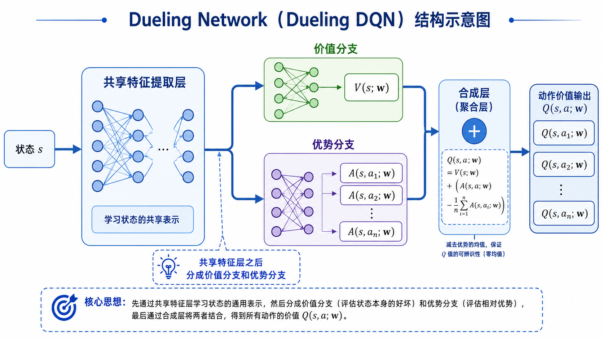

## 从基础 DQN 到改进方法

上一篇已经讨论过，深度 Q 网络（Deep Q-Network, DQN）的核心作用，是把表格型 Q-learning 推进到深度价值学习的形式。在表格型 Q-learning 中，动作价值函数 $Q(s,a)$ 通常以表格形式保存，每个状态—动作对 $(s,a)$ 对应一个独立表项。这样的表示方式在状态空间较小时比较直接，但一旦状态维度升高，或者状态本身是连续变量、图像、传感器特征等复杂输入，表格表示就很难继续使用。

DQN 的基本思路，是用神经网络近似动作价值函数。也就是说，不再为每个状态—动作对单独维护一个表项，而是用带参数的函数
$$
Q(s,a;\mathbf{w})
$$
表示动作价值。其中，$s$ 是状态，$a$ 是动作，$\mathbf{w}$ 是神经网络参数。对于离散动作空间，网络通常接收状态 $s$ 作为输入，并同时输出所有动作对应的 Q 值：
$$
Q(s,\cdot;\mathbf{w})
$$
这样，智能体就可以根据这些输出选择当前估计价值最高的动作。

不过，仅仅把 Q-learning 中的表格换成神经网络，并不能保证训练稳定。原因在于，强化学习中的数据来自智能体与环境的交互，数据分布会随着策略变化而变化；同时，Q-learning 的目标中还包含当前网络自身给出的估计值。这会使训练目标不断变化，进而影响训练稳定性。

因此，基础 DQN 引入了两个关键机制。

第一个机制是经验回放（Experience Replay）。智能体与环境交互得到的转移样本
$$
(s_t,a_t,r_t,s_{t+1})
$$
会被存入经验回放池中。训练时，并不直接按照时间顺序使用最新样本，而是从回放池中随机采样一个小批量样本进行更新。这样可以降低相邻样本之间的相关性，并提高历史经验的利用率。

第二个机制是目标网络（Target Network）。DQN 不直接用当前网络同时构造目标和更新自身，而是额外维护一个参数较旧的网络，记作
$$
Q(s,a;\mathbf{w}^-)
$$
其中 $\mathbf{w}^-$ 表示目标网络参数。当前网络参数 $\mathbf{w}$ 用于学习和动作价值估计，目标网络参数 $\mathbf{w}^-$ 用于构造时序差分目标。目标网络会隔一段时间从当前网络复制参数，从而减缓目标变化速度，使训练过程更加稳定。

在基础 DQN 中，对一条样本 $(s_t,a_t,r_t,s_{t+1})$，常见的时序差分目标写作
$$
y_t=r_t+\gamma\max_{a'}Q(s_{t+1},a';\mathbf{w}^-)
$$
然后通过最小化当前网络输出和目标之间的误差来更新参数：
$$
\big(y_t-Q(s_t,a_t;\mathbf{w})\big)^2
$$
从这个角度看，DQN 完成了一个非常重要的过渡：它把表格型动作价值学习扩展到了神经网络函数近似，使 Q-learning 可以处理更复杂的状态输入。经验回放和目标网络则分别从数据使用方式和目标构造方式上缓解训练不稳定。

但基础 DQN 并没有解决深度价值学习中的所有困难。随着任务复杂度提高，两个问题会变得比较明显。

第一，DQN 的目标中包含最大化操作：
$$
\max_{a'}Q(s_{t+1},a';\mathbf{w}^-)
$$
当神经网络给出的 Q 值存在估计误差时，这个最大化操作可能倾向于选择被偶然高估的动作，从而带来 Q 值高估。这会影响目标值的准确性，并进一步影响后续更新。

第二，普通 DQN 的网络结构直接输出每个动作的 Q 值：
$$
Q(s,\cdot;\mathbf{w})
$$
这种结构把“当前状态本身有多好”和“某个动作相对其他动作好在哪里”混在一起建模。在一些状态下，不同动作之间的价值差异并不明显，此时直接学习每个动作的 Q 值可能并不高效。

围绕这两个问题，后续提出了多种 DQN 改进方法。本文主要讨论其中两个基础而重要的改进：双重 DQN（Double DQN）和对偶 DQN（Dueling DQN）。

Double DQN 主要修改 TD 目标的构造方式，重点缓解 Q 值高估问题；Dueling DQN 主要修改网络结构，使网络能够分别建模状态价值和动作优势。二者关注的方向不同，但都建立在基础 DQN 框架之上，也可以在实际算法中结合使用。

接下来先从 Q 值高估问题开始，分析为什么 DQN 中的最大化操作会放大估计误差，并由此引出 Double DQN 的基本思想。

## Q 值高估

在基础 DQN 中，时序差分目标写作
$$
y_t=r_t+\gamma\max_{a'}Q(s_{t+1},a';\mathbf{w}^-)
$$
这个目标沿用了 Q-learning 的基本思想：当前状态—动作对 $(s_t,a_t)$ 的价值，应该向“当前奖励加上下一个状态的最优动作价值”靠近。这里的关键部分是
$$
\max_{a'}Q(s_{t+1},a';\mathbf{w}^-)
$$
它表示在下一状态 $s_{t+1}$ 下，从所有候选动作中选出估计 Q 值最大的那个动作，并把这个最大值用于构造 TD 目标。

在表格型 Q-learning 中，这种最大化操作已经存在；到了 DQN 中，它仍然保留下来。但需要注意的是，DQN 中的 $Q(s,a;\mathbf{w})$ 来自神经网络估计，它并不等于真实的最优动作价值 $Q_*(s,a)$。也就是说，网络输出的每个 Q 值都可能带有估计误差。

可以把这种关系写成
$$
Q(s,a;\mathbf{w}) = Q_*(s,a) + \varepsilon(s,a)
$$
其中，$\varepsilon(s,a)$ 表示估计误差。这个误差可能为正，也可能为负。如果某个动作的估计误差为正，那么该动作的 Q 值就会被高估；如果误差为负，那么该动作的 Q 值就会被低估。

问题的关键在于，DQN 的 TD 目标并不是随机选择一个动作的估计值，而是对所有动作的估计值取最大值：
$$
\max_{a'}Q(s_{t+1},a';\mathbf{w}^-)
$$
最大化操作会倾向于选中估计值最大的动作。如果某个动作的真实价值并不最高，但它因为估计误差而被偶然高估，那么最大化操作就可能把它选出来。此时，TD 目标会把这个偏高的估计值当作学习目标，进而推动当前 Q 值向偏高方向更新。

这就是 Q 值高估（Overestimation of Q-values）的基本来源。

更具体地说，假设在状态 $s_{t+1}$ 下有多个动作，它们的真实动作价值比较接近。由于神经网络训练不充分、样本数量有限、环境转移带有随机性等原因，每个动作的估计值都会存在一定波动。即使这些误差整体上没有明显偏向，取最大值这一步也会让正向误差更容易被选中。

例如，某个状态下有三个动作，它们真实价值都接近 $5$：
$$
Q_*(s,a_1)=5,\quad Q_*(s,a_2)=5,\quad Q_*(s,a_3)=5
$$
但网络当前给出的估计可能是
$$
Q(s,a_1;\mathbf{w}^-)=4.8 \\ Q(s,a_2;\mathbf{w}^-)=5.1 \\ Q(s,a_3;\mathbf{w}^-)=5.4
$$
此时最大化操作会选择 $a_3$，并使用 $5.4$ 构造目标。可是从真实价值看，$5.4$ 并不是更准确的价值，只是当前估计中偏高的一项。如果这种情况反复发生，DQN 的目标值就可能系统性偏高。

这类偏差并不要求每次估计都偏高。即使每个动作的估计误差在平均意义上接近 $0$，最大化操作仍然可能造成偏高倾向。原因在于，最大化操作关心的是“哪一个估计值最大”，而估计值最大的动作往往更可能包含正向误差。

这也说明，Q 值高估并不只是数值上的小偏差。它会进入 TD 目标，再通过损失函数影响当前网络参数更新：
$$
\big(y_t-Q(s_t,a_t;\mathbf{w})\big)^2
$$
如果 $y_t$ 本身偏高，那么当前网络就会被训练去拟合偏高的目标。更新后的网络又会参与后续动作选择和目标构造，偏差可能在多次自举更新中不断传播。对于深度强化学习来说，这种现象会降低训练稳定性，甚至影响最终策略质量。

因此，基础 DQN 中的最大化操作带来了一个需要认真处理的问题：它既负责选择下一状态下的高价值动作，也负责给出该动作的价值评估。当动作选择和价值评估都依赖同一组 Q 值估计时，被偶然高估的动作更容易进入 TD 目标。

为了减轻这种高估偏差，一个直接思路是：不要让同一个估计同时承担“选动作”和“评估动作”这两个角色。也就是说，可以把动作选择和动作评估拆开处理。

## Double DQN

上一节已经看到，基础 DQN 的 TD 目标为
$$
y_t=r_t+\gamma\max_{a'}Q(s_{t+1},a';\mathbf{w}^-)
$$
其中，最大化操作
$$
\max_{a'}Q(s_{t+1},a';\mathbf{w}^-)
$$
同时完成了两件事。

第一，它根据目标网络 $Q(s,a;\mathbf{w}^-)$ 的输出，在下一状态 $s_{t+1}$ 中选择估计价值最大的动作。

第二，它仍然使用同一个目标网络 $Q(s,a;\mathbf{w}^-)$，给出这个动作对应的价值估计。

也就是说，基础 DQN 中的动作选择和动作评估都依赖同一组 Q 值估计。这样做虽然形式简单，但容易受到估计误差影响。如果某个动作的 Q 值被偶然高估，它既会被最大化操作选中，又会被直接用于构造 TD 目标。这正是 Q 值高估偏差的重要来源。

双重 DQN（Double DQN）的核心思想，是将“动作选择”和“动作评估”分开。

具体来说，在构造下一状态的目标价值时，Double DQN 不再直接让目标网络完成最大化选择和价值评估两个步骤，而是采用下面的分工：

当前网络 $Q(s,a;\mathbf{w})$ 负责选择动作；

目标网络 $Q(s,a;\mathbf{w}^-)$ 负责评估该动作的价值。

对样本 $(s_t,a_t,r_t,s_{t+1})$，首先用当前网络在下一状态 $s_{t+1}$ 下选择动作：
$$
a^*=\arg\max_{a'}Q(s_{t+1},a';\mathbf{w})
$$
这里的 $a^*$ 表示当前网络认为在 $s_{t+1}$ 下最优的动作。注意，这一步只是在选择动作，并不直接把当前网络给出的最大 Q 值作为目标值。

接着，用目标网络评估这个动作 $a^*$ 的价值：
$$
Q(s_{t+1},a^*;\mathbf{w}^-)
$$
于是，Double DQN 的 TD 目标写作
$$
y_t=r_t+\gamma Q(s_{t+1},a^*;\mathbf{w}^-)
$$
把 $a^*$ 的定义代入，也可以写成
$$
y_t =
r_t+\gamma Q\Big(s_{t+1},
\arg\max_{a'}Q(s_{t+1},a';\mathbf{w});
\mathbf{w}^-\Big)
$$
这个式子看起来比基础 DQN 稍复杂，但逻辑很清楚：先用当前网络决定“选哪个动作”，再用目标网络判断“这个动作值多少”。

这样做可以减轻高估偏差，原因在于动作选择和价值评估不再完全由同一组估计值完成。即使当前网络在选择动作时仍然可能受到估计误差影响，最终进入 TD 目标的数值来自目标网络，而不是当前网络自身的最大估计值。两个网络参数不同，估计误差不完全一致，因此被当前网络偶然高估而选中的动作，不一定也会在目标网络中得到同样高的估值。 

可以对比两种目标构造方式。

基础 DQN 使用
$$
y_t^{\text{DQN}} = r_t+\gamma\max_{a'}Q(s_{t+1},a';\mathbf{w}^-)
$$
它等价于
$$
y_t^{\text{DQN}} =
r_t+\gamma Q\Big(s_{t+1},
\arg\max_{a'}Q(s_{t+1},a';\mathbf{w}^-);
\mathbf{w}^-\Big)
$$
可以看到，目标网络 $\mathbf{w}^-$ 既负责 $\arg\max$ 的动作选择，也负责最终的 Q 值评估。

Double DQN 使用
$$
y_t^{\text{Double DQN}} =
r_t+\gamma Q\Big(s_{t+1},
\arg\max_{a'}Q(s_{t+1},a';\mathbf{w});
\mathbf{w}^-\Big)
$$
这里，$\arg\max$ 中使用的是当前网络参数 $\mathbf{w}$，而最终评估使用的是目标网络参数 $\mathbf{w}^-$。两者的差别集中在这一点上。

因此，Double DQN 并没有改变 DQN 的整体训练框架。经验回放仍然保留，目标网络仍然保留，损失函数仍然可以写成
$$
\big(y_t-Q(s_t,a_t;\mathbf{w})\big)^2
$$
真正变化的是 TD 目标中下一状态价值的计算方式。它通过拆分动作选择和动作评估，降低最大化操作对估计误差的放大作用。

从算法理解上，可以把 Double DQN 看成对基础 DQN 的一个局部但关键的修正。它并不试图重新设计整个深度价值学习框架，而是专门针对 Q-learning 中最大化操作带来的高估偏差进行处理。

这一改动的意义在于：DQN 的不稳定性并不只来自神经网络训练本身，也来自 TD 目标的构造方式。如果目标值本身带有系统性偏差，那么即使优化过程执行正确，网络也可能被引导到不理想的方向。Double DQN 正是从目标构造这一层面改进了基础 DQN。

## Dueling DQN

前面讨论的 Double DQN 主要针对 TD 目标中的高估偏差。它没有改变网络如何表示 $Q(s,a;\mathbf{w})$，而是改变了下一状态价值的计算方式。接下来要讨论的对偶 DQN（Dueling DQN）关注的是另一个方向：普通 DQN 的网络结构是否足够合理。

在基础 DQN 中，网络通常接收状态 $s$ 作为输入，然后直接输出所有离散动作对应的 Q 值：
$$
Q(s,\cdot;\mathbf{w})
$$
如果动作集合为
$$
\mathcal{A}=\{a_1,a_2,\dots,a_n\}
$$
那么网络输出可以写成
$$
\big(
Q(s,a_1;\mathbf{w}),
Q(s,a_2;\mathbf{w}),
\dots,
Q(s,a_n;\mathbf{w})
\big)
$$
这种结构很直接。每个输出节点对应一个动作的价值估计，智能体可以通过
$$
\arg\max_a Q(s,a;\mathbf{w})
$$
选择当前估计最优的动作。 

但是，直接输出每个动作的 Q 值，并不一定总是最高效的表示方式。原因在于，动作价值 $Q(s,a)$ 同时包含两类信息。

第一类信息是状态本身的价值。也就是说，智能体处在状态 $s$ 时，这个状态整体上是否有利。比如在某些任务中，智能体已经接近目标区域，那么这个状态本身就可能具有较高价值。

第二类信息是动作相对于其他动作的优势。也就是说，在状态 $s$ 下，动作 $a$ 相比其他动作到底好多少。这个信息更关注动作之间的相对差异。

普通 DQN 直接学习 $Q(s,a)$，会把这两类信息混合在同一个输出中。对于很多状态来说，这样做并不一定有问题。但在一些状态下，不同动作之间的价值差异可能很小。此时，网络如果仍然要分别学习每个动作的 Q 值，就可能把大量表示能力用在区分很接近的动作价值上，而没有充分利用“状态本身价值”这一更稳定的信息。

例如，在某些游戏状态中，无论智能体选择向左还是向右，短期结果差别都不大；在某些控制任务中，多个相近动作可能都会带来类似的后续状态。此时，判断“这个状态整体上是否好”可能比精确区分每个动作的价值更容易，也更有利于学习。

Dueling DQN 的基本思想，就是把动作价值函数拆成两部分来表示：
$$
Q(s,a)=V(s)+A(s,a)
$$
其中，$V(s)$ 是状态价值函数（State Value Function），表示状态 $s$ 本身的价值；$A(s,a)$ 是优势函数（Advantage Function），表示在状态 $s$ 下动作 $a$ 相对于其他动作的优势。

这个分解的含义是：动作价值 $Q(s,a)$ 可以由“状态本身有多好”和“当前动作在这个状态下相对有多好”共同决定。

如果状态 $s$ 本身已经很好，那么所有动作的 Q 值都可能比较高；如果某个动作在该状态下明显优于其他动作，那么它的优势值 $A(s,a)$ 就应该更高。这样一来，网络就不必把所有信息都压在每个动作的 Q 值输出上，而是可以分别学习状态层面的价值和动作层面的相对差异。

基于这个思想，Dueling DQN 对网络结构进行了修改。它的前半部分仍然是共享的特征提取层，用于从状态 $s$ 中提取表示。对于低维状态输入，这部分可以是全连接网络；对于图像输入，这部分通常可以是卷积网络。

在共享特征之后，网络分成两个分支。

第一个分支输出状态价值：
$$
V(s;\mathbf{w})
$$
它通常是一个标量，表示当前状态整体的价值。

第二个分支输出每个动作对应的优势：
$$
A(s,a;\mathbf{w}), \quad a\in\mathcal{A}
$$
如果动作空间中有 $|\mathcal{A}|$ 个动作，那么优势分支会输出 $|\mathcal{A}|$ 个数，分别表示各个动作的相对优势。

最后，网络再把这两个分支合成为每个动作的 Q 值。最直接的合成方式是
$$
Q(s,a;\mathbf{w})=V(s;\mathbf{w})+A(s,a;\mathbf{w})
$$
这样，Dueling DQN 的输出仍然是每个动作的 Q 值，所以它可以继续使用 DQN 的训练流程。经验回放、目标网络、TD 目标和损失函数都可以保留。变化主要发生在网络内部：普通 DQN 直接输出 Q 值，而 Dueling DQN 先分别输出 $V(s)$ 和 $A(s,a)$，再合成为 Q 值。

从学习目标上看，Dueling DQN 并没有引入新的贝尔曼目标。它关注的是表示方式，而不是 TD 目标本身。也就是说，它仍然可以使用类似 DQN 或 Double DQN 的目标来训练，只是在网络结构上让状态价值和动作优势分别建模。

这种结构的优势在于，当某些状态下动作差异较小时，网络仍然可以较好地学习状态本身的价值；当动作差异较明显时，优势分支也可以专门表示动作之间的相对差别。因此，Dueling DQN 更适合表达“状态价值”和“动作选择影响”这两类信息。

## 优势函数的不可辨识问题

上一节已经给出 Dueling DQN 的基本分解形式：
$$
Q(s,a)=V(s)+A(s,a)
$$
这个式子从含义上是清楚的。$V(s)$ 表示状态 $s$ 本身的价值，$A(s,a)$ 表示在状态 $s$ 下动作 $a$ 相对于其他动作的优势。通过这种分解，网络可以分别学习状态层面的价值信息和动作层面的相对差异。

但如果直接使用
$$
Q(s,a;\mathbf{w})=V(s;\mathbf{w})+A(s,a;\mathbf{w})
$$
会遇到一个重要问题：$V(s)$ 和 $A(s,a)$ 的分解并不是唯一的。

这个问题通常称为不可辨识性（Identifiability）问题。所谓不可辨识，意思是：即使 $Q(s,a)$ 已经确定，也不能唯一反推出对应的 $V(s)$ 和 $A(s,a)$。

原因很直接。假设某个状态 $s$ 下，网络给出的分解为
$$
Q(s,a)=V(s)+A(s,a)
$$
现在对 $V(s)$ 加上一个常数 $c$，同时对所有动作的优势 $A(s,a)$ 减去同一个常数 $c$，得到
$$
\tilde{V}(s)=V(s)+c
$$
那么新的合成结果为
$$
\tilde{V}(s)+\tilde{A}(s,a) =
\big(V(s)+c\big)+\big(A(s,a)-c\big) =
V(s)+A(s,a) =
Q(s,a)
$$
可以看到，$Q(s,a)$ 完全没有变化。也就是说，存在很多组不同的 $V(s)$ 和 $A(s,a)$，它们合成出来的 Q 值相同。

这会带来训练上的不明确性。网络最终优化的是 Q 值误差，例如
$$
\big(y_t-Q(s_t,a_t;\mathbf{w})\big)^2
$$
损失函数只关心合成后的 $Q(s,a;\mathbf{w})$ 是否接近目标，而不会直接告诉网络：某一部分应该由 $V(s)$ 承担，另一部分应该由 $A(s,a)$ 承担。于是，如果不加限制，价值分支和优势分支之间可能出现任意平移，导致分解结果缺少明确含义。

为了解决这个问题，Dueling DQN 通常不会直接使用
$$
Q(s,a;\mathbf{w})=V(s;\mathbf{w})+A(s,a;\mathbf{w})
$$
而是使用一种带归一化的合成形式：
$$
Q(s,a;\mathbf{w}) =
V(s;\mathbf{w}) +
\Big(A(s,a;\mathbf{w}) -
\frac{1}{|\mathcal{A}|}
\sum_{a'}A(s,a';\mathbf{w})
\Big)
$$
这里，$|\mathcal{A}|$ 表示动作集合中的动作数量，$\sum_{a'}A(s,a';\mathbf{w})$ 表示对当前状态 $s$ 下所有动作的优势值求和。

这个式子的关键，是从每个动作的优势值中减去所有动作优势值的平均值：
$$
\frac{1}{|\mathcal{A}|}
\sum_{a'}A(s,a';\mathbf{w})
$$
这样处理之后，优势函数就具有了更明确的相对含义。对于状态 $s$ 下的所有动作，修正后的优势项平均值为 $0$。也就是说，优势分支不再自由地整体上移或下移，而是主要表达“某个动作相对于当前状态下平均动作水平的偏差”。

可以把修正后的优势项记作
$$
\bar{A}(s,a;\mathbf{w})=
A(s,a;\mathbf{w})-
\frac{1}{|\mathcal{A}|}
\sum_{a'}A(s,a';\mathbf{w})
$$
那么 Dueling DQN 的合成形式可以写成
$$
Q(s,a;\mathbf{w})=V(s;\mathbf{w})+\bar{A}(s,a;\mathbf{w})
$$
其中，$\bar{A}(s,a;\mathbf{w})$ 的平均值为 $0$。这使得 $V(s;\mathbf{w})$ 更接近表示当前状态下整体价值水平，而优势分支则更专注于表示不同动作之间的相对差异。

从直观含义上看，如果某个动作的优势高于平均水平，那么修正后的优势项为正，该动作的 Q 值会高于状态价值 $V(s)$；如果某个动作的优势低于平均水平，那么修正后的优势项为负，该动作的 Q 值会低于状态价值 $V(s)$；如果某个动作接近平均水平，那么它的 Q 值就主要由 $V(s)$ 决定。

这样一来，Dueling DQN 的结构就更加清晰：

共享特征层负责从状态 $s$ 中提取公共表示；

价值分支输出 $V(s;\mathbf{w})$，描述状态整体价值；

优势分支输出 $A(s,a;\mathbf{w})$，描述动作之间的相对差异；

合成层通过减去平均优势，得到最终的 $Q(s,a;\mathbf{w})$。

需要注意的是，Dueling DQN 改变的是动作价值函数的参数化方式。它并不改变动作价值学习的基本目标，也不要求重新定义奖励、回报或贝尔曼方程。训练时，网络最终输出的仍然是各个动作的 Q 值，因此仍然可以使用基础 DQN 或 Double DQN 中的 TD 目标和损失函数。

## 两种改进方向

到目前为止，Double DQN 和 Dueling DQN 的基本思想已经分别说明。二者都以基础 DQN 为出发点，但改进的位置并不相同。

Double DQN 关注的是 TD 目标的构造方式。在基础 DQN 中，下一状态价值通过
$$
\max_{a'}Q(s_{t+1},a';\mathbf{w}^-)
$$
计算。这个最大化操作既选择动作，也给出价值评估。当 Q 值估计存在误差时，被偶然高估的动作更容易被选中，从而使 TD 目标偏高。

Double DQN 对这一点做了修改。它用当前网络选择动作：
$$
a^*=\arg\max_{a'}Q(s_{t+1},a';\mathbf{w})
$$
再用目标网络评估该动作：
$$
y_t=r_t+\gamma Q(s_{t+1},a^*;\mathbf{w}^-)
$$
因此，Double DQN 的核心作用是缓解 Q 值高估。它改变的是“目标值怎样算”，而不是“网络结构怎样设计”。

Dueling DQN 关注的是动作价值函数的表示方式。在基础 DQN 中，网络直接输出所有动作对应的 Q 值：
$$
Q(s,\cdot;\mathbf{w})
$$
这种结构虽然直接，但没有显式区分状态本身价值和动作相对优势。Dueling DQN 将动作价值分解为状态价值和优势函数：
$$
Q(s,a)=V(s)+A(s,a)
$$
并在实际网络中使用修正后的合成形式：
$$
Q(s,a;\mathbf{w}) =
V(s;\mathbf{w}) +
\Big(A(s,a;\mathbf{w}) -
\frac{1}{|\mathcal{A}|}
\sum_{a'}A(s,a';\mathbf{w})
\Big)
$$
因此，Dueling DQN 的核心作用是改进网络表达能力。它改变的是“Q 值怎样由网络表示”，而不是 TD 目标本身。

从这个角度看，Double DQN 和 Dueling DQN 可以放在两个层面理解。

Double DQN 作用在目标构造层面。它关心的是：当我们用下一状态的 Q 值构造学习目标时，怎样减少最大化操作带来的高估偏差。

Dueling DQN 作用在函数表示层面。它关心的是：当我们用神经网络表示动作价值函数时，怎样更有效地表达状态价值和动作差异。

这也说明，二者并不是互斥关系。因为它们修改的是 DQN 中的不同部分，所以可以同时使用。

如果把 Dueling DQN 的网络结构和 Double DQN 的目标构造结合起来，网络输出的 $Q(s,a;\mathbf{w})$ 来自对偶结构，而 TD 目标中的下一状态价值仍然按 Double DQN 的方式计算：
$$
a^*=\arg\max_{a'}Q(s_{t+1},a';\mathbf{w})
$$
其中，当前网络和目标网络都可以采用 Dueling 结构。当前网络负责选择动作，目标网络负责评估动作；而每个网络内部都通过价值分支和优势分支合成 Q 值。

这样组合后，算法同时具有两方面改进：一方面，Double DQN 减轻目标估计中的高估偏差；另一方面，Dueling DQN 提高动作价值函数的表示能力。两者共同服务于同一个目标，即让深度动作价值学习更加稳定、更加有效。

这里也可以顺便澄清一个容易混淆的点：Double DQN 和 Dueling DQN 都属于 DQN 框架下的改进方法，它们并没有改变强化学习问题本身。状态、动作、奖励、回报、价值函数这些基本概念仍然不变；Q-learning 中通过 TD 目标逼近最优动作价值函数 $Q_*(s,a)$ 的思想也仍然保留。它们的差别主要在实现层面：一个改目标，一个改结构。

因此，理解这两个方法时，不宜把它们看成两套全新的强化学习算法。更准确的理解是：基础 DQN 提供了深度价值学习的主体框架，而 Double DQN 和 Dueling DQN 分别在这个框架中修正了两个关键环节。

前者回答的是：目标值是否容易被最大化操作高估。

后者回答的是：网络是否能够更合理地表示动作价值函数。

## 小结

这一篇围绕基础 DQN 的两个典型改进展开：Double DQN 和 Dueling DQN。

基础 DQN 的意义在于，它用神经网络近似动作价值函数
$$
Q(s,a;\mathbf{w})
$$
并结合经验回放和目标网络，使 Q-learning 能够从表格型方法扩展到更复杂的状态输入。它给出了深度价值学习的基本框架，但在实际训练中仍然存在一些局限。

第一个局限来自 TD 目标中的最大化操作。基础 DQN 使用
$$
y_t=r_t+\gamma\max_{a'}Q(s_{t+1},a';\mathbf{w}^-)
$$
构造目标值。由于神经网络输出的 Q 值只是估计值，最大化操作可能偏向选择被偶然高估的动作，使 TD 目标产生高估偏差。这种偏差进入损失函数之后，会继续影响网络参数更新。

Double DQN 针对这一问题进行修正。它将动作选择和动作评估拆开：当前网络负责选择下一状态下的动作，
$$
a^*=\arg\max_{a'}Q(s_{t+1},a';\mathbf{w})
$$
目标网络负责评估该动作的价值，
$$
y_t=r_t+\gamma Q(s_{t+1},a^*;\mathbf{w}^-)
$$
这样可以减轻最大化操作对估计误差的放大作用。它的主要改进点在于 TD 目标构造，而不是网络结构。

第二个局限来自普通 DQN 的网络表示方式。基础 DQN 直接输出各个动作的 Q 值：
$$
Q(s,\cdot;\mathbf{w})
$$
这种结构没有显式区分状态本身价值和动作相对优势。在很多状态下，不同动作的影响可能并不明显，此时单独学习每个动作的 Q 值并不一定高效。

Dueling DQN 针对这一点修改网络结构。它将动作价值分解为状态价值和优势函数：
$$
Q(s,a)=V(s)+A(s,a)
$$
其中，$V(s)$ 表示状态本身的价值，$A(s,a)$ 表示动作 $a$ 在状态 $s$ 下相对于其他动作的优势。实际使用时，为了避免 $V(s)$ 和 $A(s,a)$ 的不可辨识问题，通常采用减去平均优势的形式：
$$
Q(s,a;\mathbf{w})=
V(s;\mathbf{w})+
\Big(A(s,a;\mathbf{w})-
\frac{1}{|\mathcal{A}|}
\sum_{a'}A(s,a';\mathbf{w})
\Big)
$$
这样，优势函数具有更明确的相对含义，网络也能更清楚地表达状态价值和动作差异。

因此，可以把二者的作用概括为：

Double DQN 主要改进目标估计，缓解 Q 值高估；

Dueling DQN 主要改进网络结构，提高动作价值函数的表达能力。

二者关注的问题不同，因此可以结合使用。实际实现中，可以让当前网络和目标网络都采用 Dueling 结构，同时用 Double DQN 的方式构造 TD 目标。这样，算法既能利用更合理的价值表示，也能降低目标估计中的高估偏差。

从整个系列的脉络来看，DQN 是从表格型 Q-learning 走向深度价值学习的关键一步。Double DQN 和 Dueling DQN 则进一步说明：深度强化学习的性能不仅取决于是否使用神经网络，还取决于目标值如何构造、价值函数如何表示。这两个方向在后续许多算法中都会反复出现。

到目前为止，我们主要讨论的是价值学习方法。无论是 Q-learning、DQN，还是 Double DQN 与 Dueling DQN，它们的核心目标都是学习动作价值函数，并通过
$$
\arg\max_a Q(s,a)
$$
间接得到策略。

接下来将开始进入另一条重要路线：不再先学习动作价值函数再选动作，而是直接对策略本身进行参数化，并通过优化期望回报来更新策略。这类方法就是策略梯度方法（Policy Gradient Method）。
