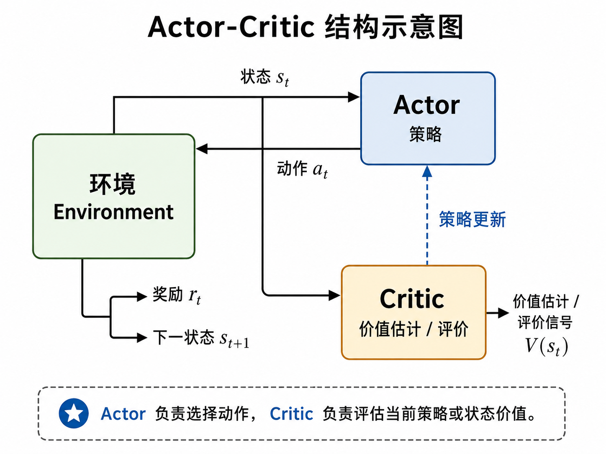

> **来源与同步说明：** 本文同步自作者个人博客[“秦时月”](https://www.qinshiyue.icu/)。个人博客与本网站将并行维护，后续更新会继续同步到本文档中心。

## Actor-Critic 的基本结构

前一篇已经看到，引入基线之后，策略梯度的更新信号可以从完整回报 $G_t$ 变成
$$
G_t - V_\pi(s_t)
$$
这一步虽然能够降低方差，但也带来了新的学习对象：状态价值函数 $V_\pi(s_t)$。如果价值函数需要被估计，那么策略梯度方法中就自然出现了两类参数化函数。

第一类是策略函数。它负责根据当前状态给出动作分布，通常写作
$$
\pi(a\mid s;\boldsymbol{\theta})
$$
其中，$\boldsymbol{\theta}$ 是策略参数。这个部分通常称为行动器（Actor）。Actor 的作用是学习策略，并在与环境交互时根据当前状态选择动作。

第二类是价值函数。它负责估计当前策略下状态的长期价值，通常写作
$$
V(s;\mathbf{w})
$$
其中，$\mathbf{w}$ 是价值函数参数。这个部分通常称为评判器（Critic）。Critic 的作用是评价当前状态或当前动作的结果，为策略更新提供更稳定的学习信号。

于是，行动器—评判器方法（Actor-Critic Method）可以定义为：一种同时学习参数化策略和参数化价值函数的强化学习方法。其中，Actor 负责输出策略，Critic 负责估计价值并评价 Actor 的行为。

从交互流程上看，Actor-Critic 的基本过程可以概括如下。

在时刻 $t$，智能体观察到状态 $s_t$。Actor 根据策略
$$
\pi(a\mid s_t;\boldsymbol{\theta})
$$
采样或选择动作 $a_t$。动作作用于环境后，环境返回奖励 $r_t$，并转移到下一个状态 $s_{t+1}$。与此同时，Critic 根据当前价值函数
$$
V(s;\mathbf{w})
$$
评价状态 $s_t$ 或这一步转移的好坏。随后，Critic 利用新的经验更新自己的价值估计，Actor 则利用 Critic 提供的评价信号更新策略参数。

这个结构的核心在于分工。

Actor 直接决定智能体如何行动，因此它承担策略学习的部分。它关心的是：在给定状态下，哪些动作应该被赋予更高概率。Critic 不直接选择动作，而是为 Actor 的行为提供评价。它关心的是：当前状态的价值估计是否准确，当前动作带来的结果是否好于预期。

因此，Actor-Critic 可以看作策略学习与价值学习的结合。和 REINFORCE 相比，Actor 仍然使用策略梯度思想更新策略；但更新时不再只依赖完整回报 $G_t$，而是借助 Critic 提供的价值估计来构造评价信号。和纯价值学习方法相比，Actor-Critic 不需要通过
$$
\arg\max_a Q(s,a)
$$
间接得到策略，而是直接维护一个可优化的策略函数。

这种结构带来的一个重要变化是：策略更新不再完全依赖回合结束后的完整回报，而可以利用一步转移中的价值估计进行更及时的更新。也就是说，Critic 把前面时序差分学习中的价值估计思想引入了策略梯度框架，使策略学习从纯蒙特卡洛式更新，逐渐走向可以边交互、边更新的形式。

这一点也是 Actor-Critic 在深度强化学习中非常重要的原因。它保留了策略梯度方法能够直接优化策略的优势，同时又引入价值函数来降低更新信号的方差，并提高经验利用的及时性。

## 一步 TD 误差

在 Actor-Critic 结构中，Critic 需要把价值估计转化为可以用于学习的评价信号。最常见的做法，是使用一步时序差分误差（One-step Temporal Difference Error）。设 Critic 用参数化函数
$$
V(s;\mathbf{w})
$$
估计状态价值，其中 $\mathbf{w}$ 是价值函数参数。智能体在时刻 $t$ 经历一次转移：
$$
(s_t,a_t,r_t,s_{t+1})
$$
根据这一步经验，可以构造一步 TD 误差：
$$
\delta_t =
r_t+\gamma V(s_{t+1};\mathbf{w})-V(s_t;\mathbf{w})
$$
这个式子可以分成两部分理解。当前 Critic 对状态 $s_t$ 的价值估计是
$$
V(s_t;\mathbf{w})
$$
而根据刚刚观察到的一步经验，可以得到一个新的估计目标：
$$
r_t+\gamma V(s_{t+1};\mathbf{w})
$$
其中，$r_t$ 是当前已经获得的即时奖励，$\gamma V(s_{t+1};\mathbf{w})$ 是对下一状态后续价值的估计。因此，$\delta_t$ 衡量的是当前价值估计和一步 TD 目标之间的差距。

如果 $\delta_t>0$，说明一步 TD 目标高于 Critic 原本对状态 $s_t$ 的估计，当前状态的价值可能被低估了；如果 $\delta_t<0$，说明一步 TD 目标低于原有估计，当前状态的价值可能被高估了。这样，$\delta_t$ 就可以作为 Critic 更新价值函数的误差信号。

从 Critic 的角度看，它希望让
$$
V(s_t;\mathbf{w})
$$
逐渐接近
$$
r_t+\gamma V(s_{t+1};\mathbf{w})
$$
因此可以通过最小化 TD 误差平方来更新价值函数参数。例如定义损失为
$$
L(\mathbf{w})=\delta_t^2
$$
然后沿着损失下降的方向更新：
$$
\mathbf{w} \leftarrow \mathbf{w}- \beta \nabla_{\mathbf{w}} \left[ \delta_t^2 \right]
$$
其中，$\beta$ 是 Critic 的学习率。实际实现中，也常把一步 TD 目标视作固定目标，对
$$
\big(r_t+\gamma V(s_{t+1};\mathbf{w})-V(s_t;\mathbf{w})\big)^2
$$
进行梯度更新。这里的重点不在于具体采用哪种优化器，而在于：Critic 通过减小 TD 误差，使自己的价值估计逐渐接近由真实经验给出的目标。

更重要的是，$\delta_t$ 还有第二层含义：它可以作为优势函数 $A_\pi(s_t,a_t)$ 的近似。

回顾优势函数的定义：
$$
A_\pi(s_t,a_t)=Q_\pi(s_t,a_t)-V_\pi(s_t)
$$
它表示在状态 $s_t$ 下选择动作 $a_t$，相对于该状态平均水平高多少。对于一次实际转移来说，
$$
r_t+\gamma V(s_{t+1};\mathbf{w})
$$
可以看作对“执行动作 $a_t$ 后得到的回报”的一步估计，而
$$
V(s_t;\mathbf{w})
$$
表示当前状态的平均价值估计。二者之差
$$
\delta_t =
r_t+\gamma V(s_{t+1};\mathbf{w})-V(s_t;\mathbf{w})
$$
就可以理解为：当前动作带来的结果，相对于 Critic 原本预期高多少。

这使得 $\delta_t$ 同时服务于两个学习过程。

对于 Critic，$\delta_t$ 是价值函数的预测误差，用来修正 $V(s;\mathbf{w})$。

对于 Actor，$\delta_t$ 是当前动作的评价信号，用来判断应该提高还是降低动作 $a_t$ 在状态 $s_t$ 下被选择的概率。

这样，Actor-Critic 的关键连接就建立起来了：Critic 通过时序差分方法学习价值函数，并把 TD 误差作为评价信号传递给 Actor；Actor 则利用这个评价信号进行策略梯度更新。

## Actor 的策略更新

有了 Critic 给出的 TD 误差 $\delta_t$ 之后，Actor 就可以用它来更新策略参数。回顾策略梯度的基本形式，策略更新通常沿着
$$
\nabla_{\boldsymbol{\theta}}
\log \pi(a_t\mid s_t;\boldsymbol{\theta})
$$
的方向进行。其中，$\pi(a_t\mid s_t;\boldsymbol{\theta})$ 表示当前策略在状态 $s_t$ 下选择动作 $a_t$ 的概率，$\boldsymbol{\theta}$ 是 Actor 的策略参数。

在 REINFORCE 中，这个方向前面乘的是完整回报 $G_t$：
$$
\boldsymbol{\theta}
\leftarrow
\boldsymbol{\theta} +
\alpha
G_t
\nabla_{\boldsymbol{\theta}}
\log \pi(a_t\mid s_t;\boldsymbol{\theta})
$$
而在 Actor-Critic 中，完整回报 $G_t$ 被 Critic 提供的评价信号替代。常见的一步 Actor-Critic 更新写作：
$$
\boldsymbol{\theta}
\leftarrow
\boldsymbol{\theta} +
\alpha
\delta_t
\nabla_{\boldsymbol{\theta}}
\log \pi(a_t\mid s_t;\boldsymbol{\theta})
$$
其中，
$$
\delta_t =
r_t+\gamma V(s_{t+1};\mathbf{w})-V(s_t;\mathbf{w})
$$
这个公式的含义可以直接从 $\delta_t$ 的符号来理解。

如果 $\delta_t>0$，说明当前动作 $a_t$ 带来的结果好于 Critic 原本的预期。此时更新会增加 $\log \pi(a_t\mid s_t;\boldsymbol{\theta})$，也就是提高策略在状态 $s_t$ 下选择动作 $a_t$ 的概率。换句话说，Actor 会倾向于在类似状态下更常选择这个动作。

如果 $\delta_t<0$，说明当前动作带来的结果低于 Critic 原本的预期。此时更新方向会反过来，使策略降低在状态 $s_t$ 下选择动作 $a_t$ 的概率。这样，Actor 在后续遇到类似状态时，就会减少选择该动作的倾向。

如果 $\delta_t$ 接近 $0$，说明当前结果与 Critic 的预期比较接近，Actor 的更新幅度也会较小。这表示当前动作既没有明显优于预期，也没有明显低于预期，策略没有必要做大幅调整。

因此，Actor 的更新可以理解为：
$$
\text{策略更新方向} =
\text{动作概率的梯度方向}
\times
\text{Critic 给出的评价强度}
$$
其中，
$$
\nabla_{\boldsymbol{\theta}}
\log \pi(a_t\mid s_t;\boldsymbol{\theta})
$$
决定“怎样改变参数才能提高当前动作概率”，而 $\delta_t$ 决定“当前动作概率应该提高还是降低，以及调整幅度有多大”。

这也说明 Actor-Critic 和 REINFORCE 的关系非常紧密。两者都使用
$$
\nabla_{\boldsymbol{\theta}}
\log \pi(a_t\mid s_t;\boldsymbol{\theta})
$$
来更新策略。区别在于，REINFORCE 用完整回报 $G_t$ 作为权重，而 Actor-Critic 用 TD 误差 $\delta_t$ 作为权重。前者更接近蒙特卡洛式策略梯度，后者则把时序差分思想引入策略更新，使策略能够在交互过程中更及时地调整。

从算法结构上看，一次基本 Actor-Critic 更新包含两个同时进行的部分：

Critic 使用 $\delta_t$ 修正价值函数 $V(s;\mathbf{w})$，使价值估计更接近一步 TD 目标；

Actor 使用同一个 $\delta_t$ 更新策略 $\pi(a\mid s;\boldsymbol{\theta})$，使好于预期的动作概率上升，低于预期的动作概率下降。

这样，$\delta_t$ 就成为连接 Actor 和 Critic 的核心信号。Critic 通过它学习价值，Actor 通过它改进策略。Actor-Critic 的基本形式也由此完整建立起来。

## 与 REINFORCE 的对比

到这里，可以把 REINFORCE 和 Actor-Critic 放在同一条线索下比较。二者都属于策略梯度方法，都会直接更新参数化策略
$$
\pi(a\mid s;\boldsymbol{\theta})
$$
并且策略更新中都包含同一个核心方向：
$$
\nabla_{\boldsymbol{\theta}}
\log \pi(a_t\mid s_t;\boldsymbol{\theta})
$$
这个方向表示：如何调整策略参数，才能提高当前状态 $s_t$ 下选择动作 $a_t$ 的概率。真正的区别在于，这个方向前面乘上的评价信号不同。

在 REINFORCE 中，评价信号是完整回报 $G_t$：
$$
\boldsymbol{\theta}
\leftarrow
\boldsymbol{\theta} +
\alpha
G_t
\nabla_{\boldsymbol{\theta}}
\log \pi(a_t\mid s_t;\boldsymbol{\theta})
$$
这里的 $G_t$ 来自当前时刻之后的整段实际轨迹。因此，REINFORCE 属于蒙特卡洛式策略梯度方法。它直接用完整回报评价当前动作，不依赖价值函数估计，形式比较直接。但它通常需要等到回合结束后才能计算 $G_t$，更新具有延迟；同时，完整回报累积了后续轨迹中的随机性，方差通常较大。

在 Actor-Critic 中，评价信号换成了 Critic 给出的一步 TD 误差 $\delta_t$：
$$
\boldsymbol{\theta}
\leftarrow
\boldsymbol{\theta} +
\alpha
\delta_t
\nabla_{\boldsymbol{\theta}}
\log \pi(a_t\mid s_t;\boldsymbol{\theta})
$$
其中，
$$
\delta_t =
r_t+\gamma V(s_{t+1};\mathbf{w})-V(s_t;\mathbf{w})
$$
这里的 $\delta_t$ 只依赖当前一步奖励、下一状态价值估计和当前状态价值估计。因此，Actor-Critic 不必等待完整回合结束，就可以在每次转移之后进行更新。它把时序差分学习引入策略梯度，使策略学习具有更强的在线更新特征。

从这个角度看，REINFORCE 与 Actor-Critic 的差别可以概括为：REINFORCE 使用完整回报 $G_t$ 评价动作，Actor-Critic 使用 TD 误差 $\delta_t$ 评价动作。前者更接近蒙特卡洛方法，后者更接近时序差分方法。

这种变化带来了明显影响。

REINFORCE 的更新目标更加接近真实采样回报，因为 $G_t$ 是实际轨迹中完整计算出来的回报。但它的代价是更新不够及时，且方差较高。Actor-Critic 的更新更加及时，因为 $\delta_t$ 在一步交互后就可以计算出来；同时，由于 Critic 用价值函数估计替代了一部分未来回报，更新信号的方差通常低于直接使用完整回报。

不过，这种改进也引入了新的依赖。REINFORCE 不需要额外学习价值函数，而 Actor-Critic 需要 Critic 提供可靠的价值估计。如果 Critic 的估计偏差较大，Actor 接收到的评价信号也会受到影响。也就是说，Actor-Critic 用更低方差和更及时的更新，换来了对价值估计质量的依赖。

因此，Actor-Critic 可以理解为 REINFORCE 与价值学习的结合。Actor 保留策略梯度方法直接优化策略的特点，Critic 则引入价值函数近似，为 Actor 提供低方差、可在线计算的评价信号。这种结构也为后续许多深度强化学习算法提供了基本框架。

## Actor-Critic 的优点与局限

Actor-Critic 方法的主要优点，来自策略学习和价值估计的结合。

首先，它比 REINFORCE 更新更及时。REINFORCE 需要等待完整回合结束，得到 $G_t$ 之后再更新策略；Actor-Critic 则可以在每次经历一步转移后，根据
$$
\delta_t =
r_t+\gamma V(s_{t+1};\mathbf{w})-V(s_t;\mathbf{w})
$$
立即更新 Critic 和 Actor。这样，经验不必等到回合结束后才被利用，学习过程更接近在线更新。

其次，它的更新信号方差通常低于直接使用完整回报。完整回报 $G_t$ 会累积后续整段轨迹中的随机性，而 TD 误差只使用一步奖励和价值估计。虽然这种做法引入了价值函数估计带来的偏差，但它通常能换来更平稳的更新信号。对于深度强化学习任务，这一点很重要，因为神经网络训练本身已经存在较强的不稳定性，过大的梯度波动会明显影响学习过程。

再次，Actor-Critic 保留了策略梯度方法直接优化策略的能力。Actor 显式维护
$$
\pi(a\mid s;\boldsymbol{\theta})
$$
因此它可以自然处理随机策略，也更容易扩展到连续动作空间。相比只学习动作价值函数再取最大动作的方法，直接学习策略在许多控制任务中更加方便。

不过，Actor-Critic 也有自己的局限。

最核心的局限是 Critic 的估计质量会直接影响 Actor 的更新。如果 $V(s;\mathbf{w})$ 估计不准确，那么 TD 误差 $\delta_t$ 就不能可靠反映当前动作的好坏。此时 Actor 可能会提高不合适动作的概率，或者降低本应保留的动作概率。换句话说，Critic 提供的评价信号如果有明显偏差，Actor 的学习方向也会受到干扰。

此外，Actor 和 Critic 同时学习，会使训练过程更加复杂。Actor 的策略变化会改变采样到的数据分布，而 Critic 又要在不断变化的数据分布下估计当前策略的价值。Critic 的变化又会进一步影响 Actor 的更新信号。因此，二者之间存在相互影响，学习率、网络结构、更新频率等设置都会影响训练稳定性。

因此，Actor-Critic 并不能简单理解为“比 REINFORCE 更稳定的版本”。更准确地说，它用 Critic 引入了更及时、低方差的评价信号，同时也引入了价值估计偏差和双网络联合训练的复杂性。它的优势和局限都来自同一个来源：Actor 负责改进策略，Critic 负责估计价值，二者在同一训练过程中不断相互作用。

这也是为什么 Actor-Critic 成为许多深度强化学习算法的基础结构。后续的 A2C、A3C、PPO、DDPG、SAC 等方法，都可以在不同程度上看作对这一基本框架的扩展。它们可能改变优势估计方式、采样方式、策略约束方式或动作空间设定，但核心思想仍然围绕“用价值估计辅助策略更新”展开。

## 小结

本文从 REINFORCE 的局限出发，引出了 Actor-Critic 方法的基本思想。REINFORCE 直接使用完整回报 $G_t$ 作为策略更新信号，形式清晰，但需要等待回合结束，且 $G_t$ 的方差通常较大。为了降低方差，可以在回报中减去与动作无关的基线，例如状态价值函数 $V_\pi(s_t)$，得到
$$
G_t - V_\pi(s_t)
$$
这个量可以看作优势函数 $A_\pi(s_t,a_t)$ 的采样估计，用来衡量当前动作相对于当前状态平均水平的好坏。

但一旦使用 $V_\pi(s_t)$ 作为基线，就需要额外估计价值函数。Actor-Critic 正是在这里出现：Actor 负责学习策略
$$
\pi(a\mid s;\boldsymbol{\theta})
$$
Critic 负责估计价值函数
$$
V(s;\mathbf{w})
$$
并向 Actor 提供评价信号。

在最基本的一步 Actor-Critic 中，Critic 使用一步 TD 误差
$$
\delta_t =
r_t+\gamma V(s_{t+1};\mathbf{w})-V(s_t;\mathbf{w})
$$
来更新价值函数。这个误差既表示当前价值估计和 TD 目标之间的差距，也可以近似表示当前动作的优势。于是，Critic 可以通过最小化 TD 误差平方来更新 $\mathbf{w}$，Actor 则使用
$$
\boldsymbol{\theta}
\leftarrow
\boldsymbol{\theta} +
\alpha
\delta_t
\nabla_{\boldsymbol{\theta}}
\log \pi(a_t\mid s_t;\boldsymbol{\theta})
$$
来更新策略参数。

这个公式体现了 Actor-Critic 的核心逻辑：如果 $\delta_t>0$，说明当前动作结果好于 Critic 的预期，Actor 应提高该动作概率；如果 $\delta_t<0$，说明当前动作结果低于预期，Actor 应降低该动作概率。

因此，Actor-Critic 可以看作 REINFORCE 与价值学习的结合。它保留了策略梯度方法直接优化策略的特点，同时利用 Critic 的价值估计提供更及时、通常更低方差的评价信号。它也带来了新的训练难点：Critic 的估计质量会影响 Actor 的更新方向，Actor 和 Critic 同时学习时也可能相互干扰。

Actor-Critic 的意义并不只在于这一个基础算法本身。更重要的是，它形成了后续许多深度强化学习算法的基本结构。A2C、A3C、PPO、DDPG、SAC 等方法虽然在具体目标、采样方式、动作空间和稳定化技巧上有所不同，但大多都延续了“Actor 学习策略，Critic 提供价值评价”这一基本框架。
