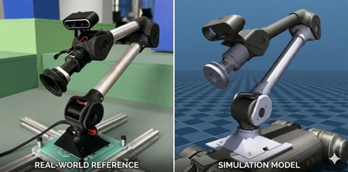
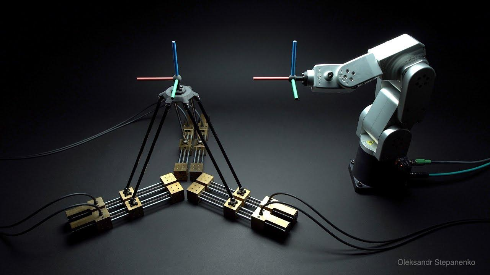
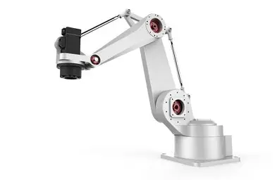
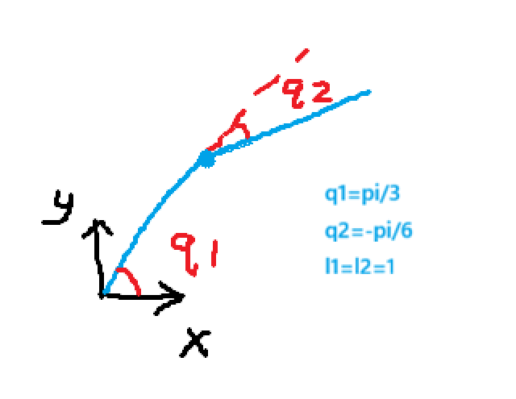
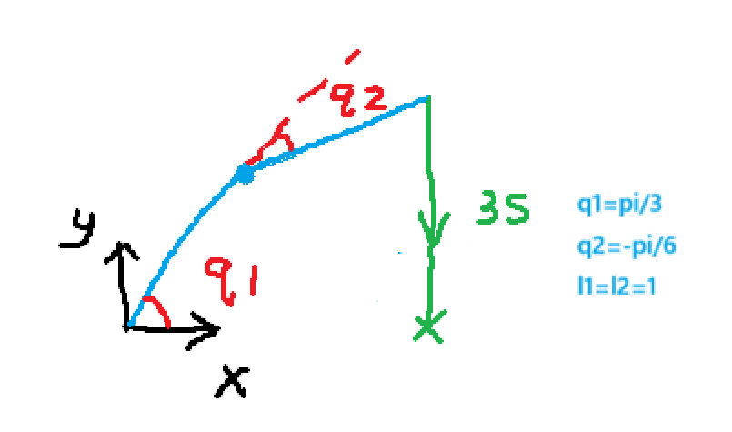
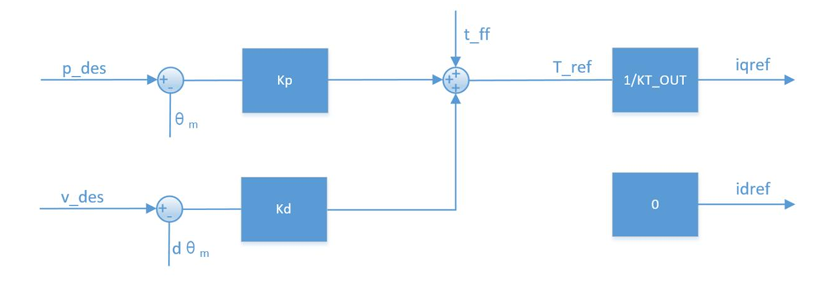
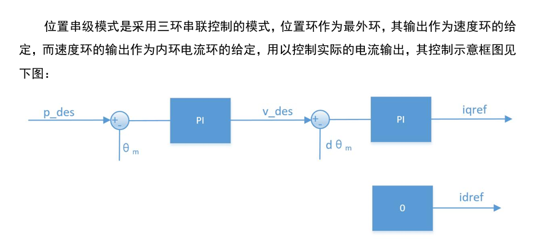
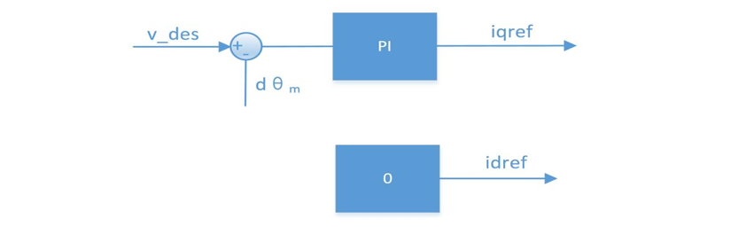

机械臂是入门机器人控制的一个很好的切入对象：它比四足机器人简单，又比小车复杂。机械臂控制涉及刚体变换、动力学解算、运动规划等基础概念，能够为今后更复杂机器人构形的研发打好基础，同时机械臂本身也是具身智能的重要载体。

> 配套视频：[【机械臂第二期】](https://www.bilibili.com/video/BV17rdHBcEHu/?share_source=copy_web&vd_source=5928ecda7581402e17049fc65a5372e1)

本章用于串联接下来学习中所有可能涉及到的概念。

## 自由度（DOF）

**自由度**（Degree of Freedom，简称 DOF）在机器人学里指**一个机构独立运动的坐标数目**，也就是你能独立控制的“动的方式”有多少种。一个刚体在三维空间中自由运动有 6 个自由度：

- **3 个平移**：沿 X、Y、Z 轴的移动；
- **3 个旋转**：绕 X、Y、Z 轴的转动。

任何刚体最多就只有 6 个自由度，这是空间本身的属性决定的。所以机械臂自由度少于 6 时，无法实现“任意位置、任意姿态”的操作。

实际工程中，很多机械臂自由度低于 6——少一个关节就意味着省一个电机、减速器、驱动器和一堆线缆，成本、重量、控制复杂度都会大幅下降。按自由度从低到高简要过一遍：

**1~2 DOF**

- 代表：旋转台、升降台、单轴摆臂
- 控制：极低，单个电机/气缸，开环或简单闭环位置控制
- 特点：单一维度运动，属于辅助机构，不算真正的机械臂

**3~4 DOF**

- 代表：SCARA（3~4 轴）、直角坐标机器人（XYZ 三轴）
- 控制：较低，运动学简单，直角坐标三轴完全解耦
- 特点：擅长平面内的搬运、点胶、贴片、装配，速度快精度高，但无法倾斜或翻转末端

**5 DOF**

- 代表：部分简化焊接/喷涂机器人
- 控制：中等偏低，能覆盖大部分位置和部分姿态
- 特点：缺一个姿态方向，常出现“够得到但摆不正”的尴尬，适合垂直焊接等单一姿态任务，全向操作不够用

**6 DOF**

- 代表：绝大多数工业六轴机器人
- 控制：中等偏高，但逆运动学有封闭解析解（数学上可求）
- 特点：3 平移 + 3 旋转，理论上可达空间任意位姿。控制算法复杂、逆运动学多解需要筛选、存在奇异点需要规避、成本高于低自由度方案

## 串联与并联机构

- 运动空间：串联的工作空间相对较大，并联机器人相对小一点。
- 末端负载力：串联机器人负载相对较小，并联机器人负载力大。
- 机械臂中一种常见设计是把远端电机放到近端，用连杆传动，从而引入并联结构。

**判断串并联，最直观的方法就看“执行机构（电机）和关节是不是长在一起”：**

- 如果电机装在关节转轴处，每个关节各管各的、串成一条线 → 大概率是**串联**（比如六轴工业机器人）。电机一转，那一段杆就动，直观、好理解。
- 如果电机装在基座或固定位置，通过连杆、钢丝或丝杠把力传到远处的关节 → 大概率是**并联**（比如 Delta 蜘蛛手、Stewart 平台）。电机在底下，动的是上面的平台，中间隔了好几根杆子。

注意：这只是视觉上快速分类的经验，不是严格定义。真正区分串并联要看运动链是开环还是闭环。

对于**串联**：逆运动学算出来的直接就是每个关节的目标角度（θ₁~θ₆），电机装在关节上，所以这个角度就是发给电机的目标值，中间不需要再做别的变换（减速比是传动层面的换算，不算运动学变换）。

对于**并联**：逆运动学算出来的是每条腿的目标长度（或每根驱动杆的伸缩量），而电机装在基座上，通过连杆带动腿伸缩。算完腿长之后，还需要根据具体的机械传动几何关系，把腿长换算成电机要转的角度，才能发给驱动器。

本篇主要讲解串联机械臂构型。

## 运动学与动力学解算

**运动学解算**是关节空间和笛卡尔空间之间的桥梁，**动力学解算**是轨迹和力矩之间的桥梁。

可以先看这个二自由度和三自由度连杆的例子：[知乎专栏](https://zhuanlan.zhihu.com/p/161348413)，其中二连杆正逆运动学与雅可比矩阵要求掌握。

- **运动学正解**：已知关节角度（广义坐标）求末端位姿。在更多自由度构型中，常用 DH 参数求解，十分容易。
- **运动学逆解**：已知末端位姿求关节角度。
- **动力学逆解**：给定期望轨迹（关节角度、角速度、角加速度），求解电机需要输出的关节力矩。

**雅可比矩阵** $J(q)$ 本质上是运动学概念，它建立关节空间速度 $\dot{q}$ 到末端任务空间速度 $v$ 的线性映射：

$$v = J(q)\dot{q}$$

末端力与关节力矩的关系由雅可比矩阵的转置决定：

$$\tau_{ext} = J^T(q) F_{ext}$$

### 一个二连杆的算例

把 $q_1$、$q_2$ 带入机械臂工程背景：它们就是关节电机的转角，规定逆时针为正，初始姿态为大臂小臂均水平向右平躺。大臂电机转角 $q_1$ 即大臂与 x 正方向的夹角；由于小臂会随大臂一起转动，小臂电机转角 $q_2$ 是小臂相对大臂延长线的夹角。

设大臂小臂长均为 1，$q_1$ 和 $q_2$ 的角速度均为 1 rad/s，求末端速度。

雅可比矩阵 $J$ 描述关节角速度与末端线速度之间的映射关系，对正运动学方程求偏导可得：

$$J = \begin{bmatrix} \frac{\partial x}{\partial q_1} & \frac{\partial x}{\partial q_2} \\ \frac{\partial y}{\partial q_1} & \frac{\partial y}{\partial q_2} \end{bmatrix} = \begin{bmatrix} -l_1 \sin(q_1) - l_2 \sin(q_1 + q_2) & -l_2 \sin(q_1 + q_2) \\ l_1 \cos(q_1) + l_2 \cos(q_1 + q_2) & l_2 \cos(q_1 + q_2) \end{bmatrix}$$

代入当前状态的值（$q_1 = \pi/3,\ q_2 = \pi/6$）：

$$J = \begin{bmatrix} -\sin(\frac{\pi}{3}) - \sin(\frac{\pi}{6}) & -\sin(\frac{\pi}{6}) \\ \cos(\frac{\pi}{3}) + \cos(\frac{\pi}{6}) & \cos(\frac{\pi}{6}) \end{bmatrix} = \begin{bmatrix} -\frac{1+\sqrt{3}}{2} & -\frac{1}{2} \\ \frac{1+\sqrt{3}}{2} & \frac{\sqrt{3}}{2} \end{bmatrix}$$

两个关节的角速度分别为 $\dot{q}_1 = 1\ \text{rad/s}$、$\dot{q}_2 = 1\ \text{rad/s}$，末端速度计算如下：

$$\begin{bmatrix} \dot{x} \\ \dot{y} \end{bmatrix} = J \begin{bmatrix} \dot{q}_1 \\ \dot{q}_2 \end{bmatrix} = \begin{bmatrix} -\frac{1+\sqrt{3}}{2} & -\frac{1}{2} \\ \frac{1+\sqrt{3}}{2} & \frac{\sqrt{3}}{2} \end{bmatrix} \begin{bmatrix} 1 \\ 1 \end{bmatrix}$$

$$\dot{x} = -\frac{1+\sqrt{3}}{2} - \frac{1}{2} = -\frac{2+\sqrt{3}}{2}, \qquad \dot{y} = \frac{1+\sqrt{3}}{2} + \frac{\sqrt{3}}{2} = \frac{1+2\sqrt{3}}{2}$$

即在该假设角速度下，末端在 x 轴和 y 轴方向上的线速度分别为 $-\frac{2+\sqrt{3}}{2}$ 和 $\frac{1+2\sqrt{3}}{2}$（单位/s）。

## 关节空间与笛卡尔空间

掌握运动学解算后，我们已经能回答“该往哪去”，但“如何过去”还没解决，于是引入**规划**。先重新认识两个空间：

- **笛卡尔空间**：以三维空间中的位置（XYZ）和姿态（RPY/欧拉角/四元数）描述末端执行器在空间中的位姿。
- **关节空间**：以各关节变量（角度 θ 或位移 d）作为独立坐标描述机械臂的位形。

机械臂的运动规划也相应分为笛卡尔空间规划和关节空间规划：

| 方面 | 笛卡尔空间规划 | 关节空间规划 |
| --- | --- | --- |
| 规划对象 | 末端位姿 $X(t)$、速度 $\dot X(t)$、加速度 $\ddot X(t)$ | 关节变量 $q(t)$、速度 $\dot q(t)$、加速度 $\ddot q(t)$ |
| 约束条件 | 末端轨迹的几何形状（直线、圆弧等） | 各关节的角速度/角加速度/力矩限幅 |
| 执行流程 | 规划 → 逆运动学 → 关节空间指令 | 规划 → 直接发送关节指令 |
| 特点 | 路径可控，但计算量大、存在奇异 | 计算高效、无奇异，但末端路径不可预测 |

常用的规划算法有梯形、S 形、多项式插值和 path blending 等。如果对轨迹没有要求，通常用关节空间规划即可；如果需要避障，可用 path blending 引入插值点微调。

### 笛卡尔空间直线插值算例

首先确定轨迹起点 $P_0$ 和终点 $P_f$：

- **初始位置** $P_0$：通过前向运动学求得（如前文计算）

$$x_0 = \frac{1+\sqrt{3}}{2}, \quad y_0 = \frac{1+\sqrt{3}}{2}$$

- **目标位置** $P_f$：

$$x_f = \frac{1+\sqrt{3}}{2}, \quad y_f = 0$$

- **运动时间**：$T = 3\ \text{s}$

在笛卡尔空间中规划直线路径需要建立参数化方程。引入一个标量插值函数 $s(t)$，要求其在 $t=0$ 时为 0，在 $t=T$ 时为 1。末端位置随时间变化表示为：

$$P(t) = P_0 + s(t) \cdot (P_f - P_0)$$

代入本例坐标：

$$x(t) = x_0 = \frac{1+\sqrt{3}}{2} \quad \text{(X 方向保持恒定)}$$

$$y(t) = y_0 + s(t) \cdot (0 - y_0) = \frac{1+\sqrt{3}}{2} \cdot (1 - s(t))$$

为保证机器人起步和停止时平稳（无冲击），不能让 $s(t)$ 呈简单线性变化，采用三次多项式插值：

$$s(t) = a_0 + a_1 t + a_2 t^2 + a_3 t^3$$

代入边界条件：位置约束 $s(0)=0,\ s(3)=1$；速度约束 $\dot{s}(0)=0,\ \dot{s}(3)=0$。解得插值函数：

$$s(t) = \frac{3}{T^2}t^2 - \frac{2}{T^3}t^3 = \frac{1}{3}t^2 - \frac{2}{27}t^3 \quad (0 \le t \le 3)$$

此时就得到了末端执行器在任意时刻 $t$ 的精确笛卡尔坐标 $(x(t), y(t))$。

由于伺服电机只能接受关节角度指令，需要将笛卡尔轨迹转换为关节空间轨迹。控制器以一定采样周期 $\Delta t$（例如 10ms）对时间 $t$ 离散化，在每个控制周期 $k$：

1. 计算当前时刻的末端期望位置：$x_k = x(k\Delta t),\ y_k = y(k\Delta t)$。
2. 调用逆运动学算法求解对应的关节角度 $q_1(k)$ 和 $q_2(k)$。

利用余弦定理计算本例的 $q_{2k}$：

$$q_{2k} = -\arccos\left( \frac{x_k^2 + y_k^2 - l_1^2 - l_2^2}{2 l_1 l_2} \right)$$

> 注：这里保持取负号以维持肘部向下的“右解”构型，避免在运动中发生构型跳变。

计算 $q_{1k}$：

$$q_{1k} = \text{atan2}(y_k, x_k) - \text{atan2}(l_2 \sin(q_{2k}),\ l_1 + l_2 \cos(q_{2k}))$$

在高级控制中，除了下发位置指令，通常还需要下发速度前馈指令以减小跟踪误差。笛卡尔空间的期望线速度通过对 $P(t)$ 求导获得：

$$\dot{x}(t) = 0$$

$$\dot{y}(t) = -y_0 \cdot \dot{s}(t) = -y_0 \cdot \left(\frac{2}{3}t - \frac{2}{9}t^2\right)$$

通过雅可比矩阵的逆矩阵 $J^{-1}$，可以实时求出期望的关节角速度：

$$\begin{bmatrix} \dot{q}_1(t) \\ \dot{q}_2(t) \end{bmatrix} = J^{-1} \begin{bmatrix} \dot{x}(t) \\ \dot{y}(t) \end{bmatrix}$$

## 动力学前馈与电机控制模式

这部分与硬件强相关：关节电机有位置模式、速度模式和 MIT（力矩）模式；采用六步换向的无刷电机、舵机和一些简单直流电机的控制方式也各不相同。

以关节电机为例，假设电机工作在**理想力矩源模式**下——把电机等效为一个理想力矩输出器：输入期望电流（或期望转矩），输出对应电磁转矩，无延迟、无饱和、无摩擦。速度模式和位置模式均是在此基础上加入角度反馈进行 PID 封装得到。达妙电机控制模式原理如下。

力矩模式：

$$\tau_{\text{ref}} = K_p (p_{\text{des}} - \theta_m) + K_d (v_{\text{des}} - \dot{\theta}_m) + t_{\text{ff}}$$

位置模式：

速度模式：

位置模式与速度模式在此基础上分别加入位置/速度环。一个最显著的区别是：**力矩模式没有积分环节**——它不追求控制的绝对精度，控制误差取决于动力学模型的误差，但可以实现更丝滑的控制效果。

建立一个好的动力学模型非常困难，位置模式足以应付比赛中的绝大多数应用场景。动力学建模并非本文重点，以后有机会可单独成文。
